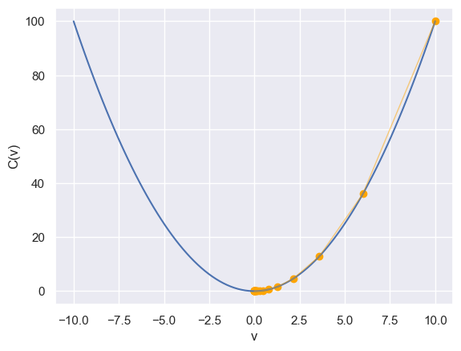
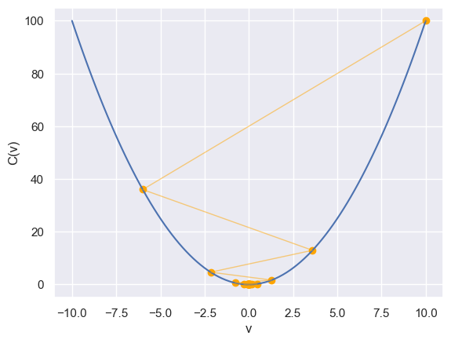
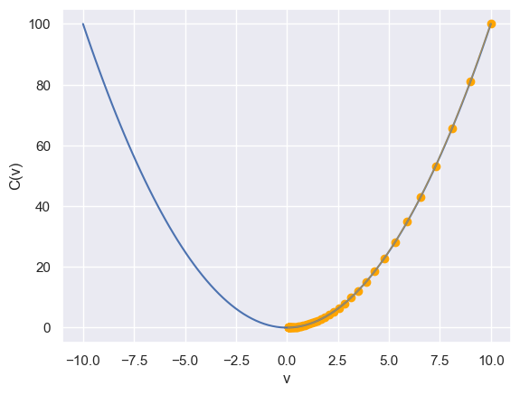
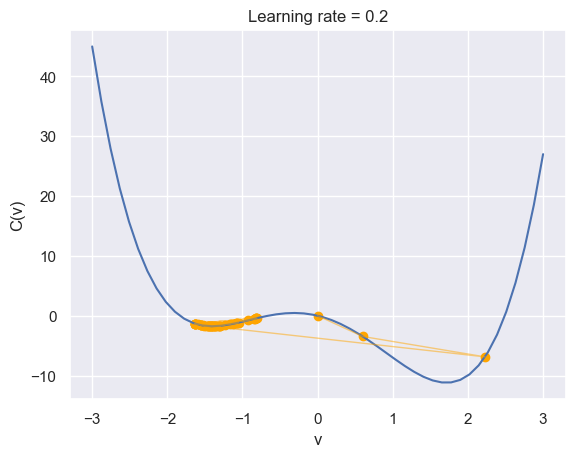
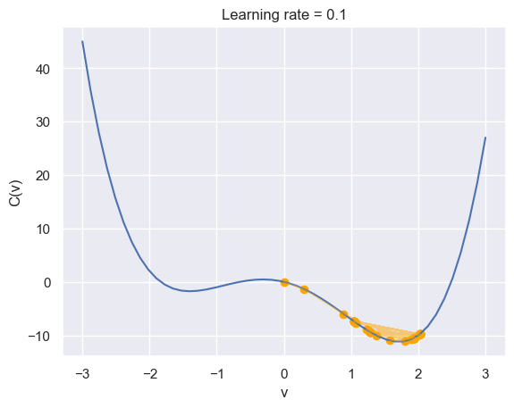

# Stochastic Gradient Descent

SGD is an optimization algorithm used in Machine Learning to find the model parameters that corresponds to the best fit between actual and predicted values.


## Cost Function

The **cost function**, or _loss function_, is the function to be minimized (or maximized) by varying the decision variables.

The goal is to minimize the difference between the predicted and the actual data. The difference is called the **residual**.

## References

https://realpython.com/gradient-descent-algorithm-python/


```python
import matplotlib.pyplot as plt
import seaborn as sns

sns.set_theme()
```


```python
import numpy as np


def gradient_descent(gradient, start, learn_rate, n_iter=50, tolerance=1e-6):
    history = []
    vector = start
    for _ in range(n_iter):
        history.append(vector)
        diff = -learn_rate * gradient(vector)
        if np.all(np.abs(diff) <= tolerance):
            break
        vector += diff
    return vector, history
```

The function below implements $C=v^2$. The minimum should be at 0.


```python
def C(v):
    """Implement C=v^2"""
    return np.square(v)
```


```python
X = np.linspace(-10, 10, 100)

minimum, movements = gradient_descent(
    gradient=lambda v: 2 * v, start=10.0, learn_rate=0.2
)
plt.plot(X, C(X))
plt.scatter(movements, C(movements), color="orange")
plt.plot(movements, C(movements), color="orange", alpha=0.5, linewidth=1)
plt.xlabel("v")
plt.ylabel("C(v)")

minimum, C(minimum)
```


    (2.210739197207331e-06, 4.887367798068914e-12)


    

    


```python
minimum, movements = gradient_descent(
    gradient=lambda v: 2 * v, start=10.0, learn_rate=0.8
)
plt.plot(X, C(X))
plt.scatter(movements, C(movements), color="orange")
plt.plot(movements, C(movements), color="orange", alpha=0.5, linewidth=1)
plt.xlabel("v")
plt.ylabel("C(v)")
plt.show()


minimum, C(minimum)
```


    

    


    (-4.77519666596786e-07, 2.2802503198670566e-13)


```python
minimum, movements = gradient_descent(
    gradient=lambda v: 2 * v, start=10.0, learn_rate=0.05
)
plt.plot(X, C(X))
plt.scatter(movements, C(movements), color="orange")
plt.plot(movements, C(movements), color="orange", alpha=0.5, linewidth=1)
plt.xlabel("v")
plt.ylabel("C(v)")
plt.show()


minimum, C(minimum)
```


    

    


    (0.051537752073201076, 0.002656139888758742)


## Nonconvex function

$C = v^4 - 5v^2 - 3v$

It has a global minimum in 𝑣 ≈ 1.7 and a local minimum in 𝑣 ≈ −1.42.


```python
def C(v):
    v = np.array(v)
    return np.power(v, 4) - 5 * np.power(v, 2) - 3 * v


C(1.7), C(-1.42)
```


    (-11.1979, -1.7561310400000014)


```python
X = np.linspace(-3, 3, 50)


minimum, movements = gradient_descent(
    lambda v: 4 * v ** 3 - 10 * v - 3, start=0, learn_rate=0.2
)

plt.plot(X, C(X))
plt.scatter(movements, C(movements), color="orange")
plt.plot(movements, C(movements), color="orange", alpha=0.5, linewidth=1)
plt.xlabel("v")
plt.ylabel("C(v)")
plt.title("Learning rate = 0.2")

minimum, C(minimum)
```


    (-1.4207567437458342, -1.7559354013679256)


    

    


```python
minimum, movements = gradient_descent(
    lambda v: 4 * v ** 3 - 10 * v - 3, start=0, learn_rate=0.1
)

plt.plot(X, C(X))
plt.scatter(movements, C(movements), color="orange")
plt.plot(movements, C(movements), color="orange", alpha=0.5, linewidth=1)
plt.xlabel("v")
plt.ylabel("C(v)")
plt.title("Learning rate = 0.1")

minimum, C(minimum)
```


    (1.285401330315467, -9.387535084753722)


    

    


```python
import tensorflow as tf
```

    2024-01-30 01:43:50.622823: I tensorflow/core/platform/cpu_feature_guard.cc:182] This TensorFlow binary is optimized to use available CPU instructions in performance-critical operations.
    To enable the following instructions: AVX2 FMA, in other operations, rebuild TensorFlow with the appropriate compiler flags.


Keras provides a way to calculate the derivates of the cost function through automatic differentiation.
This is convenient, as we do not need to derive it manually.


```python
sgd = tf.keras.optimizers.SGD(learning_rate=0.01, momentum=0.9)
x = tf.Variable(0.9)


for i in range(50):
    with tf.GradientTape() as tape:
        y = tf.pow(x, 4) - 5 * tf.pow(x, 2) - 3 * var
    dy_dx = tape.gradient(y, [x])
    sgd.apply_gradients(zip(dy_dx, [x]))

    if i % 10 == 0:
        print("loss:", dy_dx[0].numpy(), x.numpy())
x.numpy(), dy_dx[0].numpy()
```

    loss: -6.0840006 0.96084
    loss: 2.4022198 1.545779
    loss: 2.7857609 1.745681
    loss: -1.7118111 1.5297205
    loss: -0.7434063 1.5248744


    (1.6163998, 0.8602085)


```python

```
