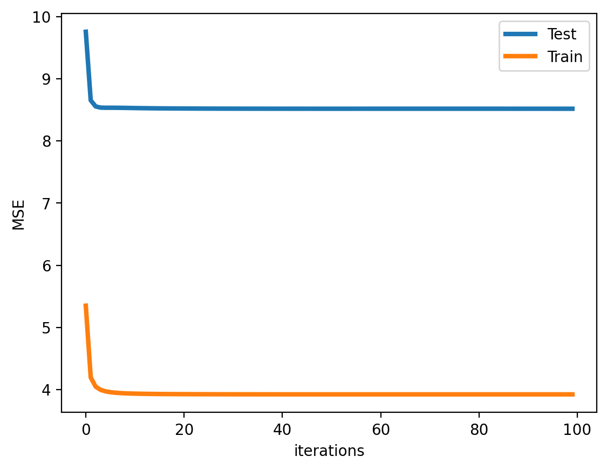

# Alternating Least Squares

References
- https://blog.griddynamics.com/how-deep-learning-improves-recommendations-for-your-catalog/
- https://ethen8181.github.io/machine-learning/recsys/1_ALSWR.html


```python
# %load_ext autoreload # magic so that the notebook will reload external python modules
# %autoreload 2
%config InlineBackend.figure_format = 'retina' # magic to enable retina (high resolution) plots
```


```python
import os

import matplotlib.pyplot as plt
import numpy as np
import pandas as pd
from sklearn.metrics import mean_squared_error
```


```python
from signature import sign

sign(packages="pandas,numpy,sklearn,matplotlib")
```

    Author: Alex Tan Hong Pin
    
    Github username: alextanhongpin
    
    Last updated: 2024-01-26
    
    Python implementation: CPython
    Python version       : 3.10.13
    IPython version      : 8.20.0
    
    pandas    : 2.2.0
    numpy     : 1.26.3
    sklearn   : 1.4.0
    matplotlib: 3.8.2
    
    Compiler    : Clang 14.0.0 (clang-1400.0.29.202)
    OS          : Darwin
    Release     : 21.6.0
    Machine     : x86_64
    Processor   : i386
    CPU cores   : 4
    Architecture: 64bit
    
    Git hash: c97e2648e53d325730b51c5dba6dbea6191d9390
    
    Git repo: https://github.com/alextanhongpin/matrix-factorization.git
    
    Git branch: master
    
    GPU Info: Install the gpu extra (pip install 'watermark[gpu]') to display GPU information for NVIDIA chipsets
    
    Watermark: 2.4.3
    


## Loading Data


```python
file_dir = "ml-100k"
file_path = os.path.join(file_dir, "u.data")

names = ["user_id", "item_id", "rating", "timestamp"]
df = pd.read_csv(file_path, sep="\t", names=names)

print(df.shape)
df.head()
```

    (100000, 4)


<div>
<style scoped>
    .dataframe tbody tr th:only-of-type {
        vertical-align: middle;
    }

    .dataframe tbody tr th {
        vertical-align: top;
    }

    .dataframe thead th {
        text-align: right;
    }
</style>
<table border="1" class="dataframe">
  <thead>
    <tr style="text-align: right;">
      <th></th>
      <th>user_id</th>
      <th>item_id</th>
      <th>rating</th>
      <th>timestamp</th>
    </tr>
  </thead>
  <tbody>
    <tr>
      <th>0</th>
      <td>196</td>
      <td>242</td>
      <td>3</td>
      <td>881250949</td>
    </tr>
    <tr>
      <th>1</th>
      <td>186</td>
      <td>302</td>
      <td>3</td>
      <td>891717742</td>
    </tr>
    <tr>
      <th>2</th>
      <td>22</td>
      <td>377</td>
      <td>1</td>
      <td>878887116</td>
    </tr>
    <tr>
      <th>3</th>
      <td>244</td>
      <td>51</td>
      <td>2</td>
      <td>880606923</td>
    </tr>
    <tr>
      <th>4</th>
      <td>166</td>
      <td>346</td>
      <td>1</td>
      <td>886397596</td>
    </tr>
  </tbody>
</table>
</div>


```python
# Create the rating matrix, r_ui.
# We substract 1 from the id so that it starts from 0.
n_users = df["user_id"].unique().shape[0]
n_items = df["item_id"].unique().shape[0]
print(n_users, n_items)
```

    943 1682


```python
ratings = np.zeros((n_users, n_items))
for row in df.itertuples(index=False):
    ratings[row.user_id - 1, row.item_id - 1] = row.rating


# Compute the non-zero elements in the matrix.
matrix_size = np.prod(ratings.shape)
interactions = np.flatnonzero(ratings).shape[0]
sparsity = interactions / matrix_size * 100
print(f"dimension: {ratings.shape}")
print(f"sparsity: {sparsity:.1f}%")
ratings
```


```python
def create_train_test(ratings):
    """
    split into training and test sets,
    remove 10 ratings from each user
    and assign them to the test set
    """
    test = np.zeros(ratings.shape)
    train = ratings.copy()
    for user in range(ratings.shape[0]):
        test_index = np.random.choice(
            np.flatnonzero(ratings[user]), size=10, replace=False
        )

        train[user, test_index] = 0.0
        test[user, test_index] = ratings[user, test_index]

    # assert that training and testing set are truly disjoint
    assert np.all(train * test == 0)
    return train, test


train, test = create_train_test(ratings)
del ratings
train.shape, test.shape
```


    ((943, 1682), (943, 1682))


```python
class ExplicitMF:
    def __init__(self, n_iters, n_factors, reg):
        self.n_iters = n_iters
        self.n_factors = n_factors
        self.reg = reg

    def fit(self, train, test):
        self.n_user, self.n_item = train.shape
        self.user_factors = np.random.random((self.n_user, self.n_factors))
        self.item_factors = np.random.random((self.n_item, self.n_factors))

        self.test_mse_record = []
        self.train_mse_record = []
        for _ in range(self.n_iters):
            self.user_factors = self._als_step(
                train, self.user_factors, self.item_factors
            )
            self.item_factors = self._als_step(
                train.T, self.item_factors, self.user_factors
            )
            predictions = self.predict()
            test_mse = self.compute_mse(test, predictions)
            train_mse = self.compute_mse(train, predictions)
            self.test_mse_record.append(test_mse)
            self.train_mse_record.append(train_mse)

        return self

    def _als_step(self, ratings, solve_vecs, fixed_vecs):
        A = fixed_vecs.T.dot(fixed_vecs) + self.reg * np.eye(self.n_factors)
        b = ratings.dot(fixed_vecs)
        A_inv = np.linalg.inv(A)
        solve_vecs = b.dot(A_inv)
        return solve_vecs

    def predict(self):
        pred = self.user_factors.dot(self.item_factors.T)
        return pred

    @staticmethod
    def compute_mse(y_true, y_pred):
        # Ignore zero terms prior to comparing the mse
        mask = np.nonzero(y_true)
        mse = mean_squared_error(y_true[mask], y_pred[mask])
        return mse
```


```python
def plot_learning_curve(model):
    """visualize the training/testing loss"""
    linewidth = 3
    plt.plot(model.test_mse_record, label="Test", linewidth=linewidth)
    plt.plot(model.train_mse_record, label="Train", linewidth=linewidth)
    plt.xlabel("iterations")
    plt.ylabel("MSE")
    plt.legend(loc="best")
```


```python
als = ExplicitMF(n_iters=100, n_factors=40, reg=0.01)
als.fit(train, test)
plot_learning_curve(als)
```


    

    


```python
user_id = 10
y_pred = als.user_factors[user_id].dot(als.item_factors.T)
# We clip after sorting
# y_pred = np.clip(y_pred, 0, 5) # Clip to 0 or 5 ratings.
```


```python
user_data = np.zeros((n_items, 2))

for row in df[df.user_id == 1].itertuples(index=False):
    user_data[row.item_id - 1, 0] = row.rating
    user_data[row.item_id - 1, 1] = y_pred[row.item_id - 1]

pred_df = pd.DataFrame(user_data, columns=["rating", "predicted"], index=range(n_items))
pred_df.query("rating > 0").sort_values("predicted", ascending=False)
```


<div>
<style scoped>
    .dataframe tbody tr th:only-of-type {
        vertical-align: middle;
    }

    .dataframe tbody tr th {
        vertical-align: top;
    }

    .dataframe thead th {
        text-align: right;
    }
</style>
<table border="1" class="dataframe">
  <thead>
    <tr style="text-align: right;">
      <th></th>
      <th>rating</th>
      <th>predicted</th>
    </tr>
  </thead>
  <tbody>
    <tr>
      <th>193</th>
      <td>4.0</td>
      <td>6.296694</td>
    </tr>
    <tr>
      <th>27</th>
      <td>4.0</td>
      <td>4.747366</td>
    </tr>
    <tr>
      <th>167</th>
      <td>5.0</td>
      <td>4.204697</td>
    </tr>
    <tr>
      <th>207</th>
      <td>5.0</td>
      <td>4.120977</td>
    </tr>
    <tr>
      <th>82</th>
      <td>3.0</td>
      <td>4.055292</td>
    </tr>
    <tr>
      <th>...</th>
      <td>...</td>
      <td>...</td>
    </tr>
    <tr>
      <th>133</th>
      <td>4.0</td>
      <td>-1.115139</td>
    </tr>
    <tr>
      <th>128</th>
      <td>5.0</td>
      <td>-1.205419</td>
    </tr>
    <tr>
      <th>165</th>
      <td>5.0</td>
      <td>-1.239841</td>
    </tr>
    <tr>
      <th>164</th>
      <td>5.0</td>
      <td>-1.567806</td>
    </tr>
    <tr>
      <th>49</th>
      <td>5.0</td>
      <td>-2.167071</td>
    </tr>
  </tbody>
</table>
<p>272 rows × 2 columns</p>
</div>


```python
recommendations = list(
    pred_df.query("rating > 0").sort_values("predicted", ascending=False).head(10).index
    + 1
)
recommendations
```


    [194, 28, 168, 208, 83, 70, 173, 12, 211, 222]


```python
from movie_helper.load_movie import load_movie
```


```python
movie_df = load_movie()
movie_df[movie_df.movie_id.isin(recommendations)]
```


<div>
<style scoped>
    .dataframe tbody tr th:only-of-type {
        vertical-align: middle;
    }

    .dataframe tbody tr th {
        vertical-align: top;
    }

    .dataframe thead th {
        text-align: right;
    }
</style>
<table border="1" class="dataframe">
  <thead>
    <tr style="text-align: right;">
      <th></th>
      <th>movie_id</th>
      <th>movie_title</th>
      <th>release_date</th>
      <th>video_release_date</th>
      <th>imdb_url</th>
      <th>unknown</th>
      <th>Action</th>
      <th>Adventure</th>
      <th>Animation</th>
      <th>Children's</th>
      <th>...</th>
      <th>Fantasy</th>
      <th>Film-Noir</th>
      <th>Horror</th>
      <th>Musical</th>
      <th>Mystery</th>
      <th>Romance</th>
      <th>Sci-Fi</th>
      <th>Thriller</th>
      <th>War</th>
      <th>Western</th>
    </tr>
  </thead>
  <tbody>
    <tr>
      <th>11</th>
      <td>12</td>
      <td>Usual Suspects, The (1995)</td>
      <td>14-Aug-1995</td>
      <td>NaN</td>
      <td>http://us.imdb.com/M/title-exact?Usual%20Suspe...</td>
      <td>0</td>
      <td>0</td>
      <td>0</td>
      <td>0</td>
      <td>0</td>
      <td>...</td>
      <td>0</td>
      <td>0</td>
      <td>0</td>
      <td>0</td>
      <td>0</td>
      <td>0</td>
      <td>0</td>
      <td>1</td>
      <td>0</td>
      <td>0</td>
    </tr>
    <tr>
      <th>27</th>
      <td>28</td>
      <td>Apollo 13 (1995)</td>
      <td>01-Jan-1995</td>
      <td>NaN</td>
      <td>http://us.imdb.com/M/title-exact?Apollo%2013%2...</td>
      <td>0</td>
      <td>1</td>
      <td>0</td>
      <td>0</td>
      <td>0</td>
      <td>...</td>
      <td>0</td>
      <td>0</td>
      <td>0</td>
      <td>0</td>
      <td>0</td>
      <td>0</td>
      <td>0</td>
      <td>1</td>
      <td>0</td>
      <td>0</td>
    </tr>
    <tr>
      <th>69</th>
      <td>70</td>
      <td>Four Weddings and a Funeral (1994)</td>
      <td>01-Jan-1994</td>
      <td>NaN</td>
      <td>http://us.imdb.com/M/title-exact?Four%20Weddin...</td>
      <td>0</td>
      <td>0</td>
      <td>0</td>
      <td>0</td>
      <td>0</td>
      <td>...</td>
      <td>0</td>
      <td>0</td>
      <td>0</td>
      <td>0</td>
      <td>0</td>
      <td>1</td>
      <td>0</td>
      <td>0</td>
      <td>0</td>
      <td>0</td>
    </tr>
    <tr>
      <th>82</th>
      <td>83</td>
      <td>Much Ado About Nothing (1993)</td>
      <td>01-Jan-1993</td>
      <td>NaN</td>
      <td>http://us.imdb.com/M/title-exact?Much%20Ado%20...</td>
      <td>0</td>
      <td>0</td>
      <td>0</td>
      <td>0</td>
      <td>0</td>
      <td>...</td>
      <td>0</td>
      <td>0</td>
      <td>0</td>
      <td>0</td>
      <td>0</td>
      <td>1</td>
      <td>0</td>
      <td>0</td>
      <td>0</td>
      <td>0</td>
    </tr>
    <tr>
      <th>167</th>
      <td>168</td>
      <td>Monty Python and the Holy Grail (1974)</td>
      <td>01-Jan-1974</td>
      <td>NaN</td>
      <td>http://us.imdb.com/M/title-exact?Monty%20Pytho...</td>
      <td>0</td>
      <td>0</td>
      <td>0</td>
      <td>0</td>
      <td>0</td>
      <td>...</td>
      <td>0</td>
      <td>0</td>
      <td>0</td>
      <td>0</td>
      <td>0</td>
      <td>0</td>
      <td>0</td>
      <td>0</td>
      <td>0</td>
      <td>0</td>
    </tr>
    <tr>
      <th>172</th>
      <td>173</td>
      <td>Princess Bride, The (1987)</td>
      <td>01-Jan-1987</td>
      <td>NaN</td>
      <td>http://us.imdb.com/M/title-exact?Princess%20Br...</td>
      <td>0</td>
      <td>1</td>
      <td>1</td>
      <td>0</td>
      <td>0</td>
      <td>...</td>
      <td>0</td>
      <td>0</td>
      <td>0</td>
      <td>0</td>
      <td>0</td>
      <td>1</td>
      <td>0</td>
      <td>0</td>
      <td>0</td>
      <td>0</td>
    </tr>
    <tr>
      <th>193</th>
      <td>194</td>
      <td>Sting, The (1973)</td>
      <td>01-Jan-1973</td>
      <td>NaN</td>
      <td>http://us.imdb.com/M/title-exact?Sting,%20The%...</td>
      <td>0</td>
      <td>0</td>
      <td>0</td>
      <td>0</td>
      <td>0</td>
      <td>...</td>
      <td>0</td>
      <td>0</td>
      <td>0</td>
      <td>0</td>
      <td>0</td>
      <td>0</td>
      <td>0</td>
      <td>0</td>
      <td>0</td>
      <td>0</td>
    </tr>
    <tr>
      <th>207</th>
      <td>208</td>
      <td>Young Frankenstein (1974)</td>
      <td>01-Jan-1974</td>
      <td>NaN</td>
      <td>http://us.imdb.com/M/title-exact?Young%20Frank...</td>
      <td>0</td>
      <td>0</td>
      <td>0</td>
      <td>0</td>
      <td>0</td>
      <td>...</td>
      <td>0</td>
      <td>0</td>
      <td>1</td>
      <td>0</td>
      <td>0</td>
      <td>0</td>
      <td>0</td>
      <td>0</td>
      <td>0</td>
      <td>0</td>
    </tr>
    <tr>
      <th>210</th>
      <td>211</td>
      <td>M*A*S*H (1970)</td>
      <td>01-Jan-1970</td>
      <td>NaN</td>
      <td>http://us.imdb.com/M/title-exact?MASH%20(1970)</td>
      <td>0</td>
      <td>0</td>
      <td>0</td>
      <td>0</td>
      <td>0</td>
      <td>...</td>
      <td>0</td>
      <td>0</td>
      <td>0</td>
      <td>0</td>
      <td>0</td>
      <td>0</td>
      <td>0</td>
      <td>0</td>
      <td>1</td>
      <td>0</td>
    </tr>
    <tr>
      <th>221</th>
      <td>222</td>
      <td>Star Trek: First Contact (1996)</td>
      <td>22-Nov-1996</td>
      <td>NaN</td>
      <td>http://us.imdb.com/M/title-exact?Star%20Trek:%...</td>
      <td>0</td>
      <td>1</td>
      <td>1</td>
      <td>0</td>
      <td>0</td>
      <td>...</td>
      <td>0</td>
      <td>0</td>
      <td>0</td>
      <td>0</td>
      <td>0</td>
      <td>0</td>
      <td>1</td>
      <td>0</td>
      <td>0</td>
      <td>0</td>
    </tr>
  </tbody>
</table>
<p>10 rows × 24 columns</p>
</div>


