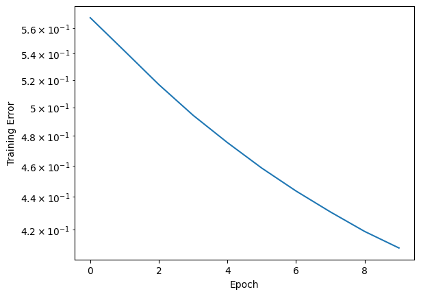

# Matrix Factorization
https://petamind.com/build-a-simple-recommender-system-with-matrix-factorization/


```python
import matplotlib.pyplot as plt
import numpy as np
import pandas as pd
import tensorflow as tf
import tqdm.autonotebook as tqdm
from sklearn.model_selection import train_test_split
from tensorflow import keras

from movie_helper.movie import load_movies
from movie_helper.rating import load_ratings
```


```python
ratings = load_ratings()
ratings.head()
```


<div>
<style scoped>
    .dataframe tbody tr th:only-of-type {
        vertical-align: middle;
    }

    .dataframe tbody tr th {
        vertical-align: top;
    }

    .dataframe thead th {
        text-align: right;
    }
</style>
<table border="1" class="dataframe">
  <thead>
    <tr style="text-align: right;">
      <th></th>
      <th>user_id</th>
      <th>item_id</th>
      <th>rating</th>
      <th>timestamp</th>
    </tr>
  </thead>
  <tbody>
    <tr>
      <th>0</th>
      <td>196</td>
      <td>242</td>
      <td>3</td>
      <td>881250949</td>
    </tr>
    <tr>
      <th>1</th>
      <td>186</td>
      <td>302</td>
      <td>3</td>
      <td>891717742</td>
    </tr>
    <tr>
      <th>2</th>
      <td>22</td>
      <td>377</td>
      <td>1</td>
      <td>878887116</td>
    </tr>
    <tr>
      <th>3</th>
      <td>244</td>
      <td>51</td>
      <td>2</td>
      <td>880606923</td>
    </tr>
    <tr>
      <th>4</th>
      <td>166</td>
      <td>346</td>
      <td>1</td>
      <td>886397596</td>
    </tr>
  </tbody>
</table>
</div>


```python
# ID starts from 0
ratings.user_id = ratings.user_id.astype("category").cat.codes.values
ratings.item_id = ratings.item_id.astype("category").cat.codes.values
```


```python
ratings.head()
```


<div>
<style scoped>
    .dataframe tbody tr th:only-of-type {
        vertical-align: middle;
    }

    .dataframe tbody tr th {
        vertical-align: top;
    }

    .dataframe thead th {
        text-align: right;
    }
</style>
<table border="1" class="dataframe">
  <thead>
    <tr style="text-align: right;">
      <th></th>
      <th>user_id</th>
      <th>item_id</th>
      <th>rating</th>
      <th>timestamp</th>
    </tr>
  </thead>
  <tbody>
    <tr>
      <th>0</th>
      <td>195</td>
      <td>241</td>
      <td>3</td>
      <td>881250949</td>
    </tr>
    <tr>
      <th>1</th>
      <td>185</td>
      <td>301</td>
      <td>3</td>
      <td>891717742</td>
    </tr>
    <tr>
      <th>2</th>
      <td>21</td>
      <td>376</td>
      <td>1</td>
      <td>878887116</td>
    </tr>
    <tr>
      <th>3</th>
      <td>243</td>
      <td>50</td>
      <td>2</td>
      <td>880606923</td>
    </tr>
    <tr>
      <th>4</th>
      <td>165</td>
      <td>345</td>
      <td>1</td>
      <td>886397596</td>
    </tr>
  </tbody>
</table>
</div>


```python
train, test = train_test_split(ratings, test_size=0.2)
train.shape, test.shape
```


    ((80000, 4), (20000, 4))


```python
n_users, n_movies = len(ratings.user_id.unique()), len(ratings.item_id.unique())
n_latent_factors = 20
```


```python
movie_input = keras.layers.Input(shape=[1], name="Item")
movie_embedding = keras.layers.Embedding(
    n_movies + 1, n_latent_factors, name="Movie-Embedding"
)(movie_input)
movie_vec = keras.layers.Flatten(name="FlattenMovies")(movie_embedding)

user_input = keras.layers.Input(shape=[1], name="User")
user_vec = keras.layers.Flatten(name="FlattenUsers")(
    keras.layers.Embedding(n_users + 1, n_latent_factors, name="User-Embedding")(
        user_input
    )
)
prod = keras.layers.dot([movie_vec, user_vec], axes=1, name="DotProduct")
model = keras.Model([user_input, movie_input], prod)
```


```python
model.compile(optimizer="adam", loss="mean_squared_error", metrics=["mae", "mse"])
```


```python
model.summary()
```

    Model: "model"
    __________________________________________________________________________________________________
     Layer (type)                Output Shape                 Param #   Connected to                  
    ==================================================================================================
     Item (InputLayer)           [(None, 1)]                  0         []                            
                                                                                                      
     User (InputLayer)           [(None, 1)]                  0         []                            
                                                                                                      
     Movie-Embedding (Embedding  (None, 1, 20)                33660     ['Item[0][0]']                
     )                                                                                                
                                                                                                      
     User-Embedding (Embedding)  (None, 1, 20)                18880     ['User[0][0]']                
                                                                                                      
     FlattenMovies (Flatten)     (None, 20)                   0         ['Movie-Embedding[0][0]']     
                                                                                                      
     FlattenUsers (Flatten)      (None, 20)                   0         ['User-Embedding[0][0]']      
                                                                                                      
     DotProduct (Dot)            (None, 1)                    0         ['FlattenMovies[0][0]',       
                                                                         'FlattenUsers[0][0]']        
                                                                                                      
    ==================================================================================================
    Total params: 52540 (205.23 KB)
    Trainable params: 52540 (205.23 KB)
    Non-trainable params: 0 (0.00 Byte)
    __________________________________________________________________________________________________


```python
tf.keras.utils.plot_model(model, to_file="model.png")
```

    You must install pydot (`pip install pydot`) and install graphviz (see instructions at https://graphviz.gitlab.io/download/) for plot_model to work.


```python
history = model.fit([train.user_id, train.item_id], train.rating, epochs=10, verbose=1)
```

    Epoch 1/10
    2500/2500 [==============================] - 5s 2ms/step - loss: 0.5683 - mae: 0.5886 - mse: 0.5683
    Epoch 2/10
    2500/2500 [==============================] - 4s 2ms/step - loss: 0.5419 - mae: 0.5736 - mse: 0.5419
    Epoch 3/10
    2500/2500 [==============================] - 5s 2ms/step - loss: 0.5166 - mae: 0.5598 - mse: 0.5166
    Epoch 4/10
    2500/2500 [==============================] - 4s 2ms/step - loss: 0.4944 - mae: 0.5467 - mse: 0.4944
    Epoch 5/10
    2500/2500 [==============================] - 5s 2ms/step - loss: 0.4755 - mae: 0.5358 - mse: 0.4755
    Epoch 6/10
    2500/2500 [==============================] - 5s 2ms/step - loss: 0.4585 - mae: 0.5247 - mse: 0.4585
    Epoch 7/10
    2500/2500 [==============================] - 5s 2ms/step - loss: 0.4437 - mae: 0.5162 - mse: 0.4437
    Epoch 8/10
    2500/2500 [==============================] - 4s 2ms/step - loss: 0.4307 - mae: 0.5079 - mse: 0.4307
    Epoch 9/10
    2500/2500 [==============================] - 7s 3ms/step - loss: 0.4188 - mae: 0.5000 - mse: 0.4188
    Epoch 10/10
    2500/2500 [==============================] - 5s 2ms/step - loss: 0.4090 - mae: 0.4938 - mse: 0.4090


```python
pd.Series(history.history["loss"]).plot(logy=True)
plt.xlabel("Epoch")
plt.ylabel("Training Error")
```


    Text(0, 0.5, 'Training Error')


    

    


```python
results = model.evaluate((test.user_id, test.item_id), test.rating, batch_size=32)
```

    625/625 [==============================] - 1s 2ms/step - loss: 1.0233 - mae: 0.7877 - mse: 1.0233


```python
movie_embedding_learnt = model.get_layer(name="Movie-Embedding").get_weights()[0]
pd.DataFrame(movie_embedding_learnt).describe()
```


<div>
<style scoped>
    .dataframe tbody tr th:only-of-type {
        vertical-align: middle;
    }

    .dataframe tbody tr th {
        vertical-align: top;
    }

    .dataframe thead th {
        text-align: right;
    }
</style>
<table border="1" class="dataframe">
  <thead>
    <tr style="text-align: right;">
      <th></th>
      <th>0</th>
      <th>1</th>
      <th>2</th>
      <th>3</th>
      <th>4</th>
      <th>5</th>
      <th>6</th>
      <th>7</th>
      <th>8</th>
      <th>9</th>
      <th>10</th>
      <th>11</th>
      <th>12</th>
      <th>13</th>
      <th>14</th>
      <th>15</th>
      <th>16</th>
      <th>17</th>
      <th>18</th>
      <th>19</th>
    </tr>
  </thead>
  <tbody>
    <tr>
      <th>count</th>
      <td>1683.000000</td>
      <td>1683.000000</td>
      <td>1683.000000</td>
      <td>1683.000000</td>
      <td>1683.000000</td>
      <td>1683.000000</td>
      <td>1683.000000</td>
      <td>1683.000000</td>
      <td>1683.000000</td>
      <td>1683.000000</td>
      <td>1683.000000</td>
      <td>1683.000000</td>
      <td>1683.000000</td>
      <td>1683.000000</td>
      <td>1683.000000</td>
      <td>1683.000000</td>
      <td>1683.000000</td>
      <td>1683.000000</td>
      <td>1683.000000</td>
      <td>1683.000000</td>
    </tr>
    <tr>
      <th>mean</th>
      <td>0.355577</td>
      <td>-0.374898</td>
      <td>0.381258</td>
      <td>0.355945</td>
      <td>-0.345298</td>
      <td>0.357012</td>
      <td>-0.360232</td>
      <td>0.338207</td>
      <td>0.349363</td>
      <td>-0.364580</td>
      <td>-0.350724</td>
      <td>-0.354714</td>
      <td>-0.359871</td>
      <td>-0.364750</td>
      <td>-0.364418</td>
      <td>-0.335376</td>
      <td>0.341497</td>
      <td>0.364001</td>
      <td>0.340281</td>
      <td>0.344957</td>
    </tr>
    <tr>
      <th>std</th>
      <td>0.265441</td>
      <td>0.331087</td>
      <td>0.291934</td>
      <td>0.364911</td>
      <td>0.401071</td>
      <td>0.249204</td>
      <td>0.270044</td>
      <td>0.323960</td>
      <td>0.270068</td>
      <td>0.326940</td>
      <td>0.297491</td>
      <td>0.264193</td>
      <td>0.276770</td>
      <td>0.263696</td>
      <td>0.294172</td>
      <td>0.352381</td>
      <td>0.318108</td>
      <td>0.283627</td>
      <td>0.319159</td>
      <td>0.269212</td>
    </tr>
    <tr>
      <th>min</th>
      <td>-0.579942</td>
      <td>-1.479557</td>
      <td>-0.741593</td>
      <td>-1.173248</td>
      <td>-1.943867</td>
      <td>-0.408374</td>
      <td>-1.392387</td>
      <td>-0.919161</td>
      <td>-0.611975</td>
      <td>-1.511046</td>
      <td>-1.389072</td>
      <td>-1.390916</td>
      <td>-1.270551</td>
      <td>-1.373782</td>
      <td>-1.571352</td>
      <td>-1.610240</td>
      <td>-1.012083</td>
      <td>-0.786071</td>
      <td>-1.002625</td>
      <td>-0.496500</td>
    </tr>
    <tr>
      <th>25%</th>
      <td>0.189836</td>
      <td>-0.586884</td>
      <td>0.185220</td>
      <td>0.130138</td>
      <td>-0.604551</td>
      <td>0.197687</td>
      <td>-0.514152</td>
      <td>0.118702</td>
      <td>0.171184</td>
      <td>-0.570390</td>
      <td>-0.533945</td>
      <td>-0.515660</td>
      <td>-0.532186</td>
      <td>-0.531131</td>
      <td>-0.542586</td>
      <td>-0.571869</td>
      <td>0.149299</td>
      <td>0.176063</td>
      <td>0.136076</td>
      <td>0.176061</td>
    </tr>
    <tr>
      <th>50%</th>
      <td>0.340875</td>
      <td>-0.373140</td>
      <td>0.384412</td>
      <td>0.364112</td>
      <td>-0.355398</td>
      <td>0.352920</td>
      <td>-0.345089</td>
      <td>0.337416</td>
      <td>0.336925</td>
      <td>-0.365527</td>
      <td>-0.349720</td>
      <td>-0.351643</td>
      <td>-0.365525</td>
      <td>-0.363273</td>
      <td>-0.365305</td>
      <td>-0.345382</td>
      <td>0.359508</td>
      <td>0.359328</td>
      <td>0.351862</td>
      <td>0.342327</td>
    </tr>
    <tr>
      <th>75%</th>
      <td>0.508361</td>
      <td>-0.158895</td>
      <td>0.561113</td>
      <td>0.600259</td>
      <td>-0.076201</td>
      <td>0.508674</td>
      <td>-0.183169</td>
      <td>0.558979</td>
      <td>0.510118</td>
      <td>-0.158903</td>
      <td>-0.161870</td>
      <td>-0.184549</td>
      <td>-0.177758</td>
      <td>-0.187008</td>
      <td>-0.176394</td>
      <td>-0.104160</td>
      <td>0.536861</td>
      <td>0.545357</td>
      <td>0.535451</td>
      <td>0.503306</td>
    </tr>
    <tr>
      <th>max</th>
      <td>1.464826</td>
      <td>0.916364</td>
      <td>1.366298</td>
      <td>1.603170</td>
      <td>0.929988</td>
      <td>1.201510</td>
      <td>0.567339</td>
      <td>1.497217</td>
      <td>1.440023</td>
      <td>1.107196</td>
      <td>0.854582</td>
      <td>0.507454</td>
      <td>0.499430</td>
      <td>0.586958</td>
      <td>0.899766</td>
      <td>0.721929</td>
      <td>1.765647</td>
      <td>1.249691</td>
      <td>1.683770</td>
      <td>1.469857</td>
    </tr>
  </tbody>
</table>
</div>


```python
user_embedding_learnt = model.get_layer(name="User-Embedding").get_weights()[0]
```


```python
def recommend(user_id, number_of_movies=5):
    movies = user_embedding_learnt[user_id] @ movie_embedding_learnt.T
    mids = np.argpartition(movies, -number_of_movies)[-number_of_movies:]
    return mids
```


```python
user_id = 10
recommend(user_id=user_id, number_of_movies=10)
```


    array([ 301,  922,  935, 1449,  458,  271, 1393, 1466, 1499, 1367])


```python
movies = load_movies()


def get_movies_by_user_ids(user_ids):
    return movies[movies.movie_id.isin(user_ids)]
```


```python
get_movies_by_user_ids(recommend(user_id=user_id, number_of_movies=10))
```


<div>
<style scoped>
    .dataframe tbody tr th:only-of-type {
        vertical-align: middle;
    }

    .dataframe tbody tr th {
        vertical-align: top;
    }

    .dataframe thead th {
        text-align: right;
    }
</style>
<table border="1" class="dataframe">
  <thead>
    <tr style="text-align: right;">
      <th></th>
      <th>movie_id</th>
      <th>movie_title</th>
      <th>release_date</th>
      <th>video_release_date</th>
      <th>imdb_url</th>
      <th>unknown</th>
      <th>Action</th>
      <th>Adventure</th>
      <th>Animation</th>
      <th>Children's</th>
      <th>...</th>
      <th>Fantasy</th>
      <th>Film-Noir</th>
      <th>Horror</th>
      <th>Musical</th>
      <th>Mystery</th>
      <th>Romance</th>
      <th>Sci-Fi</th>
      <th>Thriller</th>
      <th>War</th>
      <th>Western</th>
    </tr>
  </thead>
  <tbody>
    <tr>
      <th>270</th>
      <td>271</td>
      <td>Starship Troopers (1997)</td>
      <td>01-Jan-1997</td>
      <td>NaN</td>
      <td>http://us.imdb.com/M/title-exact?Starship+Troo...</td>
      <td>0</td>
      <td>1</td>
      <td>1</td>
      <td>0</td>
      <td>0</td>
      <td>...</td>
      <td>0</td>
      <td>0</td>
      <td>0</td>
      <td>0</td>
      <td>0</td>
      <td>0</td>
      <td>1</td>
      <td>0</td>
      <td>1</td>
      <td>0</td>
    </tr>
    <tr>
      <th>300</th>
      <td>301</td>
      <td>In &amp; Out (1997)</td>
      <td>19-Sep-1997</td>
      <td>NaN</td>
      <td>http://us.imdb.com/Title?In+%26+Out+(1997)</td>
      <td>0</td>
      <td>0</td>
      <td>0</td>
      <td>0</td>
      <td>0</td>
      <td>...</td>
      <td>0</td>
      <td>0</td>
      <td>0</td>
      <td>0</td>
      <td>0</td>
      <td>0</td>
      <td>0</td>
      <td>0</td>
      <td>0</td>
      <td>0</td>
    </tr>
    <tr>
      <th>457</th>
      <td>458</td>
      <td>Nixon (1995)</td>
      <td>01-Jan-1995</td>
      <td>NaN</td>
      <td>http://us.imdb.com/M/title-exact?Nixon%20(1995)</td>
      <td>0</td>
      <td>0</td>
      <td>0</td>
      <td>0</td>
      <td>0</td>
      <td>...</td>
      <td>0</td>
      <td>0</td>
      <td>0</td>
      <td>0</td>
      <td>0</td>
      <td>0</td>
      <td>0</td>
      <td>0</td>
      <td>0</td>
      <td>0</td>
    </tr>
    <tr>
      <th>921</th>
      <td>922</td>
      <td>Dead Man (1995)</td>
      <td>10-May-1996</td>
      <td>NaN</td>
      <td>http://us.imdb.com/M/title-exact?Dead%20Man%20...</td>
      <td>0</td>
      <td>0</td>
      <td>0</td>
      <td>0</td>
      <td>0</td>
      <td>...</td>
      <td>0</td>
      <td>0</td>
      <td>0</td>
      <td>0</td>
      <td>0</td>
      <td>0</td>
      <td>0</td>
      <td>0</td>
      <td>0</td>
      <td>1</td>
    </tr>
    <tr>
      <th>934</th>
      <td>935</td>
      <td>Paradise Road (1997)</td>
      <td>18-Apr-1997</td>
      <td>NaN</td>
      <td>http://us.imdb.com/M/title-exact?Paradise%20Ro...</td>
      <td>0</td>
      <td>0</td>
      <td>0</td>
      <td>0</td>
      <td>0</td>
      <td>...</td>
      <td>0</td>
      <td>0</td>
      <td>0</td>
      <td>0</td>
      <td>0</td>
      <td>0</td>
      <td>0</td>
      <td>0</td>
      <td>1</td>
      <td>0</td>
    </tr>
    <tr>
      <th>1366</th>
      <td>1367</td>
      <td>Faust (1994)</td>
      <td>01-Jan-1994</td>
      <td>NaN</td>
      <td>http://us.imdb.com/M/title-exact?Faust%20%2819...</td>
      <td>0</td>
      <td>0</td>
      <td>0</td>
      <td>1</td>
      <td>0</td>
      <td>...</td>
      <td>0</td>
      <td>0</td>
      <td>0</td>
      <td>0</td>
      <td>0</td>
      <td>0</td>
      <td>0</td>
      <td>0</td>
      <td>0</td>
      <td>0</td>
    </tr>
    <tr>
      <th>1392</th>
      <td>1393</td>
      <td>Stag (1997)</td>
      <td>01-Jan-1997</td>
      <td>NaN</td>
      <td>http://us.imdb.com/M/title-exact?Stag+(1997)</td>
      <td>0</td>
      <td>1</td>
      <td>0</td>
      <td>0</td>
      <td>0</td>
      <td>...</td>
      <td>0</td>
      <td>0</td>
      <td>0</td>
      <td>0</td>
      <td>0</td>
      <td>0</td>
      <td>0</td>
      <td>1</td>
      <td>0</td>
      <td>0</td>
    </tr>
    <tr>
      <th>1448</th>
      <td>1449</td>
      <td>Pather Panchali (1955)</td>
      <td>22-Mar-1996</td>
      <td>NaN</td>
      <td>http://us.imdb.com/M/title-exact?Pather%20Panc...</td>
      <td>0</td>
      <td>0</td>
      <td>0</td>
      <td>0</td>
      <td>0</td>
      <td>...</td>
      <td>0</td>
      <td>0</td>
      <td>0</td>
      <td>0</td>
      <td>0</td>
      <td>0</td>
      <td>0</td>
      <td>0</td>
      <td>0</td>
      <td>0</td>
    </tr>
    <tr>
      <th>1465</th>
      <td>1466</td>
      <td>Margaret's Museum (1995)</td>
      <td>01-Jan-1995</td>
      <td>NaN</td>
      <td>http://us.imdb.com/M/title-exact?Margaret's%20...</td>
      <td>0</td>
      <td>0</td>
      <td>0</td>
      <td>0</td>
      <td>0</td>
      <td>...</td>
      <td>0</td>
      <td>0</td>
      <td>0</td>
      <td>0</td>
      <td>0</td>
      <td>0</td>
      <td>0</td>
      <td>0</td>
      <td>0</td>
      <td>0</td>
    </tr>
    <tr>
      <th>1498</th>
      <td>1499</td>
      <td>Grosse Fatigue (1994)</td>
      <td>01-Jan-1994</td>
      <td>NaN</td>
      <td>http://us.imdb.com/M/title-exact?Grosse%20fati...</td>
      <td>0</td>
      <td>0</td>
      <td>0</td>
      <td>0</td>
      <td>0</td>
      <td>...</td>
      <td>0</td>
      <td>0</td>
      <td>0</td>
      <td>0</td>
      <td>0</td>
      <td>0</td>
      <td>0</td>
      <td>0</td>
      <td>0</td>
      <td>0</td>
    </tr>
  </tbody>
</table>
<p>10 rows × 24 columns</p>
</div>


```python
get_movies_by_user_ids(
    ratings.query(f"user_id == {user_id}")
    .sort_values("rating", ascending=False)
    .head(10)
    .item_id.values
)
```


<div>
<style scoped>
    .dataframe tbody tr th:only-of-type {
        vertical-align: middle;
    }

    .dataframe tbody tr th {
        vertical-align: top;
    }

    .dataframe thead th {
        text-align: right;
    }
</style>
<table border="1" class="dataframe">
  <thead>
    <tr style="text-align: right;">
      <th></th>
      <th>movie_id</th>
      <th>movie_title</th>
      <th>release_date</th>
      <th>video_release_date</th>
      <th>imdb_url</th>
      <th>unknown</th>
      <th>Action</th>
      <th>Adventure</th>
      <th>Animation</th>
      <th>Children's</th>
      <th>...</th>
      <th>Fantasy</th>
      <th>Film-Noir</th>
      <th>Horror</th>
      <th>Musical</th>
      <th>Mystery</th>
      <th>Romance</th>
      <th>Sci-Fi</th>
      <th>Thriller</th>
      <th>War</th>
      <th>Western</th>
    </tr>
  </thead>
  <tbody>
    <tr>
      <th>26</th>
      <td>27</td>
      <td>Bad Boys (1995)</td>
      <td>01-Jan-1995</td>
      <td>NaN</td>
      <td>http://us.imdb.com/M/title-exact?Bad%20Boys%20...</td>
      <td>0</td>
      <td>1</td>
      <td>0</td>
      <td>0</td>
      <td>0</td>
      <td>...</td>
      <td>0</td>
      <td>0</td>
      <td>0</td>
      <td>0</td>
      <td>0</td>
      <td>0</td>
      <td>0</td>
      <td>0</td>
      <td>0</td>
      <td>0</td>
    </tr>
    <tr>
      <th>194</th>
      <td>195</td>
      <td>Terminator, The (1984)</td>
      <td>01-Jan-1984</td>
      <td>NaN</td>
      <td>http://us.imdb.com/M/title-exact?Terminator,%2...</td>
      <td>0</td>
      <td>1</td>
      <td>0</td>
      <td>0</td>
      <td>0</td>
      <td>...</td>
      <td>0</td>
      <td>0</td>
      <td>0</td>
      <td>0</td>
      <td>0</td>
      <td>0</td>
      <td>1</td>
      <td>1</td>
      <td>0</td>
      <td>0</td>
    </tr>
    <tr>
      <th>330</th>
      <td>331</td>
      <td>Edge, The (1997)</td>
      <td>26-Sep-1997</td>
      <td>NaN</td>
      <td>http://us.imdb.com/M/title-exact?Edge%2C+The+(...</td>
      <td>0</td>
      <td>0</td>
      <td>1</td>
      <td>0</td>
      <td>0</td>
      <td>...</td>
      <td>0</td>
      <td>0</td>
      <td>0</td>
      <td>0</td>
      <td>0</td>
      <td>0</td>
      <td>0</td>
      <td>1</td>
      <td>0</td>
      <td>0</td>
    </tr>
    <tr>
      <th>421</th>
      <td>422</td>
      <td>Aladdin and the King of Thieves (1996)</td>
      <td>01-Jan-1996</td>
      <td>NaN</td>
      <td>http://us.imdb.com/M/title-exact?Aladdin%20and...</td>
      <td>0</td>
      <td>0</td>
      <td>0</td>
      <td>1</td>
      <td>1</td>
      <td>...</td>
      <td>0</td>
      <td>0</td>
      <td>0</td>
      <td>0</td>
      <td>0</td>
      <td>0</td>
      <td>0</td>
      <td>0</td>
      <td>0</td>
      <td>0</td>
    </tr>
    <tr>
      <th>427</th>
      <td>428</td>
      <td>Harold and Maude (1971)</td>
      <td>01-Jan-1971</td>
      <td>NaN</td>
      <td>http://us.imdb.com/M/title-exact?Harold%20and%...</td>
      <td>0</td>
      <td>0</td>
      <td>0</td>
      <td>0</td>
      <td>0</td>
      <td>...</td>
      <td>0</td>
      <td>0</td>
      <td>0</td>
      <td>0</td>
      <td>0</td>
      <td>0</td>
      <td>0</td>
      <td>0</td>
      <td>0</td>
      <td>0</td>
    </tr>
    <tr>
      <th>657</th>
      <td>658</td>
      <td>Pump Up the Volume (1990)</td>
      <td>01-Jan-1990</td>
      <td>NaN</td>
      <td>http://us.imdb.com/M/title-exact?Pump%20Up%20t...</td>
      <td>0</td>
      <td>0</td>
      <td>0</td>
      <td>0</td>
      <td>0</td>
      <td>...</td>
      <td>0</td>
      <td>0</td>
      <td>0</td>
      <td>0</td>
      <td>0</td>
      <td>0</td>
      <td>0</td>
      <td>0</td>
      <td>0</td>
      <td>0</td>
    </tr>
    <tr>
      <th>705</th>
      <td>706</td>
      <td>Bad Moon (1996)</td>
      <td>01-Nov-1996</td>
      <td>NaN</td>
      <td>http://us.imdb.com/M/title-exact?Bad%20Moon%20...</td>
      <td>0</td>
      <td>0</td>
      <td>0</td>
      <td>0</td>
      <td>0</td>
      <td>...</td>
      <td>0</td>
      <td>0</td>
      <td>1</td>
      <td>0</td>
      <td>0</td>
      <td>0</td>
      <td>0</td>
      <td>0</td>
      <td>0</td>
      <td>0</td>
    </tr>
    <tr>
      <th>743</th>
      <td>744</td>
      <td>Michael Collins (1996)</td>
      <td>11-Oct-1996</td>
      <td>NaN</td>
      <td>http://us.imdb.com/M/title-exact?Michael%20Col...</td>
      <td>0</td>
      <td>0</td>
      <td>0</td>
      <td>0</td>
      <td>0</td>
      <td>...</td>
      <td>0</td>
      <td>0</td>
      <td>0</td>
      <td>0</td>
      <td>0</td>
      <td>0</td>
      <td>0</td>
      <td>0</td>
      <td>1</td>
      <td>0</td>
    </tr>
    <tr>
      <th>747</th>
      <td>748</td>
      <td>Saint, The (1997)</td>
      <td>14-Mar-1997</td>
      <td>NaN</td>
      <td>http://us.imdb.com/M/title-exact?Saint%2C%20Th...</td>
      <td>0</td>
      <td>1</td>
      <td>0</td>
      <td>0</td>
      <td>0</td>
      <td>...</td>
      <td>0</td>
      <td>0</td>
      <td>0</td>
      <td>0</td>
      <td>0</td>
      <td>1</td>
      <td>0</td>
      <td>1</td>
      <td>0</td>
      <td>0</td>
    </tr>
    <tr>
      <th>748</th>
      <td>749</td>
      <td>MatchMaker, The (1997)</td>
      <td>01-Jan-1997</td>
      <td>NaN</td>
      <td>http://us.imdb.com/M/title-exact?Matchmaker%2C...</td>
      <td>0</td>
      <td>0</td>
      <td>0</td>
      <td>0</td>
      <td>0</td>
      <td>...</td>
      <td>0</td>
      <td>0</td>
      <td>0</td>
      <td>0</td>
      <td>0</td>
      <td>1</td>
      <td>0</td>
      <td>0</td>
      <td>0</td>
      <td>0</td>
    </tr>
  </tbody>
</table>
<p>10 rows × 24 columns</p>
</div>


