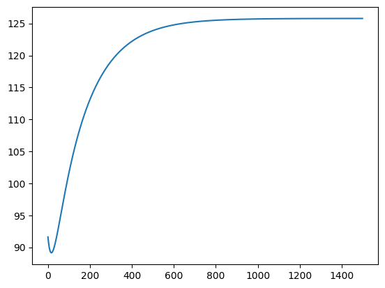
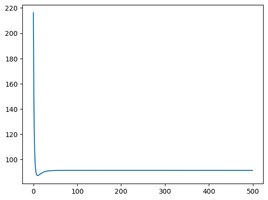

# Matrix Factorization with Bias

Similar to 09_matrix_factorization.py, but with user and item bias (TODO: Add reference on why this bias is needed).

## Reference:
- https://github.com/GabrielSandoval/matrix_factorization/blob/master/lib/mf.py
- https://d2l.ai/chapter_recommender-systems/mf.html
- https://medium.com/@maxbrenner-ai/matrix-factorization-for-collaborative-filtering-linear-to-non-linear-models-in-python-5cf54363a03c
- https://github.com/NicolasHug/Surprise/blob/master/surprise/prediction_algorithms/matrix_factorization.pyx
- https://everdark.github.io/k9/notebooks/ml/matrix_factorization/matrix_factorization.nb.html#3_neural_netork_representation

Consider the following matrix of ratings. The rows are the users, while the columns are the items, and the values are the rating 1-5.
In the first row, we see that user rated 5 for the item.

The average rating for this matrix is 2.8 stars (after rounding).


```python
import numpy as np

ratings = np.array(
    [[5, 3, 0, 1], [4, 0, 0, 1], [1, 1, 0, 5], [1, 0, 0, 4], [0, 1, 5, 4]], dtype=float
)
avg_rating = np.mean(ratings[ratings.nonzero()])
np.round(avg_rating, 1)
```


    2.8


We want to learn the bias of the user and the items. In the context of movie recommendation, the user bias can be a user that is picky about a user, and hence gives a lower rating (-0.5) than usual. However, the movie seems to have a of fans giving high rating (1.7).

The final rating after taking into consideration the initial average rating, the user bias and the item bias is:

```
final_rating = 2.8 - 0.5 + 1.7
             = 4.0
```


## Baseline Model

In the baseline model, we cover only the user and item biases.


```python
import matplotlib.pyplot as plt
import numpy as np
```


```python
# Assume we have some ratings matrix R
R = np.array(
    [[5, 3, 0, 1], [4, 0, 0, 1], [1, 1, 0, 5], [1, 0, 0, 4], [0, 1, 5, 4]],
    dtype=np.float32,
)

# Initialize user and item embedding matrices
num_users, num_items = R.shape

# Initialize user and item bias vectors
user_bias = np.zeros(num_users)
item_bias = np.zeros(num_items)

# Initialize average rating.
avg_rating = R[R.nonzero()].mean()

# Define the learning rate and regularization strength
lr = 0.01
reg_strength = 1e-5
losses = []
mask = R > 0
known_ratings = np.sum(mask)
tol = 1e-3

# Define the loss function
# NOTE: This is probably not the same as the evaluation function.
# We want to minimize this, by using the gradient.
# For errors however, we can just use anything, like MSE, SSE etc.
def sse(avg_rating, user_bias, item_bias):
    R_hat = avg_rating + user_bias[:, None] + item_bias[None, :]

    loss = np.square(R - R_hat)[mask].sum() + reg_strength * (
        np.square(user_bias).sum()
        + np.square(item_bias).sum()
        + np.square(U).sum()
        + np.square(V).sum()
    )
    return loss


def mse(avg_rating, user_bias, item_bias):
    R_hat = avg_rating + user_bias[:, None] + item_bias[None, :]
    return np.square(R - R_hat)[mask].sum() / known_ratings


T = 500
# Run the optimization
for t in range(T):
    for u, i in zip(*R.nonzero()):
        b_u = user_bias[u]
        b_i = item_bias[i]
        R_hat = avg_rating + b_u + b_i
        err = R[u, i] - R_hat

        # Update parameters
        user_bias[u] += lr * (err - reg_strength * b_u)
        item_bias[i] += lr * (err - reg_strength * b_i)
    loss = mse(avg_rating, user_bias, item_bias)
    losses.append(loss)
    if loss < tol:
        print(f"Terminating after {t} iterations, loss={loss}")
        break
```

    0.02230769157409668
    0.002084612427586555
    -0.01793623390515055
    0.012084614658355712
    -0.017633793466289144
    -0.018036231465920153
    -0.01753279045420453
    0.023019085569501364
    -0.017855869116868647
    0.012611761414457513
    -0.01753782664782399
    0.022483071594357584
    0.01225763038487244
    0.022258128244083776
    0.0023504067483800795
    -0.01812614213722135
    0.012155600643256617
    -0.017700296456240227
    -0.017895947061365793
    -0.017081490647269694
    0.02301804986823348
    -0.017790046562353258
    0.012542934746303618
    -0.01738716809329653
    0.022084703821739115
    0.011968155274682138
    0.02220602639873342
    0.002607285588364056
    -0.018310041511838723
    0.012224291897996231
    -0.01776072387169726
    -0.01776379515320986
    -0.016644603539060013
    0.023017370778018176
    -0.01772633959404631
    0.012480192409381854
    -0.017239581994849467
    0.021695722353845658
    0.011689961212186427
    0.022151591303529578
    0.002855565355652746
    -0.018488180861157427
    0.012290799374641167
    -0.017815410209955175
    -0.017639406202044104
    -0.01622165009219107
    0.023016969467119088
    -0.017664643943832884
    0.012423202227578305
    -0.01709498824882791
    0.021315856576004412
    0.011422586028002644
    0.022095017595224458
    0.0030955510806469234
    -0.018660796960493012
    0.012355228466730506
    -0.01786467323260429
    -0.017522426104403674
    -0.015812167454227442
    0.02301677399977028
    -0.01760486064855171
    0.012371648565255935
    -0.016953308704640516
    0.020944845126081125
    0.011165588049539979
    0.022036489750619753
    0.0033275368060025276
    -0.018828115164677223
    0.012417679262099196
    -0.017908814800732666
    -0.017412515583447453
    -0.015415708425264444
    0.02301671885946136
    -0.017546895806376757
    0.012325231504680128
    -0.016814467156789335
    0.020582435523909925
    0.010918545127104004
    0.021976182537378187
    0.003551805965251441
    -0.01899035000889642
    0.012478246785959355
    -0.01794812166711461
    -0.01730934960175719
    -0.015031840941129242
    0.023016744502612003
    -0.01749066034265651
    0.012283666065686965
    -0.016678389332568568
    0.020228383817750648
    0.010681053709088752
    0.021914261447396492
    0.0037686317502333834
    -0.019147705776084434
    0.012537021234494466
    -0.017982866227702416
    -0.017212616795596766
    -0.014660147571909475
    0.023016796940741466
    -0.017436069784960206
    0.012246681465324195
    -0.01654500287591481
    0.019882454246903675
    0.010452727963648541
    0.021850883113267498
    0.0039782774675121745
    -0.019300377032815973
    0.012594088199224932
    -0.018013307234607482
    -0.017122018929980748
    -0.014300225035508207
    0.02301682734935677
    -0.01738304404707731
    0.012214020415322888
    -0.016414237327851737
    0.019544418919660335
    0.010233198944386814
    0.021786195708354633
    0.0041809968839617555
    -0.019448549135529167
    0.012649528882406025
    -0.01803969047263362
    -0.017037270373909782
    -0.01395168372591578
    0.023016791701894333
    -0.017331507221714077
    0.012185438455378212
    -0.016286024103935367
    0.01921405750581193
    0.010022113797736343
    0.02172033933099653
    0.004377034561717745
    -0.01959239870879567
    0.01270342030372044
    -0.01806224940130975
    -0.01695809759514016
    -0.013614147255883184
    0.023016650427153913
    -0.017281387381630337
    0.01216070332033111
    -0.01616029646907211
    0.018891156942983076
    0.009819135009833864
    0.021653446373352696
    0.004566626182699062
    -0.019732094097253367
    0.012755835498527832
    -0.01808120576425959
    -0.016884238673865317
    -0.013287252013676604
    0.02301636808876079
    -0.017232616388959603
    0.012139594339449583
    -0.01603698951005007
    0.018575511156095022
    0.00962393969081388
    0.021585641875393812
    0.004749998862911281
    -0.019867795792719786
    0.012806843707933138
    -0.01809677016764368
    -0.016815442834698366
    -0.01297064673358958
    0.023015913085283703
    -0.017185129712456358
    0.012121901866108469
    -0.015916040106095257
    0.018266920789302397
    0.009436218894560698
    0.021517043864531796
    0.004927371456749351
    -0.019999656837913434
    0.012856510560933895
    -0.01810914262931197
    -0.016751469996356457
    -0.012663992079886792
    0.02301525736972135
    -0.01713886625241616
    0.012107426736261494
    -0.01579738689773711
    0.017965192949782462
    0.00925567697206561
    0.02144776368137597
    0.00509895485152196
    -0.020127823208125006
    0.01290489824890457
    -0.01811851310021445
    -0.016692090338460232
    -0.012366960243852554
    0.023014376187150205
    -0.017093768173016586
    0.012095979754188284
    -0.015680970254242862
    0.017670140962789405
    0.009082030956637984
    0.02137790629209191
    0.0052649522524232575
    -0.020252434172100108
    0.012952065692673083
    -0.018125061959531247
    -0.01663708388487439
    -0.012079234553616909
    0.023013247829401885
    -0.017049780741829775
    0.0120873812040831
    -0.01556673223985732
    0.017381584137417912
    0.008915009979314572
    0.021307570587830022
    0.005425559458180239
    -0.02037362263332048
    0.012998068702441263
    -0.018128960484903114
    -0.0165862401030284
    -0.01180050909643294
    0.023011853405708136
    -0.01700685217626096
    0.012081460386130935
    -0.015454616579063283
    0.017099347542550047
    0.008754354712902016
    0.02123684967168009
    0.005580965127605834
    -0.020491515452799734
    0.013042960130797275
    -0.018130371299066774
    -0.016539357518669945
    -0.011530488353080492
    0.02301017662831782
    -0.016964933496671133
    0.01207805517579128
    -0.015344568621058078
    0.016823261792487602
    0.008599816843172453
    0.021165831133597705
    0.0057313510372882515
    -0.020606233754443842
    0.01308679001906352
    -0.018129448794128315
    -0.01649624334551704
    -0.011268886844073686
    0.023008203612151782
    -0.016923978385946406
    0.012077011605079947
    -0.015236535303623655
    0.01655316284179859
    0.0084511585658127
    0.02109459731373758
    0.0058768923306476185
    -0.02071789321396425
    0.01312960573721921
    -0.018126339534639747
    -0.016456713129288585
    -0.011015428787352517
    0.023005922687619598
    -0.016883943055281063
    0.012078183464705534
    -0.015130465116550891
    0.016288891788931642
    0.00830815210780314
    0.02102322555461752
    0.00601775775858998
    -0.020826604332273315
    0.013171452117631712
    -0.018121182640580595
    -0.016420590405606773
    -0.01076984776714211
    0.02300332422577632
    -0.01684478611594628
    0.012081431925979436
    -0.01502630806476322
    0.016030294688175586
    0.008170579271974015
    0.020951788442525876
    0.006154109911987925
    -0.02093247269423702
    0.013212371582825653
    -0.01811411015128601
    -0.01638770637127863
    -0.01053188641366726
    0.02300040047504827
    -0.016806468456821586
    0.012086625181477144
    -0.01492401563127064
    0.015777222369563915
    0.008038231003554186
    0.02088035403857389
    0.006286105446215191
    -0.02103559921360841
    0.013252404267513512
    -0.018105247371306556
    -0.016357899568477653
    -0.010301296093413972
    0.022997145408804757
    -0.016768953127471307
    0.012093638103483977
    -0.014823540740071875
    0.01552953026634468
    0.007910906977591307
    0.02080898609978326
    0.006413895297960628
    -0.021136080364917036
    0.013291588135105878
    -0.018094713199131106
    -0.016331015581360207
    -0.010077836609634565
    0.022993554583097053
    -0.01673220522655382
    0.012102351919310712
    -0.01472483771911045
    0.01528707824965644
    0.0077884152061820375
    0.02073774429058772
    0.006537624894544314
    -0.021234008403044326
    0.013329959088913932
    -0.018082620439654345
    -0.016306906744665048
    -0.009861275912797712
    0.022989625003928205
    -0.01669619179535684
    0.012112653902613787
    -0.014627862263379383
    0.015049730470069507
    0.0076705716645080945
    0.020666684385116416
    0.006657434355955727
    -0.02132947157117207
    0.013367551078251048
    -0.01806907610122249
    -0.01628543186385756
    -0.009651389820690222
    0.022985355003456383
    -0.016660881716257656
    0.01212443707990147
    -0.014532571398258892
    0.01481735520566932
    0.007557199934727131
    0.020595858460615783
    0.006773458689830817
    -0.021422554297751414
    0.0134043961996346
    -0.018054181678046354
    -0.016266455946393896
    -0.009447961747882545
    0.022980744124571326
    -0.016626245615912822
    0.012137599951450997
    -0.014438923443162196
    0.014589824716375863
    0.007448130866818045
    0.020525315082355236
    0.006885827979581161
    -0.02151333738310198
    0.013440524793283304
    -0.018038033418728294
    -0.016249849943693172
    -0.009250782444276035
    0.022975793013318226
    -0.016592255772987553
    0.01215204622590348
    -0.014346877975555856
    0.014367015104208423
    0.007343202255528277
    0.02045509948035151
    0.006994667565884974
    -0.0216018981762154
    0.01347596553509973
    -0.01802072258161004
    -0.01623549050341879
    -0.00905964974245539
    0.022970503318675606
    -0.016558886030240805
    0.012167684567842044
    -0.014256395795413197
    0.014148806179220133
    0.00724225853261538
    0.020385253718235387
    0.007100098221745614
    -0.021688310742304515
    0.013510745524321448
    -0.01800233567761034
    -0.016223259731682853
    -0.008874368313575918
    0.02296487759922432
    -0.016526111710787553
    0.012184428357695983
    -0.01416743889015219
    0.013935081330840883
    0.007145150473617984
    0.0203158168545741
    0.007202236321319443
    -0.021772646021607996
    0.013544890367019119
    -0.017982954701186233
    -0.016213044964799944
    -0.00869474943152124
    0.022958919236273242
    -0.016493909538365565
    0.012202195463348262
    -0.014079970400102294
    0.013725727404380286
    0.007051734918431522
    0.02024682509695224
    0.007301194002710518
    -0.02185497197993107
    0.013578424255613458
    -0.017962657350017654
    -0.01620473855022887
    -0.008520610745072906
    0.022952632353034016
    -0.016462257561439483
    0.012220908022856834
    -0.013993954584539088
    0.01352063458245531
    0.0069618745050018215
    0.02017831194910372
    0.007397079324925518
    -0.021935353751375265
    0.013611370044577966
    -0.01794151723398409
    -0.016198237636353054
    -0.008351776057839965
    0.022946021739462447
    -0.01643113508098066
    0.01224049223773104
    -0.013909356788319647
    0.013319696271118668
    0.006875437415486012
    0.020110308351377375
    0.007489996419177774
    -0.022013853773684196
    0.013643749322488186
    -0.017919604073971238
    -0.016193443970761806
    -0.008188075115702173
    0.02293909278240743
    -0.01640052258176641
    0.012260878176234115
    -0.013826143409146676
    0.013122808990475856
    0.006792297134263728
    0.020042842814808975
    0.0075800456347250265
    -0.02209053191660801
    0.013675582480573177
    -0.017896983891018015
    -0.01619026370670634
    -0.00802934340152715
    0.022931851400730747
    -0.016370401667048087
    0.012281999586210169
    -0.013744281865484884
    0.012929872269588789
    0.0067123322172140485
    0.019975941549062674
    0.007667323679420936
    -0.022165445603666196
    0.0137068887779192
    -0.017873719186287187
    -0.016188607217415548
    -0.007875421936927609
    0.022924303985081426
    -0.016340754996442348
    0.012303793716960418
    -0.013663740565148755
    0.012740788545474595
    0.006635426071703651
    0.019909628584495815
    0.007751923755155946
    -0.022238649927666807
    0.013737686403470468
    -0.01784986911231765
    -0.016188388917967443
    -0.0077261570908310285
    0.022916457342028296
    -0.016311566226905272
    0.012326201149718304
    -0.013584488874577125
    0.012555463066017278
    0.006561466746760636
    0.019843925888591567
    0.007833935688358603
    -0.022310197760319853
    0.013767992534966505
    -0.017825489635992686
    -0.016189527094422743
    -0.007581400394640328
    0.022908318642272045
    -0.01628281995665421
    0.012349165636296313
    -0.01350649708880658
    0.012373803796619173
    0.006490346732935375
    0.0197788534769952
    0.007913446055723949
    -0.02238013985626355
    0.013797823394950615
    -0.017800633693635784
    -0.0161919437399377
    -0.007441008363769815
    0.022899895372675817
    -0.016254501671906913
    0.012372633945499657
    -0.013429736402152349
    0.012195721330427598
    0.006421962771375579
    0.019714429519381006
    0.007990538305331047
    -0.022448524951804077
    0.013827194303979003
    -0.017775351338624314
    -0.016195564397582924
    -0.007304842325347048
    0.02289119529186903
    -0.01622659769631264
    0.012396555716922796
    -0.013354178879602831
    0.012021128801980219
    0.006356215671666973
    0.019650670440368504
    0.00806529287330731
    -0.022515399858652516
    0.01385611973115511
    -0.017749689881891302
    -0.016200318009605166
    -0.007172768251876752
    0.02288222638919444
    -0.016199095142954523
    0.012420883321764662
    -0.013279797428931046
    0.011849941804120159
    0.0062930101380139596
    0.019587591015698225
    0.00813778729619292
    -0.022580809552926885
    0.013884613342109256
    -0.017723694025666262
    -0.01620613677287826
    -0.007044656600669056
    0.02287299684678258
    -0.01617198186880707
    0.01244557173031707
    -0.01320656577352419
    0.01168207830803941
    0.0062322546033563965
    0.019525204463869746
    0.008208096319154094
    -0.02264479725967194
    0.013912688044538685
    -0.017697405990788163
    -0.016212956000298737
    -0.006920382158839804
    0.022863515004550965
    -0.016145246431537207
    0.012470578385798617
    -0.013134458425930298
    0.011517458586315605
    0.006173861071039283
    0.019463522533436434
    0.00827629200018982
    -0.022707404533135463
    0.013940356031419007
    -0.017670865637906458
    -0.016220713987890642
    -0.0067998238936964476
    0.022853789327937916
    -0.01611887804854175
    0.012495863084223074
    -0.01306345066211931
    0.011356005138814063
    0.0061177449636713645
    0.019402555586144378
    0.008342443810472227
    -0.022768671333026368
    0.013967628821993433
    -0.0176441105828699
    -0.01622935188739267
    -0.006682864808328533
    0.022843828378192873
    -0.016092866558118125
    0.012521387860007152
    -0.01299351849645397
    0.011197642621332875
    0.006063824978827462
    0.019342312676095288
    0.008406618730956729
    -0.022828636096967468
    0.013994517300642068
    -0.017617176306587816
    -0.016238813584109196
    -0.006569391802227207
    0.022833640785055464
    -0.016067202382669673
    0.012547116877037568
    -0.012924638657364687
    0.011042297776874863
    0.006012022951266474
    0.019282801625106472
    0.00846888134539379
    -0.02288733580934389
    0.014021031753729343
    -0.017590096259633578
    -0.01624904557981497
    -0.006459295536763486
    0.0228232352216667
    -0.016041876493850468
    0.012573016324931477
    -0.012856788563721133
    0.010889899369435652
    0.005962263721353776
    0.019224029094433954
    0.008529293929870164
    -0.022944806066736986
    0.014047181904523831
    -0.017562901961846886
    -0.01625999688051106
    -0.006352470305360232
    0.022812620381564667
    -0.01601688037955875
    0.012599054320237849
    -0.012789946301892258
    0.01074037812020234
    0.00591447500939218
    0.01916600065301832
    0.008587916539003503
    -0.02300108114012329
    0.01407297694628072
    -0.017535623097177974
    -0.016271618888837262
    -0.006248813908197932
    0.022801804957626678
    -0.01599220601269173
    0.012625200812340164
    -0.0127240906034852
    0.010593666646062313
    0.00586858729558065
    0.019108720842406515
    0.008644807088910285
    -0.023056194034007885
    0.014098425573573473
    -0.017508287604004965
    -0.016283865300953687
    -0.006148227531299272
    0.022790797622828093
    -0.015967845821577932
    0.012651427493832692
    -0.012659200823753
    0.010449699400326402
    0.005824533705333904
    0.01905219323849669
    0.00870002143706311
    -0.02311017654265247
    0.014123536011957781
    -0.01748092176114372
    -0.01629669200771126
    -0.00605061562984243
    0.022779607012696296
    -0.015943792662007156
    0.012677707715154298
    -0.012595256920659997
    0.010308412615575021
    0.005782249899709342
    0.01899642051024714
    0.008753613459149875
    -0.023163059303549574
    0.014148316046047205
    -0.017453550269758616
    -0.016310056999937726
    -0.0059558858155577925
    0.022768241709345684
    -0.015920039790781076
    0.012704016403274287
    -0.012532239434593263
    0.01016974424854024
    0.005741673970700448
    0.01894140447548491
    0.008805635123043432
    -0.023214871848286113
    0.014172773046076684
    -0.01742619633137218
    -0.01632392027767267
    -0.005863948748067297
    0.022756710226986582
    -0.01589658084071114
    0.01273032998423531
    -0.012470129468707892
    0.010033633926940785
    0.005702746341167679
    0.01888714615394372
    0.008856136559986962
    -0.02326564265093154
    0.014196913993026838
    -0.017398881722161724
    -0.016338243763191106
    -0.005774718030030312
    0.022745020998807885
    -0.015873409796993303
    0.012756626309367887
    -0.012408908669893427
    0.009900022898190634
    0.005665409669189214
    0.018833645817655974
    0.008905166133096666
    -0.023315399174078738
    0.014220745502378796
    -0.01737162686372159
    -0.016352991217661754
    -0.005688110105964228
    0.022733182365139198
    -0.015850520974892243
    0.012782884585000398
    -0.012348559210348347
    0.009768853979905774
    0.005629608756624779
    0.01878090303881812
    0.008952770503280172
    -0.023364167912658607
    0.014244273846566308
    -0.01734445089046089
    -0.016368128161291958
    -0.005604044164612262
    0.02272120256280423
    -0.015827908998670825
    0.012809085305497223
    -0.012289063769749323
    0.009640071512136819
    0.005595290461695725
    0.018728916735243913
    0.008998994692665404
    -0.02341197443564288
    0.01426750497618903
    -0.017317371713798036
    -0.01638362179681686
    -0.005522442044735204
    0.02270908971558275
    -0.015805568781703052
    0.012835210189465764
    -0.012230405518001568
    0.009513621311258713
    0.005562403615394527
    0.01867768521351519
    0.00904388214563196
    -0.023458843425743614
    0.014290444540047957
    -0.017290406083305527
    -0.01639944093619637
    -0.005443228144207772
    0.02269685182570359
    -0.01578349550771179
    0.012861242118981174
    -0.01217256809855649
    0.009389450625451783
    0.005530898941545684
    0.0186272062099353
    0.009087474787533299
    -0.02350479871721159
    0.014313097904061432
    -0.017263569644950755
    -0.016415555930388417
    -0.005366329332304361
    0.02268449676629579
    -0.015761684613074874
    0.012887165081684969
    -0.012115535612282853
    0.009267508091711155
    0.005500728980348994
    0.018577476929385852
    0.009129813081195549
    -0.023549863331831032
    0.014335470169117464
    -0.01723687699657146
    -0.016431938602072444
    -0.005291674865062613
    0.022672032274730042
    -0.01574013177014599
    0.012912964115620764
    -0.012059292601877276
    0.00914774369432479
    0.005471848015244237
    0.018528494082183204
    0.009170936081275394
    -0.02359405951320202
    0.014357566187915624
    -0.017210341740717693
    -0.016448562181202078
    -0.005219196303617109
    0.022659465946786268
    -0.015718832871538965
    0.01293862525667705
    -0.012003824036800339
    0.00903010872476264
    0.005444212002944217
    0.018480253919026978
    0.009210881486556863
    -0.023637408759397797
    0.014379390580849407
    -0.017183976534985573
    -0.016465401243270485
    -0.005148827435399076
    0.02264680523158778
    -0.015697784015326417
    0.0129641354885134
    -0.011949115298724024
    0.008914555742922124
    0.005417778506490491
    0.01843275226412906
    0.009249685690263873
    -0.023679931854079173
    0.014400947750977623
    -0.0171577931399621
    -0.016482431650176866
    -0.005080504198101394
    0.02263405742724578
    -0.015676981491106037
    0.012989482694852403
    -0.011895152167476797
    0.008801038539677685
    0.005392506631193175
    0.01838598454660758
    0.009287383828462876
    -0.02372164889614384
    0.014422241898131205
    -0.01713180246489433
    -0.016499630493586732
    -0.0050141646063118
    0.022621229677161795
    -0.01565642176688992
    0.013014655614025485
    -0.011841920807472307
    0.008689512100684173
    0.0053683569633230085
    0.018339945830226953
    0.009324009826627079
    -0.023762579327984486
    0.01444327703219968
    -0.01710601461119091
    -0.016516976040683085
    -0.004949748680720278
    0.0226083289669389
    -0.015636101476774286
    0.013039643795666028
    -0.011789407754608077
    0.008579932571386261
    0.005345291511429979
    0.018294630841561372
    0.009359596444431444
    -0.02380274196242552
    0.014464056985639467
    -0.017080438913858444
    -0.01653444768220965
    -0.004887198379809953
    0.022595362121855648
    -0.015616017409349005
    0.013064437559448595
    -0.011737599903620527
    0.008472257223188074
    0.005323273650169068
    0.01825003399665588
    0.009394175318844926
    -0.023842155008404583
    0.014484585425244292
    -0.01705508398097041
    -0.016552025882711274
    -0.004826457533943975
    0.022582335804859684
    -0.015596166496808282
    0.01308902795577781
    -0.011686484495882915
    0.00836644442073914
    0.005302268066519335
    0.018206149426255907
    0.009427777005584271
    -0.023880836095461634
    0.014504865863216136
    -0.017029957731261515
    -0.016569692132880565
    -0.004767471781763604
    0.02256925651504063
    -0.015576545804725537
    0.013113406728335124
    -0.011636049107632898
    0.008262453590294648
    0.005282240708287933
    0.01816297099967308
    0.009460431018991177
    -0.023918802297094907
    0.014524901667573227
    -0.017005067429935884
    -0.01658742890392328
    -0.004710188508815993
    0.022556130586544692
    -0.01555715252245731
    0.013137566278396169
    -0.011586281638616708
    0.008160245189109995
    0.005263158734795894
    0.018120492347352128
    0.00949216587039257
    -0.023956070153040104
    0.014544696071929968
    -0.01698041972277332
    -0.016605219603858763
    -0.004654556788332735
    0.022542964187895486
    -0.015537983954142796
    0.013161499630835568
    -0.01153717030113709
    0.008059780675831067
    0.005244990469647373
    0.018078706882200743
    0.009523009105001331
    -0.023992655690526266
    0.014564252184682089
    -0.01695602066861352
    -0.016623048535674922
    -0.004600527324083003
    0.02252976332168826
    -0.015519037510266965
    0.01318520040174002
    -0.011488703609492262
    0.007961022481843322
    0.005227705355488789
    0.018037607819741876
    0.00955298733741302
    -0.024028574444558703
    0.014583572997628509
    -0.016931875770294823
    -0.0166409008572607
    -0.004548052395227873
    0.02251653382462658
    -0.015500310699757013
    0.013208662767554474
    -0.011440870369793726
    0.007863933983544614
    0.005211273910668607
    0.017997188197144732
    0.009582126285751908
    -0.024063841477277182
    0.014602661394060197
    -0.016907990004119758
    -0.016658762543041924
    -0.004497085803104862
    0.022503281367872642
    -0.015481801122583173
    0.013231881435689407
    -0.011393659670150545
    0.007768479475507691
    0.005195667687712869
    0.017957440891188885
    0.009610450804517638
    -0.024098471396434628
    0.014621520156344603
    -0.016884367847916727
    -0.01667662034724957
    -0.004447582819874229
    0.022490011457684346
    -0.01546350646283637
    0.013254851616521096
    -0.011347060871208424
    0.007674624144500172
    0.005180859233535382
    0.01791835863521295
    0.009637984916182151
    -0.02413247837303965
    0.014640151973033024
    -0.016861013307763534
    -0.016694461768752424
    -0.004399500138960982
    0.02247672943631392
    -0.015445424482256614
    0.01327756899671977
    -0.011301063597031782
    0.007582334044330803
    0.005166822051305544
    0.017879934035097335
    0.009664751841584501
    -0.024165876158203613
    0.014658559445516773
    -0.016837929943435498
    -0.016712275017388707
    -0.004352795827228878
    0.02246344048314459
    -0.015427553014187087
    0.013300029713843595
    -0.011255657726317576
    0.007491576071492272
    0.0051535305639001374
    0.017842159584328082
    0.009690774029169463
    -0.02419867809923115
    0.014676745094256996
    -0.01681512089263776
    -0.01673004898173416
    -0.0043074292788248545
    0.02245014961604349
    -0.015409889957930443
    0.013322230332139617
    -0.011210833383929713
    0.00740231794157199
    0.005140960078869048
    0.017805027678186945
    0.009716073183114125
    -0.024230897154990966
    0.014694711364611516
    -0.016792588894078756
    -0.01674777319824641
    -0.004263361170634659
    0.022436861692910176
    -0.015392433273484652
    0.013344167819495283
    -0.011166580932743277
    0.007314528166403433
    0.005129086754848069
    0.0177685306271106
    0.009740670290385126
    -0.024262545910601632
    0.014712460632281096
    -0.016770336309438857
    -0.01676543782172812
    -0.0042205534192922695
    0.02242358141340195
    -0.015375180976637091
    0.01336583952548709
    -0.01112289096578796
    0.0072281760319317795
    0.005117887569354998
    0.01773266066926013
    0.009764585646767347
    -0.0242936365914658
    0.014729995208396374
    -0.01674836514428592
    -0.016783033597053663
    -0.004178969139688058
    0.022410313320817946
    -0.015358131134396515
    0.013387243160475282
    -0.011079754298680473
    0.007143231576768634
    0.005107340287908374
    0.017697409982339787
    0.009787838881903672
    -0.02432418107668406
    0.014747317344265525
    -0.016726677067986816
    -0.016800551832106367
    -0.0041385726049223345
    0.0223970618041256
    -0.015341281860743676
    0.01340837677569596
    -0.011037161962335913
    0.0070596655714115246
    0.005097423434410793
    0.017662770694702585
    0.00981044898338356
    -0.024354190911878328
    0.014764429235802014
    -0.016705273432661757
    -0.01681798437187558
    -0.004099329207652827
    0.022383831100114136
    -0.01532463131268214
    0.013429238744304276
    -0.010995105195948275
    0.006977449498105032
    0.005088116262741598
    0.017628734895778337
    0.009832434319917214
    -0.024383677321453218
    0.014781333027650473
    -0.016684155291226088
    -0.016835323573664903
    -0.0040612054227867215
    0.022370625295660546
    -0.015308177686572057
    0.013449827743324592
    -0.010953575440230822
    0.006896555531321171
    0.005079398729506181
    0.017595294645858114
    0.009853812663630234
    -0.02441265122032212
    0.01479803081702806
    -0.016663323414562024
    -0.016852562283364913
    -0.0040241687714692624
    0.022357448330094926
    -0.015291919214730212
    0.013470142736465412
    -0.010912564330906932
    0.006816956518837541
    0.00507125146789163
    0.01756244198526767
    0.009874601211512755
    -0.024441123225123706
    0.01481452465729771
    -0.016642778307860914
    -0.016869693812745667
    -0.003988187786322929
    0.02234430399765268
    -0.01527585416228083
    0.013490182957759108
    -0.010872063692442566
    0.0067386259633927725
    0.0050636557625807176
    0.017530168942960764
    0.009894816606055514
    -0.024469103664952946
    0.014830816561288875
    -0.01662252022617452
    -0.016886711917726165
    -0.003953231977892733
    0.022331195950002103
    -0.015259980824242146
    0.01350994789598807
    -0.010832065532011716
    0.006661538004899253
    0.005056593525678387
    0.01749846754456193
    0.00991447495510421
    -0.024496602591629807
    0.014846908504380418
    -0.016602549189212286
    -0.016903610777579566
    -0.0039192718022546804
    0.022318127698836718
    -0.015244297522834778
    0.013529437279860968
    -0.010792562033686426
    0.006585667403194407
    0.005050047273607148
    0.017467329819886787
    0.009933591850962193
    -0.02452362978952746
    0.014862802427359835
    -0.01658286499541961
    -0.016920384975034963
    -0.0038862786297461354
    0.022305102618522393
    -0.015228802604998407
    0.013548651063904222
    -0.010753545552843092
    0.006510989521311877
    0.005044000104929553
    0.01743674780996688
    0.00995218238877054
    -0.024550194784980814
    0.014878500239071966
    -0.01656346723537047
    -0.016937029477237752
    -0.0038542247147782004
    0.02229212394879015
    -0.015213494440104202
    0.013567589415035705
    -0.010715008610777383
    0.006437480309255371
    0.005038435679057996
    0.017406713573604436
    0.009970261184193328
    -0.024576306855295074
    0.014894003818869867
    -0.01654435530450646
    -0.016953539617532643
    -0.0038230831666916454
    0.02227919479746616
    -0.015198371417850976
    0.013586252699788977
    -0.010676943889519933
    0.00636511628825798
    0.005033338195813863
    0.017377219193481647
    0.009987842390434862
    -0.024601975037373162
    0.014909315018879717
    -0.016525528415252493
    -0.01696991107803443
    -0.0037928279216193255
    0.02226631814323099
    -0.01518343194633365
    0.013604641472157968
    -0.010639344226845397
    0.00629387453551087
    0.0050286923757996505
    0.01734825678184753
    0.01000493971461473
    -0.024627208135979784
    0.014924435666091137
    -0.016506985608538288
    -0.016986139872953495
    -0.0037634337153193767
    0.022253496838401048
    -0.015168674450273334
    0.013622756462033443
    -0.01060220261146789
    0.006223732669345613
    0.005024483441549481
    0.01731981848580463
    0.01002156643352537
    -0.02465201473165917
    0.014939367564283613
    -0.016488725764753073
    -0.017002222332644094
    -0.0037348760569446975
    0.022240733611725357
    -0.01515409736939883
    0.013640598564203733
    -0.010565512178415584
    0.0061546688348551115
    0.005020697099424911
    0.017291896492216602
    0.010037735408796045
    -0.024676403188322506
    0.014954112495799145
    -0.016470747614160067
    -0.017018155088344884
    -0.0037071312037155048
    0.02222803107119161
    -0.0151396991569699
    0.013658168827893771
    -0.010529266204578005
    0.006086661689938698
    0.00501731952222441
    0.01726448303225683
    0.010053459101486131
    -0.02470038166052042
    0.01496867222317072
    -0.016453049746795727
    -0.017033935057582623
    -0.0036801761364629337
    0.022215391706835806
    -0.015125478278433187
    0.013675468446817392
    -0.01049345810441934
    0.006019690391757189
    0.005014337332476322
    0.017237570385617098
    0.0100687495861297
    -0.02472395810041521
    0.014983048490615783
    -0.01643563062187781
    -0.01704955943021082
    -0.0036539885360127944
    0.02220281789355023
    -0.015111433210202146
    0.013692498749719175
    -0.01045808142585166
    0.005953734583584884
    0.0050117375863865275
    0.01721115088439471
    0.010083618564252666
    -0.02474714026446643
    0.014997243025403154
    -0.01641848857674498
    -0.01706502565505669
    -0.003628546760379713
    0.02219031189388512
    -0.015097562438552956
    0.013709261191383201
    -0.010423129846261805
    0.005888774382045103
    0.005009507758413197
    0.017185216916675208
    0.010098077377382813
    -0.024769935719843223
    0.015011257539101664
    -0.016401621835349944
    -0.01708033142715052
    -0.0036038298227429482
    0.022177875860839497
    -0.015083864458628507
    0.013725757344087078
    -0.010388597168686264
    0.005824790364717153
    0.00500763572644232
    0.017159760929827406
    0.01011213701957229
    -0.024792351850575836
    0.015025093728718108
    -0.016385028516326658
    -0.017095474675512947
    -0.0035798173701762034
    0.022165511840637277
    -0.015070337773543382
    0.01374198888948059
    -0.01035447731812824
    0.005761763558102543
    0.005006109757538948
    0.017134775433526265
    0.010125808149451423
    -0.024814395863458256
    0.015038753277731826
    -0.01636870664065167
    -0.01711045355147647
    -0.003556489663104772
    0.022153221775484986
    -0.015056980893582855
    0.013757957610869325
    -0.010320764338011584
    0.005699675425938848
    0.005004918494249959
    0.01711025300251873
    0.010139101101831905
    -0.024836074793713282
    0.015052237857032708
    -0.016352654138918378
    -0.017125266417518558
    -0.0035338275554642855
    0.022141007506307778
    -0.01504379233548946
    0.013773665385884527
    -0.010287452386766203
    0.005638507857850198
    0.005004050941435495
    0.01708618627914663
    0.01015202589887679
    -0.024857395510430896
    0.015065549125769209
    -0.016336868858242214
    -0.017139911836584795
    -0.0035118124755362627
    0.022128870775460694
    -0.01503077062183098
    0.013789114179521183
    -0.010254535734539955
    0.005578243158323514
    0.005003496453607108
    0.01706256797564028
    0.010164592260854033
    -0.02487836472179015
    0.015078688732112391
    -0.016321348568814082
    -0.017154388561881093
    -0.0034904264074365576
    0.022116813229412568
    -0.01501791428044417
    0.013804306037527412
    -0.010222008760032097
    0.005518864036000219
    0.005003244722751541
    0.017039390876195572
    0.010176809616489564
    -0.024898988980074296
    0.015091658313941825
    -0.016306090970118384
    -0.01716869552711536
    -0.003469651873233676
    0.022104836421399977
    -0.015005221843948638
    0.013819243080128692
    -0.010189865947443562
    0.005460353593273304
    0.005003285766620103
    0.017016647838846887
    0.01018868711293546
    -0.02491927468648862
    0.015104459499458768
    -0.016291093696831287
    -0.01718283183716927
    -0.003449471915674722
    0.02209294181404918
    -0.014992691849325883
    0.013833927496071458
    -0.010158101883539501
    0.005402695316180298
    0.005003609917464529
    0.01699433179714735
    0.01020023362536799
    -0.02493922809578962
    0.015117093907731796
    -0.016276354324414228
    -0.017196796759182138
    -0.0034298700814975533
    0.022081130781963977
    -0.01498032283755858
    0.013848361536971245
    -0.010126711254819804
    0.005345873064582602
    0.005004207811200866
    0.016972435761667643
    0.010211457766229826
    -0.02495885532073416
    0.015129563149179648
    -0.01626187037441687
    -0.017210589714029258
    -0.0034108304053085386
    0.02206940461427777
    -0.014968113353325636
    0.013862547511951132
    -0.010095688844793132
    0.005289871062622468
    0.005005070376983846
    0.01695095282132379
    0.010222367894130127
    -0.024978162336356486
    0.015141868825995978
    -0.01624763931950312
    -0.017224210268177977
    -0.00339233739400597
    0.02205776451716829
    -0.014956061944748623
    0.013876487782557081
    -0.010065029531350718
    0.005234673889448701
    0.005006188827175041
    0.01692987614454389
    0.010232972122415718
    -0.02499715498408081
    0.015154012532520146
    -0.0162336585882132
    -0.01723765812590552
    -0.003374376011729962
    0.02204621161633363
    -0.014944167163185694
    0.013890184757937175
    -0.010034728284235737
    0.00518026647020299
    0.005007554647688651
    0.016909198980283428
    0.010243278327426011
    -0.025015838975676767
    0.015165995855558247
    -0.016219925569474124
    -0.017250933121863096
    -0.0033569316653203076
    0.022034746959428343
    -0.014932427563069107
    0.013903640890272484
    -0.010004780162604626
    0.005126634067258569
    0.005009159588699611
    0.016888914658897976
    0.010253294156443785
    -0.025034219897064586
    0.015177820374658072
    -0.016206437616870416
    -0.01726403521397165
    -0.0033399901902645213
    0.022023371518458682
    -0.014920841701782837
    0.013916858670447868
    -0.009975180312676628
    0.005073762271703554
    0.005010995655699272
    0.016869016592882074
    0.010263027035353669
    -0.02505230321197668
    0.015189487662341652
    -0.016193192052686354
    -0.01727696447663507
    -0.0033235378371187997
    0.02201208619213601
    -0.014909408139576917
    0.013929840623951402
    -0.009945923965468199
    0.005021636995061455
    0.00501305510088465
    0.016849498277482274
    0.010272484176019446
    -0.025070094265481895
    0.015200999284298697
    -0.016180186171730466
    -0.017289721094257433
    -0.0033075612583853835
    0.022000891808187675
    -0.014898125439515362
    0.013942589306991809
    -0.00991700643460871
    0.004970244461241434
    0.005015330414867752
    0.016830353291192063
    0.01028167258339103
    -0.025087598287378422
    0.015212356799544113
    -0.01616741724495254
    -0.01730230535505124
    -0.003292047495830279
    0.021989789125624836
    -0.014886992167454791
    0.013955107302823646
    -0.009888423114234414
    0.004919571198711516
    0.00501781431869208
    0.01681157529613613
    0.010290599062351509
    -0.02510482039546109
    0.015223561760542594
    -0.016154882522862995
    -0.017314717645124295
    -0.0032769839682260235
    0.021978778836966587
    -0.014876006892050922
    0.01396739721827055
    -0.009860169476957446
    0.004869604032887773
    0.005020499756143987
    0.016793158038350752
    0.01029927022431427
    -0.025121765598668466
    0.015234615713303012
    -0.016142579238763898
    -0.017326958442833395
    -0.0032623584595045307
    0.021967861570420154
    -0.014865168184790356
    0.01397946168043714
    -0.009832241071906868
    0.004820330078733101
    0.005023379886347141
    0.016775095347967065
    0.010307692493579679
    -0.02513843880011496
    0.015245520197445279
    -0.016130504611800576
    -0.017339028313393314
    -0.003248159107305795
    0.021957037892016786
    -0.01485447462004532
    0.013991303333600817
    -0.009804633522838939
    0.004771736733559103
    0.005026448076628692
    0.01675738113930331
    0.010315872113460698
    -0.025154844800012958
    0.015256276746242083
    -0.016118655849842338
    -0.01735092790373037
    -0.0032343743919085715
    0.021946308307703322
    -0.014843924775148969
    0.014002924836274923
    -0.009777342526313801
    0.004723811670025116
    0.005029697895646411
    0.01674000941087214
    0.010323815152186132
    -0.025170988298489544
    0.01526688688663783
    -0.01610703015220041
    -0.017362657937569994
    -0.0032209931255297647
    0.021935673265389106
    -0.014833517230489235
    0.014014328858435161
    -0.009750363849935904
    0.004676542829328333
    0.005033123106766387
    0.016722974245308476
    0.010331527508590163
    -0.025186873898302403
    0.015277352139246896
    -0.016095624712190865
    -0.017374219210748304
    -0.003208004441979666
    0.02192513315694847
    -0.014823250569619209
    0.014025518078901624
    -0.009723693330655708
    0.004629918414579382
    0.005036717661681372
    0.0167062698092234
    0.010339014917596246
    -0.025202506107459253
    0.01528767401833328
    -0.016084436719549854
    -0.017385612586738274
    -0.0031953977866607196
    0.02191468832017876
    -0.01481312337938219
    0.014036495182868938
    -0.009697326873130066
    0.004583926884357841
    0.005040475694260336
    0.01668989035298891
    0.01034628295550325
    -0.025217889341744706
    0.01529785403177341
    -0.01607346336270841
    -0.017396838992381043
    -0.0031831629068977524
    0.02190433904071395
    -0.014803134250049714
    0.014047262859577681
    -0.00967126044813906
    0.004538556946442282
    0.0050443915146199374
    0.016673830210458592
    0.010353337045081455
    -0.025233027927158723
    0.015307893681003977
    -0.016062701830933234
    -0.017407899413813873
    -0.0031712898425883484
    0.021894085553894257
    -0.014793281775470934
    0.014057823800120143
    -0.009645490091056962
    0.004493797551709699
    0.005048459603409473
    0.01665808379862848
    0.010360182460485546
    -0.025247926102270047
    0.015317794460956364
    -0.016052149316340233
    -0.017418794892586117
    -0.003159768917162119
    0.021883928046591762
    -0.01478356455323186
    0.014068180695374194
    -0.009620011900375147
    0.004449637888199385
    0.00505267460630069
    0.0166426456172426
    0.01036682433199174
    -0.02526258802048854
    0.015327557859979244
    -0.01604180301578667
    -0.01742952652195527
    -0.003148590728838221
    0.021873866658992526
    -0.014773981184823077
    0.014078336234059057
    -0.009594822036274896
    0.004406067375336328
    0.0050570313286746075
    0.01662751024834712
    0.010373267650565555
    -0.02527701775225949
    0.015337185359750713
    -0.01603166013264798
    -0.017440095443355293
    -0.0031377461421708665
    0.021863901486335498
    -0.014764530275814654
    0.014088293100907175
    -0.009569916719248034
    0.004363075658309437
    0.005061524730497606
    0.016612672355796988
    0.010379517272266834
    -0.02529121928718328
    0.015346678435181327
    -0.016021717878484682
    -0.017450502843029864
    -0.0031272262798727676
    0.021854032580608508
    -0.014755210436036996
    0.014098053974946583
    -0.009545292228763576
    0.004320652602600202
    0.005066149921379496
    0.016598126684718734
    0.010385577922498099
    -0.025305196536063508
    0.015356038554309281
    -0.016011973474604816
    -0.017460749948823497
    -0.003117022514907013
    0.021844259952202013
    -0.014746020279766653
    0.014107621527888511
    -0.009520944901978414
    0.004278788288657214
    0.005070902155806442
    0.016583868060932788
    0.010391454200102233
    -0.025318953332886418
    0.015365267178188815
    -0.016002424153527005
    -0.01747083802712366
    -0.0031071264628381033
    0.021834583571520797
    -0.014736958425915872
    0.014116998422615053
    -0.009496871132490366
    0.004237473006712493
    0.005075776828542059
    0.016569891390338647
    0.010397150581315174
    -0.025332493436734476
    0.015374365760772985
    -0.015993067160348852
    -0.017480768379947446
    -0.0030975299744331886
    0.02182500337055429
    -0.014728023498225131
    0.01412618731176218
    -0.009473067369131824
    0.004196697251735304
    0.005080769470190138
    0.016556191658265856
    0.010402671423579162
    -0.025345820533636893
    0.015383335748791731
    -0.01598389975402551
    -0.017490542342166616
    -0.003088225128504939
    0.021815519244405997
    -0.014719214125457646
    0.014135190836393354
    -0.009449530114802438
    0.004156451718519687
    0.005085875742912895
    0.016542763928793825
    0.010408020969221762
    -0.025358938238359423
    0.015392178581626162
    -0.015974919208562643
    -0.01750016127886494
    -0.0030792042249877666
    0.02180613105278261
    -0.014710528941595108
    0.014144011624759431
    -0.009426255925339194
    0.004116727296901693
    0.0050910914362986195
    0.01652960334404307
    0.010413203349005733
    -0.025371850096136087
    0.015400895691179915
    -0.015966122814128195
    -0.017509626582822225
    -0.0030704597782393486
    0.021796838621443267
    -0.014701966586033897
    0.014152652291140546
    -0.009403241408422462
    0.004077515067102767
    0.0050964124633732346
    0.016516705123440598
    0.010418222585554677
    -0.025384559584345105
    0.015409488501748348
    -0.015957507878086762
    -0.017518939672119534
    -0.003061984510559771
    0.021787641743609757
    -0.014693525703781041
    0.014161115434766043
    -0.009380483222516481
    0.004038806295195391
    0.0051018348567500975
    0.016504064562961798
    0.010423082596659082
    -0.025397070114131153
    0.015417958429886277
    -0.015949071725960627
    -0.017528101987860322
    -0.0030537713459208335
    0.02177854018133804
    -0.014685204945649392
    0.014169403638808564
    -0.009357978075843034
    0.00400059242868777
    0.005107354764912906
    0.016491677034351095
    0.010427787198467311
    -0.025409385031976282
    0.015426306884274939
    -0.01594081170232099
    -0.017537114992002483
    -0.003045813403898333
    0.02176953366685192
    -0.014677002968451383
    0.01417751946944864
    -0.009335722725386828
    0.003962865092224039
    0.00511296844862662
    0.016479537984323656
    0.010432340108565813
    -0.025421507621221286
    0.015434535265588788
    -0.015932725171612875
    -0.017545980165296574
    -0.0030381039938004225
    0.021760621903839397
    -0.014668918435190826
    0.014185465475006317
    -0.009313713975931469
    0.003925616083396662
    0.0051186722774716345
    0.016467642933750023
    0.010436744948952753
    -0.025433441103539713
    0.0154426449663626
    -0.015924809518917185
    -0.01755469900532552
    -0.003030636608985335
    0.021751804568712285
    -0.014660950015252344
    0.01419324418513646
    -0.009291948679124707
    0.0038888373686679686
    0.005124462726496415
    0.016455987476825733
    0.010441005248909063
    -0.0254451886403662
    0.015450637370859504
    -0.015917062150652875
    -0.0175632730246414
    -0.003023404921362049
    0.02174308131183003
    -0.014653096384587965
    0.014200858110084572
    -0.009270423732571814
    0.0038525210793975964
    0.0051303363729843995
    0.016444567280227692
    0.010445124447770678
    -0.025456753334280987
    0.01545851385494034
    -0.015909480495222478
    -0.01757170374899518
    -0.0030164027760676464
    0.021734451758687958
    -0.014645356225900488
    0.014208309740000032
    -0.009249136078956008
    0.0038166595079729745
    0.0051362898933305775
    0.01643337808225889
    0.010449105897605762
    -0.025468138230352245
    0.015466275785934751
    -0.01590206200360375
    -0.017579992715655232
    -0.0030096241863154473
    0.021725915511071045
    -0.01463772822882331
    0.014215601544303975
    -0.00922808270518484
    0.0037812451040398483
    0.005142320060023976
    0.016422415691983234
    0.01045295286580036
    -0.02547934631743796
    0.0154739245225144
    -0.015894804149890293
    -0.01758814147181085
    -0.0030030633284080016
    0.021717472148173628
    -0.014630211090096384
    0.014222735971108914
    -0.009207260641561469
    0.0037462704708301543
    0.005148423738731852
    0.016411675988351897
    0.010456668537555969
    -0.025490380529448797
    0.015481461414568689
    -0.015887704431783597
    -0.01759615157305704
    -0.0029967145369095057
    0.02170912122768581
    -0.01462280351373798
    0.01422971544668756
    -0.009186666960979913
    0.0037117283615843394
    0.005154597885481983
    0.01640115491932254
    0.010460256018302243
    -0.02550124374657347
    0.01548888780308323
    -0.01588076037103931
    -0.017604024581956944
    -0.0029905722999721547
    0.021700862286847224
    -0.014615504211212087
    0.014236542374988309
    -0.009166298778143324
    0.003677611676065718
    0.005160839543939367
    0.01639084850097288
    0.010463718336028036
    -0.025511938796468105
    0.01549620502002141
    -0.015873969513869855
    -0.017611762066678655
    -0.002984631254811249
    0.021692694843468825
    -0.014608311901591236
    0.014243219137194944
    -0.009146153248804306
    0.0036439134571640665
    0.005167145842773858
    0.016380752816609664
    0.01046705844353374
    -0.025522468455410813
    0.015503414388209189
    -0.015867329431305813
    -0.017619365599703035
    -0.002978886183324108
    0.021684618396923486
    -0.01460122531171445
    0.014249748091328342
    -0.009126227569026544
    0.003610626887586176
    0.005173513993115378
    0.01637086401587437
    0.010470279220607918
    -0.025532835449422954
    0.01551051722122351
    -0.01586083771951826
    -0.017626836756599408
    -0.00297333200784784
    0.02167663242910586
    -0.014594243176340279
    0.014256131571887931
    -0.009106518974466795
    0.0035777452866308096
    0.005179941286093566
    0.016361178313846585
    0.010473383476130945
    -0.025543042455358114
    0.015517514823284317
    -0.01585449200010402
    -0.01763417711486627
    -0.0029679637870514515
    0.02166873640536237
    -0.01458736423829474
    0.014262371889530855
    -0.009087024739676538
    0.0035452621070457963
    0.005186425090458661
    0.016351691990146192
    0.010476373950108385
    -0.025553092101960218
    0.015524408489150543
    -0.015848289920336007
    -0.017641388252834022
    -0.0029627767119576255
    0.02166092977539193
    -0.01458058724861403
    0.014268471330786845
    -0.009067742177422459
    0.0035131709319649695
    0.005192962850280824
    0.016342401388035176
    0.010479253315636719
    -0.025562986970891745
    0.015531199504020071
    -0.015842229153380284
    -0.01764847174862701
    -0.0029577661020899395
    0.021653211974118056
    -0.014573910966681931
    0.01427443215780696
    -0.009048668638025073
    0.00348146547192278
    0.005199552082724863
    0.016333302913520125
    0.010482024180803812
    -0.025572729597733157
    0.015537889143433806
    -0.01583630739848191
    -0.017655429179182305
    -0.002952927401741304
    0.021645582422532998
    -0.014567334160361834
    0.014280256608144214
    -0.009029801508714824
    0.003450139561944427
    0.005206190375897803
    0.016324393034456014
    0.010484689090526635
    -0.025582322472954742
    0.01554447867318408
    -0.01583052238112112
    -0.017662262119322626
    -0.0029482561763595413
    0.021638040528514573
    -0.014560855606123314
    0.014285946894564638
    -0.009011138213004935
    0.0034191871587094026
    0.005212875386766552
    0.016315668279652275
    0.010487250528328433
    -0.025591768042861597
    0.015550969349227308
    -0.01582487185314142
    -0.0176689721408811
    -0.002943748109046216
    0.021630585687616395
    -0.014554474089163248
    0.014291505204886874
    -0.008992676210080364
    0.0033886023377865475
    0.005219604839143207
    0.016307125237981685
    0.010489710918057596
    -0.025601068710512962
    0.015557362417601077
    -0.01581935359285141
    -0.0176755608118754
    -0.0029393989971649766
    0.021623217283831996
    -0.01454818840352139
    0.014296933701848922
    -0.008974412994202383
    0.0033583792909385323
    0.005226376521735576
    0.01629876055749284
    0.01049207262555036
    -0.02561022683661667
    0.015563659114345664
    -0.015813965405101552
    -0.017682029695729223
    -0.0029352047490557153
    0.021615934690333675
    -0.014541997352190453
    0.014302234523000397
    -0.008956346094127985
    0.003328512323493971
    0.0052331882862605116
    0.01629057094452677
    0.010494337960239358
    -0.025619244740399654
    0.015569860665430087
    -0.0158087051213374
    -0.017688380350538883
    -0.0029311613808510563
    0.021608737270186446
    -0.014535899747220667
    0.014307409780619043
    -0.008938473072543784
    0.003298995851785312
    0.005240038045617931
    0.016282553162838363
    0.010496509176710007
    -0.02562812470045532
    0.0155759682866826
    -0.01580357059963069
    -0.01769461432838301
    -0.0029272650133917973
    0.021601624377037977
    -0.01452989440981882
    0.014312461561649994
    -0.008920791525513685
    0.0032698244006506565
    0.005246923772123262
    0.01627470403272293
    0.010498588476206583
    -0.025636868955568635
    0.015581983183725756
    -0.01579855972468948
    -0.017700733174673407
    -0.0029235118692380276
    0.021594595355784875
    -0.014523980170441826
    0.01431739192766653
    -0.008903299081939951
    0.0032409926009979067
    0.005253843495796322
    0.016267020430148663
    0.010500578008089831
    -0.025645479705519617
    0.015587906551915987
    -0.015793670407848643
    -0.017706738427545318
    -0.0029198982697727135
    0.021587649543216087
    -0.01451815586888486
    0.0143222029148512
    -0.008885993403037069
    0.003212495187429369
    0.0052607953027045806
    0.01625949928589517
    0.010502479871247876
    -0.025653959111866072
    0.01559373957628767
    -0.015788900587041837
    -0.017712631617285108
    -0.0029164206323947827
    0.02158078626863393
    -0.014512420354364064
    0.01432689653399595
    -0.008868872181818057
    0.003184326995925429
    0.005267777333358957
    0.016252137584698706
    0.010504296115462029
    -0.02566230929870621
    0.015599483431501705
    -0.015784248226755997
    -0.017718414265793857
    -0.0029130754677986763
    0.02157400485445333
    -0.014506772485593938
    0.014331474770520339
    -0.00885193314259263
    0.0031564829615854744
    0.005274787781160221
    0.016244932364404344
    0.010506028742729193
    -0.02567053235342188
    0.015605139281798557
    -0.01577971131796959
    -0.017724087886085167
    -0.00290985937733762
    0.021567304616779866
    -0.014501211130859384
    0.014335939584506598
    -0.008835174040476929
    0.003128958116424666
    0.005281824890894321
    0.016237880715125518
    0.010507679708542406
    -0.025678630327402974
    0.015610708280955721
    -0.015775287878075434
    -0.017729653981815547
    -0.0029067690504677507
    0.021560684865967177
    -0.014495735168082589
    0.01434029291075068
    -0.00881859266091431
    0.003101747587225025
    0.005288886957274876
    0.016230979778411148
    0.01050925092313094
    -0.025686605236753778
    0.015616191572249534
    -0.01577097595078913
    -0.017735114046846016
    -0.002903801262270583
    0.021554144907154262
    -0.014490343484884713
    0.014344536658828205
    -0.008802186819206836
    0.0030748465934394404
    0.005295972323531203
    0.016224226746420788
    0.0105107442526615
    -0.025694459062981758
    0.015621590288421382
    -0.015766773606044084
    -0.017740469564833362
    -0.002900952871051108
    0.021547684040783208
    -0.014485034978642515
    0.014348672713174415
    -0.008785954360057092
    0.0030482504451470327
    0.0053030793800403165
    0.016217618861107886
    0.01051216152040181
    -0.02570219375366933
    0.01562690555164812
    -0.01576267893987379
    -0.01774572200884976
    -0.002898220816009201
    0.021541301563097942
    -0.01447980855653998
    0.014352702933177362
    -0.008769893157119946
    0.0030219545410586895
    0.00531020656300138
    0.016211153413411505
    0.010513504507848005
    -0.02570981122312933
    0.015632138473516726
    -0.015758690074282444
    -0.01775087284102944
    -0.0028956021149818436
    0.021534996766624428
    -0.014474663135615058
    0.014356629153283324
    -0.008754001112563971
    0.002995954366571332
    0.005317352353151113
    0.016204827742456688
    0.010514774955817024
    -0.025717313353044505
    0.015637290155003113
    -0.01575480515710447
    -0.017755923512241114
    -0.0028930938622538883
    0.02152876894063291
    -0.014469597642801573
    0.014360453183113802
    -0.008738276156642084
    0.002970245491869648
    0.005324515274518834
    0.01619863923476362
    0.010515974565505291
    -0.025724701993091723
    0.015642361686454977
    -0.01575102236185384
    -0.01776087546178494
    -0.0028906932264351334
    0.021522617371582654
    -0.014464611014966414
    0.014364176807593257
    -0.00872271624727121
    0.0029448235700740392
    0.005331693893219663
    0.01619258532346577
    0.01051710499951484
    -0.025731978961551258
    0.01564735414757867
    -0.015747339887563765
    -0.017765730117112955
    -0.0028883974484016145
    0.02151654134354968
    -0.014459702198942142
    0.014367801787086921
    -0.0087073193696206
    0.0029196843354335894
    0.005338886816284698
    0.016186663487537205
    0.010518167882848047
    -0.02573914604590164
    0.01565226860743
    -0.01574375595861761
    -0.017770488893571763
    -0.0028862038392989215
    0.021510540138638005
    -0.014454870151555005
    0.014371329857547948
    -0.008692083535708503
    0.0028948236015627527
    0.0053460926905268555
    0.01618087125102911
    0.01051916480387203
    -0.02574620500340066
    0.015657106124408803
    -0.01574026882457146
    -0.017775153194166553
    -0.0028841097786056345
    0.021504613037374828
    -0.0144501138396486
    0.014374762730673332
    -0.008677006784006985
    0.0028702372597208085
    0.005353310201441133
    0.01617520618231569
    0.010520097315253815
    -0.02575315756165273
    0.015661867746257357
    -0.015736876759969175
    -0.017779724409345245
    -0.002882112712254914
    0.021498759319090108
    -0.014445432240103194
    0.01437810209406785
    -0.008662087179054536
    0.0028459212771327807
    0.005360538072138245
    0.01616966589334956
    0.010520966934867246
    -0.025760005419163207
    0.015666554510062398
    -0.01573357806415027
    -0.017784203916802056
    -0.002880210150812328
    0.021492978262281026
    -0.014440824339850854
    0.014381349611415604
    -0.008647322811076311
    0.0028218716953508174
    0.005367775062310334
    0.016164248038926604
    0.010521775146672636
    -0.025766750245880023
    0.015671167442260707
    -0.015730371061051376
    -0.017788593081299292
    -0.0028783996677081793
    0.021487269144961806
    -0.014436289135886427
    0.014384506922658455
    -0.008632711795611652
    0.0027980846286549633
    0.0053750199672279245
    0.016158950315960503
    0.010522523401570094
    -0.025773393683722917
    0.015675707558648232
    -0.015727254099001723
    -0.017792893254506694
    -0.0028766788975225217
    0.021481631244999185
    -0.014431825635274618
    0.014387575644180908
    -0.008618252273148792
    0.002774556262492339
    0.005382271616766774
    0.01615377046276683
    0.01052321311822743
    -0.025779937347100858
    0.015680175864392586
    -0.015724225550513088
    -0.01779710577485732
    -0.0028750455343212323
    0.02147606384043413
    -0.014427432855153063
    0.014390557369000911
    -0.008603942408766366
    0.0027512828519535622
    0.0053895288744639286
    0.01614870625835689
    0.010523845683883518
    -0.025786382823417723
    0.0156845733540488
    -0.01572128381206476
    -0.0178012319674193
    -0.002873497330041467
    0.021470566209790046
    -0.014423109822731763
    0.014393453666966101
    -0.00858978039178167
    0.002728260720285747
    0.005396790636601788
    0.01614375552174122
    0.01052442245512797
    -0.02579273167356686
    0.015688901011578358
    -0.01571842730388395
    -0.017805273143782576
    -0.0028720320929249083
    0.021465137632368105
    -0.01441885557528871
    0.01439626608495504
    -0.00857576443540532
    0.002705486257440736
    0.005404055831319369
    0.016138916111242806
    0.010524944758657844
    -0.025798985432414642
    0.0156931598103713
    -0.015715654469722003
    -0.017809230601959915
    -0.0028706476859973805
    0.02145977738852976
    -0.014414669160162074
    0.014398996147083003
    -0.008561892776402258
    0.002682955918658057
    0.005411323417749819
    0.016134185923820026
    0.01052541389201232
    -0.025805145609273456
    0.015697350713271385
    -0.015712963776626947
    -0.01781310562630154
    -0.002869342025593221
    0.0214544847599672
    -0.01441054963473886
    0.014401645354911896
    -0.008548163674758757
    0.002660666223081393
    0.005418592385183377
    0.016129562894399298
    0.010525831124285921
    -0.025811213688364407
    0.01570147467260412
    -0.015710353714712594
    -0.0178168994874226
    -0.0028681130799230905
    0.021449259029961802
    -0.014406496066440271
    0.014404215187663971
    -0.008534575413355434
    0.002638613752407883
    0.0054258617522548605
    0.016125044995217417
    0.010526197696821123
    -0.025817191129270042
    0.015705532630207714
    -0.015707822796924703
    -0.01782061344214288
    -0.002866958867683806
    0.021444099483631192
    -0.014402507532703793
    0.01440670710243889
    -0.00852112629764591
    0.002616795149569322
    0.005433130566154957
    0.01612063023517354
    0.010526514823881002
    -0.02582307936737728
    0.01570952551746667
    -0.015705369558804413
    -0.017824248733438172
    -0.00286587745670888
    0.021439005408165065
    -0.014398583120962214
    0.014409122534433884
    -0.008507814655341105
    0.0025952071174444595
    0.00544039790186449
    0.016116316659190836
    0.010526783693302563
    -0.02582887981431099
    0.01571345425534813
    -0.01570299255824944
    -0.01782780659040259
    -0.0028648669626584427
    0.021433976093050304
    -0.014394721928619523
    0.01441146289716655
    -0.008494638836098918
    0.0025738464176016554
    0.005447662861410971
    0.016112102347587677
    0.010527005467131477
    -0.02583459385835834
    0.015717319754440705
    -0.01570069037527312
    -0.017831288228221404
    -0.002863925547747399
    0.02142901083028557
    -0.014390923063024015
    0.014413729582700102
    -0.008481597211219162
    0.0025527098690709955
    0.0054549245731466646
    0.016107985415458426
    0.010527181282238694
    -0.025840222864884216
    0.01572112291499579
    -0.015698461611761798
    -0.01783469484815371
    -0.002863051419510505
    0.021424108914585845
    -0.014387185641438472
    0.014415923961870684
    -0.008468688173343659
    0.0025317943471452474
    0.005462182191047477
    0.016103964012063657
    0.010527312250919754
    -0.025845768176738
    0.01572486462697126
    -0.015696304891230698
    -0.017838027637524498
    -0.0028622428296032764
    0.02141926964357713
    -0.014383508791007684
    0.014418047384516575
    -0.00845591013616126
    0.00251109678220884
    0.00546943489403205
    0.016100036320229872
    0.010527399461477125
    -0.02585123111465189
    0.01572854577007744
    -0.015694218858578607
    -0.01784128776972564
    -0.0028614980726375983
    0.02141449231798165
    -0.014379891648723348
    0.014420101179708824
    -0.008443261534117764
    0.0024906141585941343
    0.005476681885300351
    0.016096200555758503
    0.010527443978786312
    -0.025856612977630977
    0.01573216721382528
    -0.015692202179841578
    -0.01784447640422523
    -0.0028608154850509465
    0.021409776241793948
    -0.014376333361386476
    0.014422086655983296
    -0.008430740822130528
    0.002470343513464383
    0.005483922391691195
    0.01609245496684427
    0.010527446844846163
    -0.02586191504333534
    0.01573572981757664
    -0.015690253541945906
    -0.017847594686584856
    -0.002860193444008156
    0.02140512072244804
    -0.014372833085567334
    0.014424005101573717
    -0.008418346475307674
    0.0024502819357226325
    0.005491155663058024
    0.01608879783350276
    0.010527409079313972
    -0.025867138568454368
    0.01573923443059656
    -0.01568837165246058
    -0.01785064374848442
    -0.0028596303663347266
    0.021400525070976006
    -0.014369389987563125
    0.014425857784645602
    -0.008406076988671794
    0.002430426564945894
    0.00549838097166247
    0.016085227467007076
    0.010527331680025738
    -0.025872284789073503
    0.01574268189210755
    -0.015686555239349406
    -0.017853624707754038
    -0.0028591247074807448
    0.021395988602158328
    -0.014366003243353399
    0.014427645953530785
    -0.008393930876888018
    0.002410774590344017
    0.005505597611585001
    0.016081742209333675
    0.010527215623502265
    -0.02587735492103358
    0.015746073031345637
    -0.015684803050723034
    -0.01785653866841261
    -0.0028586749605143697
    0.021391510634666107
    -0.014362672038553369
    0.014429370836962377
    -0.008381906673996308
    0.002391323249742601
    0.00551280489815227
    0.016078340432617026
    0.01052706186544133
    -0.025882350160282987
    0.015749408667618207
    -0.01568311385459105
    -0.017859386720712737
    -0.0028582796551440406
    0.02138709049119563
    -0.014359395568365168
    0.014431033644309942
    -0.008370002933147965
    0.002372069828589301
    0.0055200021673805135
    0.016075020538613302
    0.01052687134119657
    -0.02588727168322282
    0.015752689610363614
    -0.015681486438614282
    -0.017862169941191518
    -0.0028579373567685223
    0.021382727498595364
    -0.014356173037527143
    0.014432635565814792
    -0.008358218226346158
    0.0023530116589830044
    0.005527188775434555
    0.016071780958172785
    0.010526644966243354
    -0.02589212064704519
    0.015755916659212287
    -0.015679919609857495
    -0.017864889392727
    -0.0028576466655538825
    0.021378420987985754
    -0.014353003660261333
    0.014434177772825102
    -0.008346551144190398
    0.0023341461187252974
    0.005534364098101934
    0.016068620150720962
    0.01052638363663218
    -0.025896898190064903
    0.015759090604049435
    -0.015678412194542656
    -0.01786754612459991
    -0.002857406215536611
    0.02137417029487202
    -0.014349886660219118
    0.014435661418030817
    -0.008335000295624943
    0.002315470630393611
    0.0055415275302816685
    0.016065536603748314
    0.0105260882294299
    -0.02590160543204462
    0.01576221222507918
    -0.01567696303780288
    -0.01787014117256022
    -0.0028572146737520622
    0.021369974759250208
    -0.014346821270425206
    0.014437087635698112
    -0.008323564307690892
    0.0022969826604355664
    0.0055486784854871995
    0.016062528832308513
    0.01052575960314921
    -0.025906243474513705
    0.0157652822928901
    -0.01567557100343721
    -0.017872675558898498
    -0.0028570707393874625
    0.021365833725706686
    -0.014343806733220008
    0.014438457541903284
    -0.008312241825282061
    0.002278679718283919
    0.005555816395363118
    0.0160595953785251
    0.01052539859816676
    -0.02591081340108087
    0.015768301568522058
    -0.015674234973666296
    -0.017875150292521513
    -0.0028569731429587035
    0.02136174654351144
    -0.014340842300200461
    0.014439772234766023
    -0.008301031510904418
    0.0022605593554917
    0.005562940709215147
    0.016056734811106456
    0.010525006037130247
    -0.025915316277740852
    0.015771270803534233
    -0.015672953848889205
    -0.01787756636903192
    -0.0028569206455102297
    0.02135771256670519
    -0.014337927232159436
    0.01444103279468179
    -0.008289932044439063
    0.0022426191648869313
    0.005570050893553161
    0.016053945724868936
    0.010524582725354814
    -0.02591975315317512
    0.015774190740074412
    -0.01567172654744137
    -0.01787992477081181
    -0.002856912037837268
    0.021353731154180745
    -0.014335060799023736
    0.014442240284553327
    -0.008278942122908696
    0.0022248567797464574
    0.005577146431646607
    0.016051226740268182
    0.010524129451209115
    -0.02592412505904695
    0.015777062110949275
    -0.01567055200535382
    -0.017882226467109765
    -0.0028569461397297963
    0.021349801669758674
    -0.014332242279790833
    0.014443395750021135
    -0.008268060460247431
    0.002207269872988567
    0.005584226823092163
    0.016048576502938373
    0.010523646986491345
    -0.025928433010290807
    0.015779885639695776
    -0.015669429176113754
    -0.017884472414131238
    -0.0028570217992375034
    0.021345923482257514
    -0.014329470962464314
    0.014444500219692792
    -0.008257285787073942
    0.0021898561563836313
    0.005591291583393108
    0.016045993683239404
    0.01052313608679556
    -0.02593267800539631
    0.015782662040653456
    -0.015668357030426672
    -0.017886663555132035
    -0.0028571378919551938
    0.021342095965558822
    -0.014326746143988245
    0.01444555470537104
    -0.008246616850467852
    0.0021726133797826735
    0.005598340243550179
    0.016043476975811814
    0.01052259749186858
    -0.025936861026686846
    0.015785392019037697
    -0.015667334555979916
    -0.017888800820514642
    -0.002857293320327917
    0.021338318498667058
    -0.014324067130180411
    0.01444656020228061
    -0.008236052413749344
    0.0021555393303631823
    0.005605372349663434
    0.016041025099139454
    0.010522031925957749
    -0.025940983040592933
    0.015788076271013772
    -0.015666360757207946
    -0.017890885127927227
    -0.002857487012975365
    0.021334590465764674
    -0.014321433235664522
    0.014447517689293574
    -0.008225591256261804
    0.0021386318318917467
    0.005612387462544901
    0.01603863679511967
    0.010521440098149868
    -0.02594504499792054
    0.015790715483771693
    -0.015665434655059235
    -0.01789291738236508
    -0.002857717924034802
    0.021330911256262523
    -0.014318843783801499
    0.014448428129153305
    -0.008215232173157637
    0.00212188874400333
    0.005619385157341641
    0.01603631082864101
    0.010520822702701493
    -0.02594904783411438
    0.015793310335601815
    -0.015664555286764956
    -0.017894898476274318
    -0.002857985032522097
    0.021327280264845722
    -0.014316298106619822
    0.014449292468696811
    -0.008204973975186972
    0.0021053079614964687
    0.005626365023168929
    0.01603404598716823
    0.010520180419360961
    -0.025952992469516368
    0.01579586149597105
    -0.0156637217056095
    -0.0178968292896577
    -0.0028582873417102536
    0.021323696891515195
    -0.01431379554474513
    0.014450111639075525
    -0.008194815488489385
    0.0020888874136442215
    0.005633326662753219
    0.016031841080334615
    0.010519513913682315
    -0.02595687980961928
    0.015798369625599717
    -0.01566293298070281
    -0.01789871069018232
    -0.002858623878524944
    0.021320160541625027
    -0.01431133544732894
    0.014450886555974388
    -0.008184755554388506
    0.002072625063520403
    0.005640269692084663
    0.01602969493954142
    0.010518823837331388
    -0.0259607107453158
    0.015800835376538973
    -0.015662188196754735
    -0.01790054353328905
    -0.0028589936929564897
    0.021316670625915815
    -0.014308917171976765
    0.014451618119829226
    -0.008174793029189407
    0.0020565189073407644
    0.005647193740078855
    0.01602760641756433
    0.010518110828384301
    -0.025964486153143
    0.0158032593922487
    -0.01566148645385123
    -0.0179023286623036
    -0.002859395857487881
    0.021313226560544178
    -0.01430654008467551
    0.014452307216042326
    -0.008164926783978852
    0.0020405669738186713
    0.005654098448247518
    0.016025574388166916
    0.010517375511618573
    -0.025968206895522383
    0.015805642307675893
    -0.015660826867232705
    -0.017904066908548982
    -0.0028598294665382936
    0.021309827767108488
    -0.014304203559720275
    0.014452954715196203
    -0.008155155704428216
    0.0020247673235350696
    0.005660983470377934
    0.016023597745720868
    0.010516618498797052
    -0.025971873820995525
    0.015807984749333426
    -0.015660208567074348
    -0.01790575909145927
    -0.0028602936359216585
    0.02130647367267113
    -0.014301906979640634
    0.014453561473265522
    -0.008145478690599142
    0.0020091180483222566
    0.0056678484722208254
    0.016021675404832954
    0.010515840388944956
    -0.025975487764455536
    0.0158102873353792
    -0.015659630698268555
    -0.01790740601869456
    -0.002860787502319866
    0.02130316370977725
    -0.014299649735126426
    0.014454128331827035
    -0.008135894656751809
    0.0019936172706612057
    0.005674693131186366
    0.01601980629997866
    0.010515041768620097
    -0.025979049547374303
    0.015812550675695543
    -0.01565909242020949
    -0.017909008486256896
    -0.0028613102227701493
    0.02129989731647033
    -0.014297431224953057
    0.014454656118267677
    -0.008126402531155806
    0.0019782631430921038
    0.005681517136048273
    0.016017989385142258
    0.010514223212176585
    -0.025982559978025663
    0.015814775371969
    -0.015658592906579772
    -0.01791056727860717
    -0.002861860974166204
    0.021296673936304446
    -0.014295250855906452
    0.014455145645990587
    -0.008117001255903582
    0.0019630538476377276
    0.005688320186655529
    0.016016223633463347
    0.0105133852820222
    -0.025986019851704616
    0.0158169620177702
    -0.015658131345139378
    -0.017912083168782754
    -0.002862438952772739
    0.021293493018353687
    -0.014293108042707628
    0.0144555977146192
    -0.008107689786726354
    0.001947987595239445
    0.005695101993651684
    0.016014508036889714
    0.010512528528869521
    -0.02598942995094257
    0.01581911119863402
    -0.01565770693751669
    -0.01791355691851585
    -0.0028630433737529153
    0.021290354017218554
    -0.014291002207936974
    0.014456013110199274
    -0.00809846709281255
    0.0019330626252054702
    0.005701862278201392
    0.01601284160583635
    0.0105116534919811
    -0.025992791045718836
    0.01582122349213984
    -0.01565731889900185
    -0.017914989278352396
    -0.0028636734707084472
    0.021287256393029596
    -0.014288932781958275
    0.014456392605398839
    -0.008089332156628624
    0.00191827720467106
    0.00570860077172412
    0.01601122336885062
    0.010510760699408797
    -0.025996103893668333
    0.015823299467991932
    -0.015656966458342202
    -0.01791638098777145
    -0.0028643284952319056
    0.021284199611448444
    -0.014286899202842493
    0.014456736959706125
    -0.008080283973742315
    0.001903629628070489
    0.005715317215634647
    0.016009652372283422
    0.01050985066822743
    -0.02599936924028562
    0.01582533968809987
    -0.015656648857540142
    -0.017917732775304944
    -0.002865007716470872
    0.021281183143666237
    -0.014284900916291412
    0.01445704691962535
    -0.008071321552648215
    0.001889118216620333
    0.005722011361090314
    0.016008127679966268
    0.010508923904762948
    -0.02600258781912537
    0.01582734470665904
    -0.015656365351653104
    -0.017919045358657744
    -0.00286571042070365
    0.021278206466399645
    -0.014282937375561085
    0.014457323218870425
    -0.0080624439145957
    0.0018747413178139495
    0.005728682968744715
    0.016006648372894165
    0.010507980904815226
    -0.026005760351999307
    0.015829315070231078
    -0.015656115208595906
    -0.017920319444827873
    -0.0028664359109261462
    0.021275269061884542
    -0.014281008041385237
    0.014457566578556503
    -0.008053650093419107
    0.0018604973049268587
    0.00573533180850779
    0.01600521354891423
    0.010507022153875667
    -0.0260088875491697
    0.015831251317824337
    -0.015655897708945283
    -0.017921555730226916
    -0.0028671835064496493
    0.021272370417867465
    -0.014279112381898587
    0.01445777770738946
    -0.008044939135370176
    0.0018463845765326662
    0.005741957659311966
    0.01600382232241989
    0.010506048127339766
    -0.026011970109539463
    0.015833153980974225
    -0.015655712145746792
    -0.01792275490080038
    -0.0028679525425091322
    0.021269510027594946
    -0.014277249872560077
    0.014457957301853173
    -0.008036310098952709
    0.0018324015560294209
    0.005748560308884305
    0.016002473824050626
    0.010505059290714719
    -0.02601500872083896
    0.01583502358382348
    -0.015655557824323922
    -0.01792391763214812
    -0.0028687423698818292
    0.021266687389800785
    -0.014275419996076238
    0.014458106046394666
    -0.008027762054759403
    0.0018185466911760557
    0.005755139553524428
    0.0160011672003972
    0.010504056099822263
    -0.026018004059809613
    0.015836860643202326
    -0.015655434062089562
    -0.017925044589644577
    -0.002869552354515754
    0.02126390200869143
    -0.014273622242324436
    0.014458224613607122
    -0.00801929408531084
    0.00180481845363874
    0.005761695197888102
    0.0159999016137121
    0.010503039000996915
    -0.026020956792384198
    0.015838665668708427
    -0.015655340188359707
    -0.01792613642855892
    -0.00287038187716793
    0.02126115339392947
    -0.014271856108276316
    0.014458313664410732
    -0.008010905284896598
    0.001791215338546804
    0.005768227054776281
    0.015998676241625348
    0.010502008431279592
    -0.026023867573864178
    0.01584043916278671
    -0.015655275544169445
    -0.017927193794174928
    -0.002871230333051957
    0.021258441060615387
    -0.014270121097921265
    0.014458373848231352
    -0.008002594759418438
    0.0017777358640582244
    0.005774734944929467
    0.015997490276865416
    0.010500964818606904
    -0.026026737049093904
    0.01584218162080891
    -0.015655239482091274
    -0.017928217321910564
    -0.0028720971314947752
    0.021255764529267595
    -0.014268416722190029
    0.014458405803177072
    -0.007994361626235567
    0.001764378570934148
    0.005781218696827278
    0.015996342926985183
    0.010499908581996129
    -0.026029565852631796
    0.01584389353115298
    -0.015655231366055646
    -0.01792920763743726
    -0.002872981695602242
    0.02125312332580096
    -0.014266742498878476
    0.01445841015621256
    -0.007986205014011916
    0.0017511420221225575
    0.005787678146493011
    0.015995233414092935
    0.01049884013172605
    -0.026032354608918663
    0.015845575375282094
    -0.015655250571173812
    -0.017930165356798766
    -0.0028738834619333733
    0.021250516981503736
    -0.014265097952571559
    0.014458387523331293
    -0.007978124062565442
    0.0017380248023505488
    0.005794113137303155
    0.015994160974588195
    0.010497759869513687
    -0.026035103932443057
    0.015847227627823538
    -0.015655296483562915
    -0.017931091086529582
    -0.0028748018801829293
    0.021247945033013055
    -0.014263482614567455
    0.014458338509725641
    -0.00797011792271937
    0.0017250255177253804
    0.005800523519801615
    0.015993124858902422
    0.010496668188687117
    -0.02603781442790387
    0.015848850756647156
    -0.015655368500173343
    -0.01793198542377287
    -0.002875736412872165
    0.021245407022289085
    -0.014261896022801954
    0.014458263709954781
    -0.007962185756155423
    0.0017121427953436445
    0.005806909151518587
    0.01599212433124435
    0.01049556547435446
    -0.026040486690370124
    0.015850445222943512
    -0.01565546602861835
    -0.017932848956397886
    -0.002876686535047458
    0.021242902496587914
    -0.014260337721773078
    0.014458163708110497
    -0.00795432673526893
    0.001699375282908869
    0.005813269896793953
    0.015991158669350074
    0.010494452103569056
    -0.02604312130543804
    0.015852011481301755
    -0.015655588487005857
    -0.017933682263116767
    -0.002877651733986667
    0.021240431008433116
    -0.01425880726246602
    0.014458039077980862
    -0.007946540043025876
    0.001686721648356919
    0.005819605626605051
    0.01599022716423757
    0.010493328445491078
    -0.02604571884938546
    0.015853549979787045
    -0.01565573530377255
    -0.017934485913600768
    -0.0028786315089129317
    0.021237992115586257
    -0.014257304202278345
    0.014457890383211776
    -0.007938824872821782
    0.0016741805794892907
    0.005825916218398702
    0.01598932911996582
    0.010492194861545541
    -0.026048279889323633
    0.015855061160017635
    -0.015655905917520113
    -0.017935260468595816
    -0.002879625370715737
    0.021235585381016234
    -0.014255828104945497
    0.014457718177466392
    -0.007931180428342444
    0.0016617507836139864
    0.005832201555927397
    0.015988463853398218
    0.010491051705576872
    -0.026050804983346453
    0.015856545457241532
    -0.015656099776853755
    -0.0179360064800374
    -0.002880632841679066
    0.0212332103728676
    -0.014254378540466689
    0.01445752300458249
    -0.007923605923426499
    0.0016494309871938984
    0.005838461529089523
    0.015987630693970373
    0.010489899324000103
    -0.026053294680677123
    0.01585800330041276
    -0.015656316340222805
    -0.017936724491164735
    -0.0028816534552163855
    0.02123086666442792
    -0.014252955085031079
    0.01445730539872771
    -0.007916100581929781
    0.0016372199355023562
    0.005844696033773513
    0.01598682898346212
    0.010488738055948759
    -0.026055749521812447
    0.01585943511226716
    -0.015656555075763592
    -0.017937415036634177
    -0.0028826867556123303
    0.021228553834094197
    -0.014251557320944417
    0.014457065884552738
    -0.007908663637591446
    0.0016251163922859086
    0.005850904971705823
    0.0159860580757737
    0.010487568233419632
    -0.026058170038664574
    0.01586084130939777
    -0.015656815461144377
    -0.017938078642631895
    -0.002883732297770867
    0.021226271465338443
    -0.014250184836555964
    0.014456804977342417
    -0.007901294333901859
    0.0016131191394339564
    0.005857088250302646
    0.015985317336706033
    0.010486390181414292
    -0.026060556754700454
    0.015862222302329726
    -0.015657096983412534
    -0.017938715826985703
    -0.002884789646969771
    0.02122401914667241
    -0.014248837226185909
    0.014456523183164828
    -0.00789399192397219
    0.0016012269766552054
    0.005863245782525232
    0.015984606143744987
    0.01048520421807771
    -0.026062910185078884
    0.015863578495594676
    -0.01565739913884374
    -0.01793932709927611
    -0.0028858583786212345
    0.021221796471611622
    -0.014247514090053157
    0.014456220999018337
    -0.007886755670405733
    0.0015894387211607707
    0.0058693774867387425
    0.015983923885849648
    0.010484010654833804
    -0.02606523083678533
    0.01586491028780472
    -0.01565772143279335
    -0.0179399129609465
    -0.0028869380780384563
    0.02121960303863863
    -0.014246215034203587
    0.01445589891297659
    -0.007879584845170907
    0.0015777532073537144
    0.005875483286574544
    0.0159832699632444
    0.010482809796518172
    -0.026067519208764413
    0.015866218071725856
    -0.015658063379549836
    -0.017940473905412476
    -0.0028880283402080327
    0.021217438451165638
    -0.014244939670438697
    0.014455557404331538
    -0.007872478729475902
    0.00156616928652493
    0.00588156311079586
    0.01598264378721481
    0.010481601941507932
    -0.026069775792050255
    0.01586750223435087
    -0.015658424502190276
    -0.017941010418170283
    -0.002889128769567976
    0.02121530231749653
    -0.01424368761624478
    0.01445519694373449
    -0.007865436613644982
    0.0015546858265552833
    0.00588761689316664
    0.015982044779907327
    0.010480387381848904
    -0.026072001069894584
    0.01586876315697176
    -0.015658804332437937
    -0.017941522976904368
    -0.002890238979791259
    0.021213194250788287
    -0.014242458494722535
    0.014454817993335128
    -0.007858457796996397
    0.0015433017116236836
    0.005893644572323631
    0.01598147237413252
    0.010479166403380036
    -0.026074195517892775
    0.01587000121525158
    -0.015659202410521857
    -0.017942012051594007
    -0.0028913585935746756
    0.02121111386901188
    -0.014241251934517155
    0.014454421006918645
    -0.007851541587721915
    0.001532015841921152
    0.0058996460916515584
    0.015980926013172022
    0.010477939285855253
    -0.02607635960410773
    0.015871216779295778
    -0.015659618285038448
    -0.017942478104618985
    -0.0028924872424329114
    0.02120906079491274
    -0.01424006756974894
    0.014454006430040913
    -0.007844687302767902
    0.001520827133370634
    0.005905621399161255
    0.015980405150588937
    0.01047670630306275
    -0.026078493789191717
    0.015872410213722935
    -0.015660051512815094
    -0.017942921590864372
    -0.002893624566497667
    0.021207034655970666
    -0.014238905039944372
    0.014453574700161705
    -0.007837894267718
    0.0015097345173524996
    0.005911570447370787
    0.01597990925004177
    0.010475467722941795
    -0.02608059852650622
    0.015873581877735007
    -0.015660501658775746
    -0.017943342957824293
    -0.0028947702143216993
    0.02120503508435941
    -0.014237763989967738
    0.01445312624677605
    -0.007831161816677285
    0.001498736940435494
    0.00591749319318938
    0.01597943778510171
    0.01047422380769709
    -0.026082674262239758
    0.015874732125186936
    -0.015660968295808434
    -0.01794374264570478
    -0.002895923842687662
    0.021203061716905877
    -0.014236644069953286
    0.014452661491543742
    -0.00782448929215803
    0.0014878333641131442
    0.005923389597804169
    0.01597899023907328
    0.010472974813910789
    -0.026084721435523775
    0.015875861304655726
    -0.015661451004634726
    -0.017944121087525616
    -0.0028970851164216043
    0.021201114195048963
    -0.014235544935237848
    0.014452180848416858
    -0.007817876044966898
    0.0014770227645454648
    0.005929259626569641
    0.015978566104818296
    0.010471720992652181
    -0.026086740478546606
    0.01587696975950894
    -0.015661949373681146
    -0.01794447870922118
    -0.002898253708210989
    0.021199192164798084
    -0.01423446624629408
    0.014451684723765576
    -0.007811321434093651
    0.0014663041323057212
    0.005935103248899691
    0.015978164884582965
    0.010470462589585122
    -0.026088731816665562
    0.01587805782797256
    -0.015662462998952402
    -0.017944815929740357
    -0.0028994292984271244
    0.021197295276691445
    -0.014233407668664195
    0.014451173516502075
    -0.007804824826601309
    0.0014556764721323232
    0.005940920438162311
    0.01597778608982823
    0.010469199845073258
    -0.026090695868517165
    0.015879125843198366
    -0.015662991483906572
    -0.017945133161145363
    -0.0029006115749519398
    0.021195423185754084
    -0.014232368872894254
    0.014450647618202648
    -0.007798385597517785
    0.0014451388026856698
    0.005946711171576735
    0.015977429241063174
    0.010467932994283112
    -0.026092633046125566
    0.01588017413333056
    -0.015663534439332084
    -0.017945430808709653
    -0.0029018002330088617
    0.02119357555145569
    -0.014231349534469043
    0.014450107413228037
    -0.007792003129728917
    0.0014346901563097143
    0.005952475430113045
    0.015977093867681466
    0.010466662267285029
    -0.02609454375500916
    0.015881203021571925
    -0.015664091483226564
    -0.017945709271014743
    -0.0029029949749978367
    0.02119175203766822
    -0.014230349333747488
    0.014449553278841993
    -0.007785676813872921
    0.0014243295787983287
    0.005958213198394161
    0.015976779507800843
    0.010465387889152132
    -0.026096428394285477
    0.01588221282624931
    -0.01566466224067746
    -0.01794596894004606
    -0.002904195510334255
    0.02118995231262338
    -0.014229367955898622
    0.01444898558532807
    -0.00777940604823624
    0.0014140561291662785
    0.00596392446460017
    0.015976485708105427
    0.010464110080057192
    -0.026098287356774327
    0.015883203860878548
    -0.015665246343744516
    -0.017946210201287765
    -0.0029054015552917897
    0.021188176048869994
    -0.014228405090838201
    0.014448404696104708
    -0.007773190238650774
    0.0014038688794246784
    0.005969609220374865
    0.015976212023691056
    0.010462829055367624
    -0.026100121029099213
    0.0158841764342287
    -0.015665843431343945
    -0.01794643343381653
    -0.002906612832848945
    0.021186422923231238
    -0.014227460433165782
    0.014447810967838594
    -0.007767028798392465
    0.0013937669143608247
    0.005975267460734548
    0.01597595801791331
    0.010461545025738483
    -0.026101929791787205
    0.015885130850385745
    -0.015666453149134382
    -0.01794663901039435
    -0.0029078290725392908
    0.021184692616761806
    -0.014226533682102473
    0.014447204750556344
    -0.00776092114808123
    0.0013837493313224522
    0.005980899183978947
    0.01597572326223842
    0.010460258197203674
    -0.026103714019367
    0.015886067408815614
    -0.015667075149404578
    -0.01794682729756024
    -0.002909050010305251
    0.021182984814705014
    -0.014225624541429243
    0.014446586387754472
    -0.0077548667155822
    0.0013738152400060916
    0.00598650439160426
    0.015975507336096807
    0.010458968771265271
    -0.026105474080465513
    0.01588698640442663
    -0.015667709090962816
    -0.017946998655721025
    -0.0029102753883553474
    0.021181299206449917
    -0.014224732719425799
    0.014445956216507766
    -0.007748864935908309
    0.0013639637622496251
    0.00599208308821821
    0.01597530982673938
    0.010457676944981072
    -0.02610721033790282
    0.015887888127631315
    -0.015668354639027927
    -0.017947153439240995
    -0.002911504955024864
    0.021179635485488325
    -0.01422385792881006
    0.014445314567575996
    -0.007742915251124129
    0.001354194031828857
    0.005997635281457109
    0.015975130329096383
    0.010456382911050433
    -0.02610892314878556
    0.01588877286440758
    -0.01566901146512206
    -0.01794729199653059
    -0.002912738464639735
    0.021177993349371906
    -0.014222999886678247
    0.014444661765508987
    -0.007737017110251022
    0.0013445051942580458
    0.00600316098190489
    0.015974968445638858
    0.010455086857898333
    -0.02611061286459883
    0.015889640896359258
    -0.01566967924696507
    -0.017947414670134065
    -0.0029139756773837104
    0.021176372499669322
    -0.01422215831444554
    0.014443998128750152
    -0.007731169969173543
    0.0013348964065942562
    0.006008660203013985
    0.015974823786242622
    0.010453788969757854
    -0.026112279831296523
    0.015890492500776086
    -0.01567035766837053
    -0.017947521796816114
    -0.0029152163591685916
    0.021174772641923287
    -0.014221332937787323
    0.014443323969738431
    -0.007725373290547074
    0.0013253668372455636
    0.0060141329610281045
    0.015974695968054734
    0.010452489426750962
    -0.026113924389390274
    0.015891327950692983
    -0.0156710464191433
    -0.017947613707647497
    -0.002916460281507533
    0.02117319348560788
    -0.014220523486581054
    0.014442639595008619
    -0.007719626543706712
    0.0013159156657829027
    0.006019579274906797
    0.015974584615362372
    0.010451188404967717
    -0.026115546874036846
    0.01589214751494876
    -0.015671745194978767
    -0.01794769072808963
    -0.0029177072213913027
    0.02117163474408578
    -0.014219729694848714
    0.014441945305290256
    -0.007713929204577348
    0.0013065420827555307
    0.006024999166251746
    0.01597448935946411
    0.01044988607654395
    -0.026117147615124223
    0.01589295145824417
    -0.01567245369736356
    -0.017947753178078167
    -0.0029189569611674233
    0.021170096134565688
    -0.014218951300699846
    0.014441241395604924
    -0.007708280755584992
    0.0012972452895101028
    0.006030392659234843
    0.01597440983854357
    0.010448582609737361
    -0.02611872693735614
    0.01589374004119937
    -0.015673171633477867
    -0.017947801372105603
    -0.0029202092884221494
    0.021168577378059807
    -0.014218188046275218
    0.01444052815536211
    -0.007702680685569229
    0.0012880244980130633
    0.006035759780527865
    0.01597434569754531
    0.010447278169002162
    -0.026120285160335405
    0.01589451352041071
    -0.01567389871609922
    -0.0179478356193028
    -0.002921463995865147
    0.02116707819934151
    -0.014217439677691042
    0.014439805868453488
    -0.007697128489696876
    0.001278878930676643
    0.006041100559233836
    0.015974296588053008
    0.010445972915062291
    -0.02612182259864572
    0.015895272148506962
    -0.015674634663507842
    -0.0179478562235196
    -0.0029227208812168865
    0.02116559832690308
    -0.014216705944983825
    0.014439074813345892
    -0.007691623669376797
    0.0012698078201879351
    0.006046415026819988
    0.0159742621681699
    0.010444667004983105
    -0.02612333956193225
    0.015896016174204882
    -0.01567537919939342
    -0.017947863483404387
    -0.002923979747098614
    0.021164137492913654
    -0.014215986602055808
    0.014438335263172722
    -0.007686165732175867
    0.0012608104093413954
    0.006051703217052227
    0.015974242102401306
    0.010443360592241794
    -0.026124836354980873
    0.015896745842364148
    -0.015676132052763355
    -0.017947857692482676
    -0.002925240400924868
    0.021162695433177347
    -0.014215281406620983
    0.014437587485823994
    -0.007680754191736034
    0.0012518859508744646
    0.006056965165931152
    0.015974236061539346
    0.010442053826796317
    -0.026126313277796086
    0.015897461394041745
    -0.01567689295785246
    -0.017947839139234686
    -0.0029265026547984686
    0.021161271887091476
    -0.014214590120151735
    0.014436831744034975
    -0.007675388567692532
    0.001243033707306276
    0.006062200911629579
    0.01597424372254974
    0.010440746855153093
    -0.026127770625677754
    0.015898163066545633
    -0.015677661654034076
    -0.017947808107172
    -0.0029277663254079324
    0.021159866597605083
    -0.014213912507826044
    0.014436068295473429
    -0.007670068385593174
    0.001234252950779407
    0.00606741049443146
    0.01597426476846068
    0.010439439820433329
    -0.02612920868929647
    0.015898851093487897
    -0.01567843788573259
    -0.01794776487491317
    -0.0029290312339271974
    0.02115847931117758
    -0.014213248338475296
    0.014435297392825498
    -0.00766479317681873
    0.001225542962904652
    0.006072593956672235
    0.01597429888825367
    0.010438132862438096
    -0.02613062775476783
    0.01589952570483725
    -0.015679221402337344
    -0.017947709716258423
    -0.0029302972059176975
    0.021157109777737625
    -0.014212597384532698
    0.014434519283880277
    -0.007659562478504406
    0.001216903034608682
    0.006077751342680582
    0.015974345776756417
    0.010436826117712125
    -0.026132028103725374
    0.015900187126970878
    -0.015680011958117857
    -0.01794764290026336
    -0.002931564071232615
    0.02115575775064225
    -0.014211959421982239
    0.01443373421161298
    -0.007654375833462341
    0.0012083324659845714
    0.006082882698721487
    0.015974405134537583
    0.010435519719606403
    -0.026133410013392464
    0.01590083558272577
    -0.01568080931214046
    -0.017947564691311705
    -0.0029328316639233654
    0.021154422986636185
    -0.014211334230308266
    0.0144329424142669
    -0.007649232790105176
    0.0011998305661450707
    0.006087988072940626
    0.01597447666780353
    0.010434213798339578
    -0.026134773756652897
    0.015901471291449386
    -0.015681613228186217
    -0.017947475349187142
    -0.0029340998221481485
    0.021153105245811453
    -0.014210721592445675
    0.014432144125433977
    -0.007644132902370668
    0.0011913966530787315
    0.006093067515310047
    0.015974560088296844
    0.010432908481058123
    -0.02613611960212045
    0.01590209446904973
    -0.015682423474670158
    -0.01794737512914417
    -0.002935368388082633
    0.02115180429156715
    -0.014210121294730583
    0.014431339574134193
    -0.007639075729647298
    0.0011830300535085314
    0.006098121077575083
    0.0159746551131968
    0.010431603891895444
    -0.02613744781420722
    0.015902705328044834
    -0.015683239824561792
    -0.01794726428197804
    -0.0029366372078326003
    0.021150519890569583
    -0.014209533126851706
    0.014430528984893607
    -0.0076340608367009045
    0.00117473010275333
    0.0061031488132025115
    0.015974761465021536
    0.010430300152029793
    -0.026138758653190926
    0.015903304077611643
    -0.015684062055306917
    -0.017947143054093753
    -0.0029379061313486044
    0.02114925181271259
    -0.014208956881802197
    0.01442971257782127
    -0.007629087793602302
    0.0011664961445917086
    0.006108150777329877
    0.01597487887153203
    0.010428997379741085
    -0.026140052375281088
    0.01590389092363434
    -0.015684889948750617
    -0.01794701168757417
    -0.0029391750123425402
    0.021147999831078144
    -0.014208392355832154
    0.014428890568684785
    -0.007624156175655892
    0.001158327531128432
    0.006113127026715993
    0.01597500706563786
    0.010427695690466669
    -0.02614132923268414
    0.015904466068752014
    -0.015685723291061604
    -0.01794687042024718
    -0.002940443708206087
    0.02114676372189725
    -0.01420783934840161
    0.014428063168984803
    -0.007619265563329241
    0.0011502236226633544
    0.006118077619692594
    0.01597514578530459
    0.01042639519685603
    -0.02614258947366746
    0.01590502971240583
    -0.015686561872657642
    -0.01794671948575197
    -0.002941712079930948
    0.02114554326451114
    -0.014207297662134166
    0.014427230586028244
    -0.007614415542183611
    0.0011421837875627023
    0.006123002616117077
    0.01597529477346287
    0.010425096008824406
    -0.026143833342622436
    0.015905582050885544
    -0.015687405488132255
    -0.01794655911360442
    -0.0029429799920309397
    0.02114433824133272
    -0.014206767102771132
    0.014426393023000344
    -0.0076096057028054425
    0.00113420740213275
    0.0061279020773263295
    0.0159754537779192
    0.01042379823360546
    -0.026145061080126437
    0.015906123277375485
    -0.015688253936182606
    -0.017946389529261548
    -0.0029442473124657777
    0.0211431484378083
    -0.014206247479126242
    0.014425550679035639
    -0.007604835640738778
    0.0011262938504958014
    0.006132776066091646
    0.015975622551268227
    0.01042250197580292
    -0.02614627292300382
    0.015906653581999976
    -0.01568910701953851
    -0.01794621095418518
    -0.002945513912566532
    0.02114197364237968
    -0.014205738603040967
    0.014424703749287702
    -0.007600104956418571
    0.0011184425244684481
    0.006137624646574632
    0.015975800850806736
    0.010421207337441259
    -0.026147469104385933
    0.01590717315186813
    -0.015689964544892597
    -0.017946023605904648
    -0.002946779666962826
    0.02114081364644649
    -0.014205240289340304
    0.014423852424997854
    -0.007595413255104972
    0.0011106528234419665
    0.006142447884284158
    0.015975988438449076
    0.010419914418015387
    -0.026148649853770172
    0.01590768217111812
    -0.01569082632283164
    -0.017945827698078686
    -0.0029480444535115715
    0.021139668244328887
    -0.014204752355789179
    0.014422996893562696
    -0.0075907601468184465
    0.0011029241542650685
    0.0061472458460343
    0.01597618508064422
    0.010418623314539459
    -0.026149815397078044
    0.015908180820960932
    -0.015691692167768955
    -0.017945623440556425
    -0.002949308153227312
    0.021138537233230448
    -0.014204274623049353
    0.014422137338600621
    -0.00758614524627581
    0.001095255931128554
    0.006152018599903198
    0.015976390548294216
    0.010417334121594752
    -0.026150965956712333
    0.015908669279723463
    -0.015692561897877887
    -0.017945411039437597
    -0.0029505706502141113
    0.021137420413201533
    -0.014203806914636916
    0.01442127394001722
    -0.007581568172827157
    0.0010876475754522004
    0.006156766215192906
    0.01597660461667418
    0.0104160469313766
    -0.026152101751613338
    0.015909147722891145
    -0.015693435335026443
    -0.01794519069713183
    -0.002951831831598928
    0.021136317587102854
    -0.014203349056880256
    0.014420406874069652
    -0.00757702855039361
    0.0010800985157736873
    0.00616148876239018
    0.015976827065353694
    0.010414761833740512
    -0.026153222997314138
    0.015909616323149984
    -0.015694312304712906
    -0.017944962612417206
    -0.0029530915874664823
    0.021135228560569402
    -0.014202900878878624
    0.014419536313429931
    -0.007572526007405952
    0.0010726081876394295
    0.0061661863131280675
    0.01597705767811966
    0.010413478916247389
    -0.026154329905995075
    0.01591007525042812
    -0.01569519263600253
    -0.01794472698049788
    -0.002954349810795516
    0.021134153141974688
    -0.014202462212461173
    0.014418662427247233
    -0.007568060176744113
    0.0010651760334974625
    0.006170858940148508
    0.015977296242900466
    0.010412198264207903
    -0.02615542268653727
    0.015910524671936713
    -0.015696076161465306
    -0.017944483993061006
    -0.0029556063973964946
    0.02113309114239532
    -0.01420203289214656
    0.014417785381209223
    -0.007563630695677447
    0.00105780150259222
    0.0061755067172656695
    0.015977542551691596
    0.010410919960726071
    -0.02615650154457529
    0.01591096475221048
    -0.01569696271711466
    -0.01794423383833278
    -0.00295686124585063
    0.021132042375575914
    -0.014201612755103048
    0.014416905337602298
    -0.007559237205805867
    0.0010504840508611666
    0.006180129719330228
    0.015977796400482504
    0.010409644086741976
    -0.026157566682548997
    0.015911395653147527
    -0.01569785214234724
    -0.017943976701133683
    -0.002958114257450274
    0.0211310066578943
    -0.01420120164110916
    0.014416022455370922
    -0.007554879353001778
    0.0010432231408333235
    0.006184728022194381
    0.015978057589184868
    0.010408370721073725
    -0.026158618299754553
    0.015911817534048786
    -0.0156987442798836
    -0.017943712762933037
    -0.0029593653361405753
    0.021129983808327077
    -0.014200799392514769
    0.014415136890175996
    -0.007550556787352796
    0.0010360182415295263
    0.00618930170267772
    0.0159783259215621
    0.010407099940458613
    -0.026159656592394546
    0.015912230551656855
    -0.015699638975709924
    -0.01794344220190263
    -0.0029606143884624383
    0.02112897364841553
    -0.01420040585420279
    0.01441424879445222
    -0.007546269163105281
    0.001028868828364564
    0.0061938508385338585
    0.0159786012051601
    0.010405831819593528
    -0.026160681753627412
    0.01591263486019437
    -0.0157005360790207
    -0.017943165192969693
    -0.002961861323496692
    0.021127976002231805
    -0.014200020873551298
    0.014413358317464615
    -0.007542016138608636
    0.0010217743830509365
    0.006198375508417852
    0.015978883251239296
    0.0104045664311746
    -0.02616169397361593
    0.01591303061140183
    -0.015701435442162258
    -0.017942881907869065
    -0.00296310605280951
    0.02112699069634554
    -0.014199644300396178
    0.014412465605364008
    -0.007537797376260358
    0.0010147343935044055
    0.006202875791854301
    0.015979171874707848
    0.010403303845936138
    -0.02616269343957508
    0.015913417954574967
    -0.015702336920577344
    -0.017942592515194613
    -0.0029643484903989522
    0.021126017559790666
    -0.01419927598699429
    0.014411570801241726
    -0.007533612542451887
    0.0010077483537511425
    0.006207351769206305
    0.01597946689405614
    0.01040204413268878
    -0.026163680335818968
    0.01591379703660154
    -0.01570324037275055
    -0.017942297180449925
    -0.002965588552642726
    0.02112505642403271
    -0.014198915787987067
    0.014410674045183314
    -0.007529461307515167
    0.0010008157638365504
    0.006211803521644991
    0.015979768131292302
    0.010400787358357038
    -0.026164654843807186
    0.015914168001997714
    -0.015704145660154593
    -0.017941996066098222
    -0.0029668261582470254
    0.021124107122936324
    -0.014198563560364653
    0.014409775474321406
    -0.007525343345669971
    0.0009939361297356805
    0.006216231131119835
    0.015980075411879048
    0.01039953358801605
    -0.026165617142190196
    0.01591453099294388
    -0.01570505264719758
    -0.0179416893316116
    -0.0029680612281964996
    0.021123169492733167
    -0.014198219163430496
    0.014408875222887734
    -0.00752125833497194
    0.0009871089632652124
    0.00622063468032964
    0.015980388564671526
    0.01039828288492773
    -0.026166567406854215
    0.015914886149320066
    -0.015705961201171105
    -0.017941377133519492
    -0.0029692936857052894
    0.021122243371990198
    -0.014197882458766414
    0.014407973422264263
    -0.007517205957261337
    0.0009803337819969836
    0.006225014252694186
    0.01598070742185631
    0.010397035310576192
    -0.02616750581096521
    0.015915233608740777
    -0.015706871192199122
    -0.017941059625456512
    -0.0029705234561691004
    0.021121328601578174
    -0.014197553310198119
    0.014407070201033517
    -0.007513185898112531
    0.0009736101091729871
    0.006229369932326505
    0.015981031818891527
    0.010395790924702573
    -0.026168432525012244
    0.01591557350658943
    -0.015707782493187807
    -0.01794073695820948
    -0.0029717504671183297
    0.02112042502464062
    -0.014197231583761285
    0.01440616568502805
    -0.00750919784678417
    0.0009669374736219032
    0.006233701804005848
    0.015981361594447987
    0.010394549785339158
    -0.026169347716850134
    0.015915905976052296
    -0.015708694979776113
    -0.01794040927976385
    -0.0029729746481721663
    0.02111953248656303
    -0.014196917147667947
    0.014405259997379105
    -0.007505241496170053
    0.0009603154096770474
    0.006238009953151221
    0.015981696590351428
    0.01039331194884293
    -0.026170251551741408
    0.01591623114815194
    -0.015709608530287265
    -0.017940076735349406
    -0.0029741959309937
    0.021118650834942465
    -0.014196609872273471
    0.014404353258564501
    -0.007501316542750653
    0.000953743457095742
    0.0062422944657955495
    0.01598203665152571
    0.010392077469928467
    -0.026171144192397567
    0.015916549151780278
    -0.01571052302568094
    -0.017939739467485304
    -0.002975414249245969
    0.02111777991955746
    -0.014196309630043926
    0.014403445586455699
    -0.0074974226865453675
    0.000947221160980117
    0.006246555428560487
    0.015982381625937132
    0.01039084640170025
    -0.026172025799019748
    0.0159168601137311
    -0.015711438349506328
    -0.01793939761602441
    -0.0029766295385489374
    0.02111691959233827
    -0.014196016295523924
    0.014402537096364099
    -0.00749355963106538
    0.0009407480716991806
    0.006250792928631704
    0.015982731364539645
    0.01038961879568437
    -0.026172896529338626
    0.01591716415873218
    -0.015712354387855964
    -0.017939051318197057
    -0.0029778417364374
    0.021116069707337433
    -0.014195729745304846
    0.014401627901086568
    -0.007489727083267209
    0.0009343237448123567
    0.006255007053734858
    0.015983085721221094
    0.010388394701859665
    -0.026173756538653774
    0.015917461409476953
    -0.01571327102932023
    -0.017938700708654044
    -0.0029790507823197867
    0.02111523012070071
    -0.014195449857993614
    0.014400718110950252
    -0.0074859247535069085
    0.000927947740994219
    0.006259197892112034
    0.0159834445527504
    0.010387174168688267
    -0.026174605979872357
    0.015917751986655685
    -0.015714188164942782
    -0.017938345919509064
    -0.002980256617437812
    0.021114400690638285
    -0.01419517651418178
    0.014399807833856583
    -0.0074821523554948624
    0.0009216196259606314
    0.006263365532498798
    0.015983807718725696
    0.010385957243145586
    -0.026175445003547144
    0.015918036008986315
    -0.01571510568817658
    -0.017937987080380493
    -0.002981459184827016
    0.021113581277396355
    -0.014194909596415131
    0.014398897175324618
    -0.007478409606251261
    0.0009153389703960131
    0.006267510064101732
    0.015984175081523368
    0.01038474397074979
    -0.026176273757914023
    0.015918313593244734
    -0.015716023494840668
    -0.017937624318432537
    -0.0029826584292781027
    0.021112771743229033
    -0.014194648989163661
    0.014397986238533611
    -0.007474696226062171
    0.0009091053498819486
    0.006271631576576516
    0.015984546506248015
    0.010383534395590673
    -0.026177092388928794
    0.015918584854294777
    -0.01571694148307776
    -0.01793725775841574
    -0.0029838542972991005
    0.021111971952370547
    -0.014194394578792012
    0.014397075124364896
    -0.007471011938436209
    0.0009029183448270111
    0.006275730160006527
    0.015984921860683305
    0.010382328560358063
    -0.026177901040303472
    0.015918849905117632
    -0.015717859553312456
    -0.01793688752270694
    -0.002985046737078349
    0.021111181771007806
    -0.01419414625353028
    0.014396163931443108
    -0.0074673564700618615
    0.0008967775403976709
    0.006279805904881903
    0.015985301015243692
    0.010381126506369647
    -0.026178699853541924
    0.015919108856841033
    -0.015718777608210163
    -0.017936513731348542
    -0.002986235698448241
    0.021110401067253245
    -0.014193903903445267
    0.014395252756176669
    -0.007463729550765333
    0.0008906825264505014
    0.006283858902079147
    0.015985683842926996
    0.010379928273598342
    -0.02617948896797497
    0.015919361818767817
    -0.015719695552636737
    -0.01793613650208728
    -0.002987421132849698
    0.021109629711118058
    -0.014193667420412115
    0.014394341692797604
    -0.0074601309134690605
    0.0008846328974654847
    0.006287889242841143
    0.01598607021926785
    0.010378733900699131
    -0.02618026852079494
    0.01591960889840425
    -0.015720613293618752
    -0.017935755950412333
    -0.002988602993297454
    0.02110886757448566
    -0.014193436698086382
    0.014393430833400745
    -0.0074565602941507395
    0.000878628252480385
    0.0062918970187577075
    0.015986460022291902
    0.01037754342503543
    -0.026181038647089618
    0.015919850201487874
    -0.01572153074030451
    -0.017935372189592874
    -0.002989781234346019
    0.02110811453108553
    -0.014193211631876453
    0.014392520267982208
    -0.007453017431802953
    0.0008726681950262828
    0.006295882321746545
    0.015986853132470943
    0.010376356882704933
    -0.026181799479875693
    0.015920085832014957
    -0.015722447803925607
    -0.017934985330715067
    -0.0029909558120563566
    0.02110737045646737
    -0.01419299211891637
    0.014391610084477298
    -0.007449502068393398
    0.0008667523330642049
    0.006299845244034688
    0.01598724943267871
    0.010375174308565042
    -0.02618255115013167
    0.01592031589226756
    -0.01572336439775922
    -0.017934595482718467
    -0.002992126683963287
    0.021106635227975554
    -0.014192778058039103
    0.01439070036879773
    -0.007446013948825573
    0.0008608802789227816
    0.0063037858781403245
    0.015987648808147594
    0.010373995736257784
    -0.026183293786830177
    0.015920540482840216
    -0.015724280437091006
    -0.01793420275243191
    -0.0029932938090435376
    0.02110590872472389
    -0.014192569349750087
    0.014389791204868236
    -0.007442552820900136
    0.0008550516492369544
    0.006307704316855119
    0.01598805114642599
    0.010372821198234303
    -0.026184027516969847
    0.01592075970266622
    -0.015725195839178596
    -0.01793380724460882
    -0.0029944571476844713
    0.021105190827570692
    -0.014192365896201266
    0.014388882674662616
    -0.007439118435276696
    0.0008492660648876764
    0.006311600653226898
    0.01598845633733651
    0.01037165072577889
    -0.02618475246560668
    0.015920973649043553
    -0.015726110523215747
    -0.01793340906196194
    -0.0029956166616534824
    0.021104481419094198
    -0.014192167601165403
    0.014387974858239075
    -0.007435710545436219
    0.0008435231509426805
    0.006315474980542761
    0.015988864272934892
    0.01037048434903256
    -0.026185468755884792
    0.015921182417660402
    -0.015727024410297056
    -0.017933008305197628
    -0.002996772314067983
    0.02110378038356821
    -0.014191974370010829
    0.014387067833775082
    -0.0074323289076438995
    0.0008378225365981874
    0.006319327392312613
    0.015989274847469634
    0.010369322097016256
    -0.026186176509066815
    0.015921386102620352
    -0.015727937423383315
    -0.01793260507304953
    -0.0029979240693660744
    0.021103087606938145
    -0.014191786109676521
    0.014386161677601579
    -0.007428973280912607
    0.0008321638551215562
    0.006323157982253037
    0.015989687957342336
    0.010368163997653538
    -0.02618687584456371
    0.015921584796467173
    -0.0157288494872674
    -0.017932199462311785
    -0.0029990718932777645
    0.021102402976797278
    -0.014191602728647569
    0.014385256464236629
    -0.007425643426966793
    0.0008265467437949284
    0.00632696684427163
    0.015990103501068786
    0.010367010077792931
    -0.02618756687996412
    0.01592177859020925
    -0.01572976052854075
    -0.01793179156787169
    -0.003000215752796837
    0.021101726382363375
    -0.014191424136930956
    0.0143843522664185
    -0.007422339110206954
    0.0008209708438597982
    0.006330754072451621
    0.015990521379240685
    0.010365860363229869
    -0.026188249731063293
    0.015921967573343705
    -0.015730670475560468
    -0.01793138148274188
    -0.003001355616153235
    0.021101057714455553
    -0.01419125024603172
    0.014383449155138185
    -0.007419060097674524
    0.0008154358004624677
    0.006334519761036911
    0.015990941494488084
    0.010364714878728169
    -0.026188924511891504
    0.01592215183388009
    -0.015731579258416863
    -0.01793096929809201
    -0.0030024914527860985
    0.021100396865471494
    -0.014191080968929501
    0.014382547199671422
    -0.007415806159017355
    0.0008099412626003657
    0.006338264004417496
    0.01599136375144248
    0.010363573648041174
    -0.026189591334741982
    0.01592233145836379
    -0.015732486808901665
    -0.017930555103279903
    -0.0030036232333172964
    0.021099743729364892
    -0.014190916220055307
    0.01438164646761009
    -0.00741257706645559
    0.0008044868830693708
    0.006341986897115147
    0.01599178805670054
    0.010362436693932496
    -0.026190250310198497
    0.015922506531899076
    -0.015733393060476678
    -0.017930138985882294
    -0.003004750929525501
    0.021099098201623204
    -0.014190755915268777
    0.014380747024893144
    -0.0074093725947480685
    0.0007990723184118154
    0.006345688533769553
    0.0159922143187885
    0.010361304038196368
    -0.02619090154716238
    0.0159226771381718
    -0.015734297948243037
    -0.017929721031725007
    -0.0030058745143208597
    0.02109846017924575
    -0.014190599971835645
    0.014379848935837025
    -0.007406192521159178
    0.0007936972288655324
    0.006349369009124705
    0.01599264244812717
    0.010360175701677648
    -0.02619154515287922
    0.015922843359471736
    -0.015735201408910927
    -0.017929301324912703
    -0.0030069939617201023
    0.021097829560722006
    -0.014190448308405617
    0.014378952263165486
    -0.0074030366254261805
    0.0007883612783135388
    0.00635302841801564
    0.01599307235699759
    0.010359051704291411
    -0.026192181232965024
    0.015923005276714662
    -0.015736103380769854
    -0.017928879947858203
    -0.003008109246822238
    0.021097206246010223
    -0.014190300844990542
    0.01437805706803903
    -0.007399904689727011
    0.0007830641342346798
    0.006356666855355531
    0.015993503959507226
    0.010357932065042246
    -0.026192809891432047
    0.01592316296946404
    -0.01573700380365943
    -0.01792845698131126
    -0.003009220345784686
    0.021096590136516328
    -0.014190157502942903
    0.014377163410083745
    -0.007396796498648502
    0.0007778054676550099
    0.00636028441612308
    0.015993937171556862
    0.010356816802043159
    -0.026193431230714163
    0.01592331651595243
    -0.015737902618940595
    -0.017928032504386952
    -0.003010327235799946
    0.021095981135073095
    -0.014190018204934629
    0.014376271347419705
    -0.007393711839155054
    0.0007725849530999732
    0.006363881195350172
    0.015994371910807978
    0.010355705932534143
    -0.02619404535169184
    0.015923465993102532
    -0.015738799769467394
    -0.017927606594593613
    -0.0030114298950727125
    0.021095379145919576
    -0.014189882874936227
    0.01437538093668888
    -0.007390650500557779
    0.0007674022685473384
    0.006367457288109908
    0.015994808096650766
    0.010354599472900386
    -0.0261946523537167
    0.015923611476547993
    -0.01573969519955919
    -0.01792717932786032
    -0.003012528302797481
    0.021094784074680822
    -0.014189751438196214
    0.014374492233082571
    -0.007387612274484048
    0.0007622570953808896
    0.006371012789504866
    0.015995245650172706
    0.010353497438690202
    -0.026195252334635696
    0.015923753040653795
    -0.01574058885497338
    -0.017926750778563923
    -0.0030136224391365987
    0.021094195828347862
    -0.014189623821220859
    0.014373605290368373
    -0.007384596954847453
    0.0007571491183449065
    0.006374547794655705
    0.01599568449412766
    0.010352399844632583
    -0.02619584539081492
    0.015923890758536452
    -0.015741480682878548
    -0.01792632101955571
    -0.003014712285198756
    0.021093614315257962
    -0.014189499951754234
    0.014372720160916706
    -0.007381604337818243
    0.0007520780254993474
    0.006378062398690016
    0.015996124552905534
    0.010351306704654435
    -0.026196431617162976
    0.015924024702083834
    -0.01574237063182809
    -0.017925890122187572
    -0.003015797823017942
    0.02109303944507511
    -0.014189379758758535
    0.014371836895726858
    -0.007378634221794124
    0.0007470435081756703
    0.0063815566967314495
    0.015996565752502523
    0.010350218031897528
    -0.02619701110715403
    0.015924154941974696
    -0.0157432586517343
    -0.01792545815633783
    -0.0030168790355328103
    0.02109247112877082
    -0.014189263172394748
    0.014370955544452614
    -0.007375686407371479
    0.0007420452609335082
    0.006385030783889135
    0.015997008020491768
    0.010349133838735116
    -0.02619758395285048
    0.015924281547697976
    -0.015744144693842877
    -0.0179250251904366
    -0.0030179559065664717
    0.02109190927860513
    -0.014189150124003515
    0.014370076155427425
    -0.007372760697317024
    0.0007370829815179116
    0.006388484755247349
    0.015997451285994654
    0.010348054136788248
    -0.02619815024492521
    0.01592440458757171
    -0.01574502871070788
    -0.017924591291490787
    -0.00301902842080668
    0.021091353808107907
    -0.014189040546086412
    0.014369198775689205
    -0.0073698568965398035
    0.000732156370817329
    0.006391918705855475
    0.015997895479652524
    0.0103469789369418
    -0.02619871007268356
    0.015924524128761733
    -0.01574591065616709
    -0.017924156525108655
    -0.0030200965637864636
    0.021090804632060367
    -0.014188934372287387
    0.014368323451004592
    -0.007366974812063652
    0.0007272651328222176
    0.006395332730718128
    0.015998340533598936
    0.010345908249360181
    -0.026199263524084936
    0.015924640237300093
    -0.01574679048531785
    -0.017923720955524036
    -0.0030211603218651163
    0.021090261666476883
    -0.014188831537374548
    0.014367450225892949
    -0.007364114252999975
    0.0007224089745843288
    0.006398726924785662
    0.015998786381432397
    0.010344842083502805
    -0.026199810685763977
    0.015924752978103134
    -0.01574766815449322
    -0.017923284645620118
    -0.003022219682209563
    0.021089724828587
    -0.0141887319772222
    0.014366579143649805
    -0.007361275030520961
    0.0007175876061766607
    0.006402101382944789
    0.015999232958189585
    0.010343780448139215
    -0.026200351643051522
    0.015924862414989367
    -0.015748543621238665
    -0.017922847656952904
    -0.003023274632776163
    0.021089194036817714
    -0.014188635628793172
    0.01436571024637001
    -0.007358456957833115
    0.0007128007406539781
    0.006405456200009531
    0.01599968020031904
    0.010342723351363976
    -0.026200886479995127
    0.01592496861069704
    -0.015749416844289037
    -0.017922410049774243
    -0.0030243251622927977
    0.021088669210776016
    -0.014188542430121368
    0.014364843574970405
    -0.0073556598501512485
    0.0007080480940139988
    0.006408791470712356
    0.016000128045655294
    0.010341670800611286
    -0.026201415279379327
    0.015925071626901443
    -0.015750287783545987
    -0.017921971883054524
    -0.003025371260241403
    0.021088150271231607
    -0.014188452320294647
    0.014363979169212207
    -0.007352883524672726
    0.0007033293851591846
    0.006412107289695561
    0.01600057643339351
    0.01034062280266931
    -0.02620193812274552
    0.01592517152423195
    -0.015751156400055814
    -0.017921533214505007
    -0.003026412916840808
    0.021087637140099945
    -0.014188365239437896
    0.014363117067722897
    -0.007350127800552164
    0.000698644335859109
    0.00641540375150285
    0.016001025304064505
    0.010339579363694238
    -0.02620245509041158
    0.01592526836228884
    -0.015752022655987578
    -0.017921094100599774
    -0.0030274501230299305
    0.021087129740425422
    -0.014188281128696401
    0.014362257308017814
    -0.00734739249887646
    0.0006939926707134193
    0.006418680950571182
    0.01600147459951027
    0.010338540489224127
    -0.026202966261491083
    0.015925362199659766
    -0.01575288651461175
    -0.01792065459659736
    -0.003028482870451317
    0.02108662799636488
    -0.01418819993021946
    0.01436139992652134
    -0.007344677442640119
    0.0006893741171153962
    0.00642193898122279
    0.01600192426285989
    0.01033750618419246
    -0.026203471713912352
    0.015925453093936094
    -0.015753747940279058
    -0.017920214756562008
    -0.0030295111514350133
    0.021086131833171266
    -0.014188121587144229
    0.014360544958587752
    -0.007341982456721006
    0.0006847884052160429
    0.006425177937657415
    0.016002374238505868
    0.010336476452941423
    -0.026203971524437042
    0.015925541101728884
    -0.01575460689839984
    -0.0179197746333846
    -0.003030534958982771
    0.02108564117717755
    -0.014188046043579868
    0.014359692438521683
    -0.007339307367856389
    0.0006802352678887719
    0.00642839791394475
    0.01600282447208095
    0.010335451299235042
    -0.026204465768678513
    0.01592562627868473
    -0.015755463355423664
    -0.01791933427880325
    -0.0030315542867525545
    0.02108515595578088
    -0.014187973244591826
    0.014358842399598263
    -0.00733665200461933
    0.0006757144406945705
    0.006431599004017108
    0.016003274910435218
    0.010334430726271939
    -0.026204954521119952
    0.015925708679501268
    -0.015756317278819324
    -0.017918893743423533
    -0.00303256912904337
    0.021084676097426938
    -0.01418790313618649
    0.014357994874082854
    -0.007334016197395396
    0.000671225661847815
    0.006434781301662234
    0.016003725501613747
    0.01033341473669797
    -0.026205437855132067
    0.015925788357942477
    -0.01575716863705521
    -0.017918453076738457
    -0.0030335794807804157
    0.02108420153159451
    -0.014187835665295965
    0.014357149893250565
    -0.00733139977835973
    0.0006667686721824748
    0.0064379449005163595
    0.016004176194834532
    0.010332403332618563
    -0.026205915842990646
    0.015925865366853763
    -0.015758017399579966
    -0.01791801232714803
    -0.0030345853375005113
    0.021083732188780294
    -0.014187770779763171
    0.014356307487405278
    -0.007328802581454398
    0.0006623432151189482
    0.006441089894057429
    0.016004626940466855
    0.010331396515610878
    -0.026206388555893727
    0.01592593975817682
    -0.015758863536803537
    -0.01791757154197858
    -0.00303558669533782
    0.021083268000483896
    -0.01418770842832709
    0.014355467685898465
    -0.0073262244423660805
    0.0006579490366313596
    0.006444216375598476
    0.016005077690010028
    0.010330394286735678
    -0.02620685606397855
    0.01592601158296419
    -0.01575970702007847
    -0.01791713076750171
    -0.003036583551009886
    0.02108280889919307
    -0.014187648560608272
    0.014354630517147622
    -0.007323665198504076
    0.000653585885215345
    0.006447324438281232
    0.01600552839607252
    0.010329396646549036
    -0.026207318436338223
    0.015926080891393708
    -0.015760547821681667
    -0.01791669004895299
    -0.0030375759018039044
    0.021082354818369127
    -0.014187591127094624
    0.014353796008654432
    -0.007321124688978599
    0.0006492535118563351
    0.0064504141750698915
    0.01600597901235142
    0.01032840359511381
    -0.026207775741038098
    0.01592614773278261
    -0.015761385914796252
    -0.017916249430550316
    -0.0030385637455633352
    0.021081905692432575
    -0.014187536079127283
    0.014352964187022522
    -0.007318602754579391
    0.0006449516699983716
    0.006453485678745032
    0.016006429493612296
    0.010327415132010914
    -0.02620822804513193
    0.015926212155601523
    -0.015762221273493988
    -0.017915808955511953
    -0.003039547080674734
    0.021081461456748954
    -0.014187483368886863
    0.014352135077975045
    -0.00731609923775464
    0.0006406801155133049
    0.006456539041897721
    0.01600687979566938
    0.010326431256350323
    -0.02620867541467772
    0.015926274207488184
    -0.01576305387271781
    -0.01791536866607435
    -0.0030405259060548606
    0.021081022047614875
    -0.014187432949379773
    0.014351308706371833
    -0.007313613982590155
    0.0006364386066705422
    0.006459574356923793
    0.01600732987536612
    0.010325451966781996
    -0.026209117914753364
    0.015926333935260925
    -0.015763883688264754
    -0.01791492860350962
    -0.0030415002211380453
    0.02108058740224426
    -0.014187384774424836
    0.01435048509622633
    -0.007311146834788901
    0.0006322269041072057
    0.0064625917160182605
    0.016007779690556088
    0.010324477261506442
    -0.026209555609472017
    0.015926391384932036
    -0.015764710696769175
    -0.0179144888081427
    -0.0030424700258638504
    0.021080157458754772
    -0.014187338798640113
    0.014349664270722219
    -0.007308697641650735
    0.0006280447707987684
    0.006465591211169919
    0.016008229200084174
    0.010323507138285242
    -0.026209988561997192
    0.015926446601720826
    -0.015765534875686233
    -0.01791404931936833
    -0.003043435320664902
    0.021079732156154444
    -0.014187294977429857
    0.014348846252229716
    -0.0073062662520524966
    0.0006238919720301089
    0.006468572934156088
    0.016008678363768167
    0.010322541594451241
    -0.02621041683455768
    0.015926499630066548
    -0.015766356203275666
    -0.017913610175667644
    -0.0030443961064550292
    0.021079311434328476
    -0.01418725326697175
    0.014348031062321662
    -0.007303852516428342
    0.0006197682753669827
    0.006471536976537506
    0.016009127142380612
    0.010321580626918661
    -0.026210840488462152
    0.01592655051364106
    -0.01576717465858589
    -0.01791317141462457
    -0.003045352384617641
    0.021078895234026267
    -0.0141872136242043
    0.014347218721789226
    -0.007301456286750345
    0.0006156734506280183
    0.006474483429653346
    0.016009575497631046
    0.010320624232192944
    -0.026211259584113605
    0.01592659929536138
    -0.015767990221438304
    -0.017912733072941937
    -0.0030463041569942966
    0.021078483496848602
    -0.014187176006814446
    0.014346409250657473
    -0.007299077416509401
    0.0006116072698569965
    0.0064774123846164525
    0.016010023392148468
    0.01031967240638048
    -0.026211674181023492
    0.015926646017401937
    -0.015768802872411947
    -0.017912295186457282
    -0.0030472514258735386
    0.021078076165234997
    -0.014187140373225327
    0.014345602668200523
    -0.007296715760696367
    0.0006075695072956636
    0.006480323932308628
    0.016010470789464208
    0.010318725145198085
    -0.02621208433782571
    0.01592669072120673
    -0.015769612592828348
    -0.01791185779015848
    -0.003048194193979934
    0.021077673182451306
    -0.014187106682584294
    0.01434479899295654
    -0.007294371175783481
    0.0006035599393568374
    0.0064832181633761275
    0.016010917653994986
    0.01031778244398236
    -0.02621249011229033
    0.015926733447501226
    -0.015770419364736697
    -0.017911420918199014
    -0.00304913246446336
    0.02107727449257742
    -0.014187074894751057
    0.014343998242742422
    -0.007292043519706019
    0.0005995783445980191
    0.00648609516822526
    0.016011363951026404
    0.01031684429769884
    -0.026212891561337076
    0.015926774236304096
    -0.01577122317089926
    -0.017910984603913084
    -0.003050066240888481
    0.021076880040495186
    -0.014187044970286052
    0.014343200434668232
    -0.007289732651844245
    0.0005956245036953254
    0.006488955037018117
    0.016011809646696625
    0.010315910700951003
    -0.02621328874104863
    0.0159268131269388
    -0.01577202399477705
    -0.017910548879830426
    -0.00305099552722444
    0.0210764897718765
    -0.014187016870438964
    0.014342405585151414
    -0.007287438433005576
    0.0005916981994178554
    0.006491797859668445
    0.01601225470798034
    0.01031498164798906
    -0.0262136817066837
    0.01592685015804493
    -0.0157728218205157
    -0.017910113777690858
    -0.0030519203278347785
    0.021076103633171594
    -0.01418699055713744
    0.014341613709930687
    -0.007285160725407004
    0.000587799216602369
    0.006494623725837651
    0.016012699102673108
    0.010314057132718647
    -0.0262140705126899
    0.015926885367589416
    -0.015773616632931663
    -0.01790967932845868
    -0.003052840647467529
    0.021075721571597407
    -0.014186965992976005
    0.014340824824079786
    -0.007282899392657775
    0.0005839273421284174
    0.006497432724930918
    0.01601314279937588
    0.010313137148709288
    -0.026214455212716415
    0.015926918792877557
    -0.015774408417498643
    -0.01790924556233673
    -0.0030537564912455285
    0.02107534353512624
    -0.014186943141205097
    0.014340038942020879
    -0.0072806542997423
    0.0005800823648937855
    0.0065002249460934395
    0.016013585767479833
    0.010312221689202762
    -0.026214835859626442
    0.01592695047056386
    -0.01577519716033418
    -0.017908812508780233
    -0.0030546678646569416
    0.0210749694724745
    -0.014186921965720314
    0.014339256077537837
    -0.007278425313003303
    0.0005762640757902969
    0.006503000478206803
    0.016014027977151478
    0.010311310747121263
    -0.026215212505509462
    0.015926980436662713
    -0.01577598284818658
    -0.017908380196510535
    -0.0030555747735459176
    0.021074599333091602
    -0.014186902431051815
    0.014338476243789165
    -0.007276212300125193
    0.000572472267679994
    0.006505759409885455
    0.016014469399317995
    0.010310404315075418
    -0.02621558520169331
    0.01592700872655891
    -0.01577676546842199
    -0.017907948653528398
    -0.003056477224103498
    0.021074233067149128
    -0.014186884502353914
    0.014337699453320805
    -0.007274015130117684
    0.0005687067353716895
    0.006508501829473306
    0.01601491000565288
    0.010309502385372173
    -0.026215953998756023
    0.015927035375017967
    -0.015777545009011767
    -0.01790751790712728
    -0.0030573752228586905
    0.021073870625529983
    -0.014186868145394771
    0.014336925718078652
    -0.00727183367329964
    0.000564967275597785
    0.006511227825040422
    0.016015349768561803
    0.010308604950022525
    -0.026216318946537545
    0.01592706041619633
    -0.01577832145852001
    -0.017907087983906275
    -0.003058268776669692
    0.021073511959817895
    -0.014186853326546334
    0.014336155049420882
    -0.0072696678012831315
    0.0005612536869914714
    0.0065139374843798505
    0.01601578866116871
    0.01030771200074909
    -0.026216680094151214
    0.015927083883651393
    -0.015779094806091375
    -0.01790665890978287
    -0.0030591578927153264
    0.021073157022286897
    -0.014186840012774355
    0.01433538745813004
    -0.007267517386957704
    0.000557565770064302
    0.006516630895004559
    0.016016226657302225
    0.010306823528993536
    -0.02621703748999506
    0.015927105810351345
    -0.015779865041439037
    -0.01790623071000549
    -0.0030600425784866408
    0.021072805765891094
    -0.014186828171628647
    0.014334622954424931
    -0.0072653823044749105
    0.0005539033271839803
    0.006519308144144447
    0.016016663731482226
    0.010305939525923888
    -0.026217391181762962
    0.015927126228684883
    -0.01578063215483291
    -0.017905803409165845
    -0.0030609228417786704
    0.021072458144254506
    -0.014186817771233397
    0.014333861547972298
    -0.007263262429233001
    0.0005502661625526071
    0.006521969318743476
    0.01601709985890669
    0.010305059982441696
    -0.026217741216455558
    0.015927145170470777
    -0.015781396137088077
    -0.017905377031211058
    -0.003061798690682368
    0.021072114111661093
    -0.014186808780277735
    0.014333103247898285
    -0.007261157637861856
    0.0005466540821850895
    0.006524614505456903
    0.01601753501543878
    0.010304184889189012
    -0.02621808764039106
    0.015927162666967257
    -0.015782156979553392
    -0.01790495159945558
    -0.0030626701335767083
    0.021071773623044895
    -0.01418680116800637
    0.014332348062799713
    -0.0072590678082081195
    0.0005430668938880201
    0.00652724379064863
    0.016017969177594144
    0.01030331423655534
    -0.026218430499215836
    0.01592717874888127
    -0.01578291467410032
    -0.017904527136592935
    -0.0030635371791209306
    0.021071436633980378
    -0.014186794904210416
    0.014331596000755151
    -0.007256992819320537
    0.0005395044072386976
    0.006529857260388615
    0.01601840232252841
    0.010302448014684351
    -0.02621876983791486
    0.015927193446377587
    -0.015783669213111955
    -0.017904103664707263
    -0.003064399836246977
    0.021071103100672832
    -0.01418678995921835
    0.014330847069335767
    -0.007254932551435498
    0.0005359664335646109
    0.006532455000450386
    0.016018834428024983
    0.010301586213480525
    -0.026219105700821956
    0.01592720678908777
    -0.01578442058947223
    -0.017903681205284627
    -0.003065258114152028
    0.021070772979949
    -0.014186786303887129
    0.014330101275616035
    -0.007252886885962784
    0.0005324527859230542
    0.006535037096308669
    0.016019265472482964
    0.010300728822615637
    -0.026219438131629934
    0.015927218806118994
    -0.015785168796555324
    -0.017903259779224207
    -0.0030661120222912385
    0.02107044622924779
    -0.014186783909593418
    0.014329358626184204
    -0.007250855705471475
    0.0005289632790811704
    0.006537603633137097
    0.01601969543490535
    0.010299875831535181
    -0.026219767173400497
    0.01592722952606271
    -0.015785913828215266
    -0.017902839406849228
    -0.0030669615703705993
    0.021070122806611167
    -0.014186782748224993
    0.014328619127152614
    -0.007248838893676112
    0.0005254977294961798
    0.006540154695805987
    0.0160201242948874
    0.01029902722946456
    -0.026220092868574057
    0.015927238977003204
    -0.015786655678775737
    -0.01790242010791777
    -0.0030678067683399413
    0.0210698026706751
    -0.014186782792172241
    0.014327882784167825
    -0.0072468363354230006
    0.0005220559552959651
    0.006542690368880221
    0.01602055203260522
    0.010298183005415278
    -0.02622041525897934
    0.015927247186525998
    -0.01578739434301999
    -0.017902001901633338
    -0.003068647626386105
    0.021069485780660754
    -0.014186784014319824
    0.014327149602420517
    -0.007244847916676717
    0.0005186377762598677
    0.006545210736617206
    0.016020978628804593
    0.010297343148190925
    -0.026220734385842874
    0.015927254181726122
    -0.015788129816181024
    -0.017901584806655314
    -0.0030694841549262102
    0.02106917209636573
    -0.014186786388038495
    0.014326419586655308
    -0.00724287352450681
    0.0005152430137997889
    0.006547715882964939
    0.016021404064789916
    0.010296507646393093
    -0.026221050289798306
    0.015927259989216257
    -0.015788862093931898
    -0.017901168841109184
    -0.003070316364601089
    0.02106886157815546
    -0.014186789887176966
    0.014325692741180307
    -0.007240913047074658
    0.0005118714909415633
    0.006550205891560115
    0.016021828322413414
    0.010295676488427172
    -0.026221363010895553
    0.015927264635134723
    -0.015789591172376216
    -0.017900754022596624
    -0.003071144266268852
    0.02106855418695473
    -0.014186794486053991
    0.014324969069876544
    -0.007238966373620545
    0.0005085230323065392
    0.006552680845726331
    0.0160222513840645
    0.010294849662508003
    -0.02622167258860988
    0.015927268145153405
    -0.01579031704803881
    -0.01790034036820538
    -0.003071967870998588
    0.02106824988423936
    -0.014186800159450539
    0.014324248576207215
    -0.00723703339445088
    0.0005051974640935383
    0.006555140828472375
    0.016022673232659344
    0.010294027156665471
    -0.026221979061850725
    0.015927270544485478
    -0.015791039717856552
    -0.01789992789451903
    -0.0030727871900641714
    0.02106794863202794
    -0.014186806882602076
    0.01432353126322678
    -0.007235114000925591
    0.0005018946140609338
    0.006557585922490592
    0.016023093851630633
    0.01029320895874995
    -0.026222282468970494
    0.015927271857893048
    -0.015791759179169335
    -0.017899516617626562
    -0.0030736022349382055
    0.021067650392873727
    -0.01418681463119101
    0.014322817133589863
    -0.007233208085445735
    0.0004986143115090098
    0.006560016210155288
    0.01602351322491746
    0.01029239505643766
    -0.026222582847773124
    0.01592727210969466
    -0.01579247542971127
    -0.017899106553131757
    -0.0030744130172861224
    0.021067355129856715
    -0.014186823381339215
    0.014322106189560042
    -0.007231315541441206
    0.0004953563872626692
    0.006562431773521282
    0.01602393133695548
    0.01029158543723592
    -0.026222880235522567
    0.015927271323772696
    -0.015793188467601978
    -0.017898697716162454
    -0.003075219548960341
    0.021067062806575707
    -0.014186833109600713
    0.014321398433018424
    -0.007229436263358689
    0.0004921206736542472
    0.006564832694322414
    0.01602434817266715
    0.010290780088488287
    -0.026223174668951108
    0.015927269523580645
    -0.015793898291338048
    -0.017898290121379667
    -0.0030760218419945947
    0.021066773387140608
    -0.01418684379295443
    0.014320693865472108
    -0.0072275701466497
    0.0004889070045066271
    0.00656721905397027
    0.016024763717452217
    0.010289978997379625
    -0.026223466184267574
    0.01592726673215025
    -0.015794604899784685
    -0.017897883782986485
    -0.003076819908598368
    0.021066486836164796
    -0.014186855408797107
    0.014319992488062507
    -0.007225717087758854
    0.0004857152151165957
    0.006569590933552817
    0.016025177957178307
    0.010289182150941031
    -0.02622375481716538
    0.015927262972098562
    -0.015795308292167475
    -0.017897478714736872
    -0.0030776137611514087
    0.021066203118757603
    -0.014186867934936325
    0.014319294301573447
    -0.007223876984112251
    0.000482545142238421
    0.0065719484138332404
    0.016025590878171764
    0.010288389536054694
    -0.0262240406028305
    0.015927258265634864
    -0.015796008468064324
    -0.017897074929944353
    -0.0030784034121984247
    0.02106592220051689
    -0.014186881349583581
    0.01431859930643921
    -0.007222049734106049
    0.0004793966240676251
    0.0065742915752487335
    0.01602600246720853
    0.010287601139458664
    -0.02622432357594926
    0.015927252634567485
    -0.015796705427397497
    -0.017896672441490444
    -0.003079188874443807
    0.021065644047521783
    -0.014186895631347562
    0.014317907502752381
    -0.007220235237095161
    0.0004762695002250322
    0.006576620497909457
    0.01602641271150534
    0.01028681694775149
    -0.026224603770716
    0.015927246100310505
    -0.01579739917042588
    -0.017896271261833022
    -0.0030799701607465346
    0.02106536862632549
    -0.014186910759227489
    0.01431721889027155
    -0.007218433393382129
    0.00047316361174099545
    0.006578935261597465
    0.01602682159871095
    0.010286036947396831
    -0.026224881220840685
    0.015927238683890364
    -0.015798089697737282
    -0.017895871403014553
    -0.003080747284115127
    0.021065095903948214
    -0.014186926712606523
    0.014316533468428908
    -0.007216644104206141
    0.00047007880103987025
    0.006581235945765766
    0.016027229116897534
    0.010285261124727886
    -0.026225155959556316
    0.015927230405952352
    -0.015798777010240975
    -0.01789547287667014
    -0.00308152025770275
    0.0210648258478702
    -0.014186943471245349
    0.014315851236337662
    -0.007214867271732202
    0.00046701491192464097
    0.006583522629537373
    0.016027635254552332
    0.010284489465951846
    -0.026225428019626275
    0.01592722128676699
    -0.0157994611091603
    -0.017895075694035426
    -0.003082289094802378
    0.021064558426024848
    -0.014186961015275834
    0.014315172192799368
    -0.007213102799040424
    0.0004639717895618481
    0.0065857953917044755
    0.016028040000569347
    0.010283721957154148
    -0.026225697433351514
    0.01592721134623633
    -0.015800141996025432
    -0.017894679865954468
    -0.00308305380884208
    0.021064293606791976
    -0.014186979325194766
    0.014314496336311086
    -0.0072113505901155095
    0.00046094928046665803
    0.006588054310727643
    0.016028443344241187
    0.010282958584302742
    -0.026225964232577663
    0.015927200603900116
    -0.01580081967266629
    -0.017894285402887285
    -0.003083814413380417
    0.021064031358991167
    -0.014186998381857736
    0.014313823665072414
    -0.007209610549836335
    0.00045794723248811914
    0.006590299464735058
    0.016028845275251145
    0.010282199333252178
    -0.02622622844870202
    0.015927189078941903
    -0.01580149414120554
    -0.017893892314917476
    -0.003084570922101901
    0.02106377165187518
    -0.01418701816647309
    0.014313154176992408
    -0.007207882583965687
    0.0004549654947946847
    0.006592530931521854
    0.01602924578366532
    0.010281444189747715
    -0.026226490112680384
    0.015927176790195025
    -0.015802165404051778
    -0.01789350061175959
    -0.003085323348812569
    0.021063514455123524
    -0.01418703866059597
    0.014312487869696373
    -0.007206166599140152
    0.0004520039178598686
    0.00659474878854946
    0.016029644859924932
    0.010280693139429243
    -0.02622674925503387
    0.01592716375614847
    -0.015802833463892777
    -0.0178931103027664
    -0.003086071707435655
    0.02106325973883608
    -0.014187059846122476
    0.014311824740532535
    -0.0072044625028601095
    0.0004490623534481322
    0.00659695311294501
    0.01603004249483875
    0.01027994616783523
    -0.0262270059058555
    0.01592714999495271
    -0.015803498323688922
    -0.017892721396936012
    -0.0030868160120073335
    0.021063007473526844
    -0.014187081705283922
    0.014311164786578536
    -0.0072027702034798925
    0.0004461406546009492
    0.006599143981500841
    0.016030438679575706
    0.010279203260406485
    -0.026227260094816813
    0.015927135524425363
    -0.015804159986666694
    -0.01789233390291898
    -0.0030875562766725703
    0.021062757630117748
    -0.014187104220641164
    0.014310508004647933
    -0.007201089610198068
    0.000443238675623038
    0.006601321470673958
    0.01603083340565754
    0.010278464402489938
    -0.026227511851174272
    0.015927120362056832
    -0.01580481845631234
    -0.01789194782902513
    -0.0030882925156810455
    0.021062510179932575
    -0.01418712737507903
    0.014309854391296416
    -0.007199420633047835
    0.0004403562720688091
    0.006603485656585651
    0.01603122666495168
    0.01027772957934228
    -0.02622776120377561
    0.015927104525015827
    -0.01580547373636562
    -0.01789156318323036
    -0.003089024743383168
    0.021062265094691012
    -0.014187151151800843
    0.014309203942828067
    -0.007197763182887555
    0.0004374933007289971
    0.006605636615021048
    0.01603161844966419
    0.010276998776133575
    -0.026228008181066062
    0.01592708803015475
    -0.01580612583081369
    -0.017891179973183343
    -0.003089752974226169
    0.021062022346502698
    -0.014187175534323039
    0.014308556655301383
    -0.007196117171391446
    0.000434649619617392
    0.00660777442142882
    0.016032008752332884
    0.01027627197795075
    -0.026228252811094543
    0.015927070894015096
    -0.015806774743885053
    -0.017890798206212057
    -0.003090477222750309
    0.02106178190786147
    -0.014187200506469839
    0.014307912524535279
    -0.007194482511040331
    0.00043182508795789807
    0.0066098991509208485
    0.01603239756582049
    0.010275549169801071
    -0.02622849512151964
    0.01592705313283266
    -0.01580742048004371
    -0.017890417889330205
    -0.0030911975035850946
    0.021061543751639614
    -0.014187226052368067
    0.014307271546114924
    -0.0071928591151125855
    0.00042901956617161084
    0.0066120108782719775
    0.01603278488330805
    0.010274830336615486
    -0.026228735139615607
    0.01592703476254273
    -0.01580806304398332
    -0.017890039029243594
    -0.0030919138314456623
    0.021061307851082255
    -0.014187252156442003
    0.014306633715397466
    -0.007191246897675139
    0.00042623291586415195
    0.006614109677919807
    0.016033170698288305
    0.010274115463251965
    -0.026228972892278178
    0.015927015798785166
    -0.01580870244062154
    -0.0178896616323563
    -0.003092626221129165
    0.021061074179801773
    -0.014187278803408315
    0.014305999027517705
    -0.00718964577357465
    0.0004234649998131189
    0.0066161956239645095
    0.01603355500455932
    0.010273404534498716
    -0.02622920840603036
    0.015926996256909385
    -0.015809338675094424
    -0.017889285704776815
    -0.0030933346875112763
    0.021060842711772405
    -0.014187305978271114
    0.014305367477393605
    -0.007188055658428748
    0.00042071568195580145
    0.006618268790168712
    0.01603393779621815
    0.010272697535077377
    -0.026229441707028088
    0.015926976151979327
    -0.015809971752750954
    -0.01788891125232404
    -0.0030940392455427635
    0.021060613421324786
    -0.014187333666317057
    0.014304739059731742
    -0.007186476468617456
    0.0004179848273768808
    0.006620329249957393
    0.016034319067654644
    0.010271994449646094
    -0.026229672821065808
    0.01592695549877826
    -0.015810601679147662
    -0.017888538280533196
    -0.0030947399102461237
    0.021060386283140737
    -0.014187361853110559
    0.014304113769032623
    -0.007184908121274639
    0.000415272302296501
    0.006622377076417829
    0.016034698813545356
    0.010271295262802597
    -0.026229901773581955
    0.015926934311813537
    -0.01581122846004337
    -0.017888166794661594
    -0.0030954366967122938
    0.021060161272247968
    -0.014187390524489028
    0.014303491599595906
    -0.007183350534279658
    0.00041257797405833173
    0.006624412342299596
    0.01603507702884755
    0.01027059995908718
    -0.02623012858966437
    0.015926912605321305
    -0.01581185210139398
    -0.017887796799694374
    -0.003096129620097431
    0.02105993836401501
    -0.01418741966655826
    0.014302872545525574
    -0.007181803626249079
    0.0004099017111178535
    0.006626435120014568
    0.016035453708793362
    0.010269908522985576
    -0.026230353294055632
    0.01592689039327111
    -0.015812472609347417
    -0.017887428300350075
    -0.0030968186956197735
    0.0210597175341461
    -0.014187449265687806
    0.014302256600734928
    -0.007180267316528488
    0.00040724338303079345
    0.006628445481636997
    0.016035828848883996
    0.010269220938931869
    -0.026230575911158245
    0.01592686768937042
    -0.015813089990238626
    -0.01788706130108613
    -0.0030975039385565577
    0.02105949875867622
    -0.014187479308506532
    0.01430164375895158
    -0.00717874152518445
    0.000404602860441739
    0.006630443498903592
    0.01603620244488409
    0.010268537191311272
    -0.026230796465039848
    0.015926844507069073
    -0.015813704250584697
    -0.017886695806104295
    -0.003098185364241006
    0.021059282013966216
    -0.014187509781898134
    0.014301034013722244
    -0.007177226172996543
    0.00040198001507277774
    0.0066324292432136615
    0.01603657449281614
    0.010267857264462853
    -0.026231014979438236
    0.01592682085956372
    -0.015814315397080052
    -0.017886331819355943
    -0.0030988629880593557
    0.021059067276697912
    -0.01418754067299684
    0.014300427358417567
    -0.007175721181449514
    0.0003993747197124932
    0.006634402785629247
    0.01603694498895504
    0.01026718114268223
    -0.026231231477766383
    0.015926796759802048
    -0.01581492343659174
    -0.017885969344547285
    -0.0030995368254480176
    0.021058854523869398
    -0.01418757196918307
    0.014299823786236744
    -0.007174226472725523
    0.00039678684820487135
    0.006636364196875362
    0.01603731392982273
    0.010266508810224211
    -0.026231445983117326
    0.015926772220487117
    -0.0158155283761548
    -0.017885608385144497
    -0.00310020689189071
    0.021058643732790327
    -0.014187603658079247
    0.014299223290212137
    -0.007172741969696506
    0.0003942162754385361
    0.006638313547340176
    0.016037681312182927
    0.010265840251305332
    -0.026231658518269023
    0.015926747254081483
    -0.015816130222967763
    -0.017885248944378762
    -0.003100873202915714
    0.02105843488107728
    -0.01418763572754566
    0.014298625863213761
    -0.007171267595916617
    0.00039166287733600184
    0.00664025090707529
    0.016038047133035936
    0.01026517545010641
    -0.026231869105689067
    0.01592672187281131
    -0.015816728984388146
    -0.017884891025251187
    -0.0031015357740931866
    0.02105822794664926
    -0.01418766816567638
    0.014298031497953691
    -0.0071698032756147955
    0.0003891265308431403
    0.006642176345796031
    0.016038411389613604
    0.010264514390774976
    -0.026232077767539427
    0.01592669608867043
    -0.015817324667928127
    -0.017884534630537716
    -0.0031021946210324936
    0.02105802290772318
    -0.014187700960795222
    0.014297440186990404
    -0.007168348933687405
    0.00038660711391872604
    0.0066440899328817585
    0.01603877407937431
    0.010263857057427687
    -0.026232284525681028
    0.015926669913424292
    -0.01581791728125026
    -0.017884179762793845
    -0.0031028497593796472
    0.021057819742809493
    -0.01418773410145185
    0.014296851922733018
    -0.007166904495690994
    0.0003841045055241519
    0.006645991737376209
    0.016039135199998097
    0.010263203434152721
    -0.026232489401678244
    0.015926643358613896
    -0.01581850683216326
    -0.01788382642435937
    -0.0031035012048147587
    0.0210576184307078
    -0.014187767576417838
    0.01429626669744547
    -0.007165469887835102
    0.00038161858561326786
    0.0066478818279878905
    0.01603949474938182
    0.010262553505012038
    -0.02623269241680342
    0.015926616435559614
    -0.015819093328617886
    -0.017883474617362942
    -0.003104148973049582
    0.02105741895050264
    -0.01418780137468291
    0.014295684503250595
    -0.007164045036975239
    0.0003791492351223181
    0.006649760273090456
    0.01603985272563447
    0.010261907254043658
    -0.02623289359204125
    0.015926589155365
    -0.0158196767787029
    -0.017883124343726645
    -0.003104793079825097
    0.021057221281559214
    -0.014187835485451153
    0.014295105332134135
    -0.0071626298706058715
    0.00037669633596007344
    0.0066516271407231625
    0.016040209127072547
    0.010261264665263878
    -0.026233092948093062
    0.015926561528920465
    -0.015820257190641104
    -0.017882775605170396
    -0.003105433540909133
    0.021057025403519305
    -0.014187869898137298
    0.014294529175948686
    -0.007161224316853568
    0.000374259770997999
    0.006653482498591279
    0.01604056395221545
    0.010260625722669428
    -0.02623329050538114
    0.01592653356690699
    -0.015820834572785443
    -0.017882428403216348
    -0.0031060703720940746
    0.021056831296297145
    -0.014187904602363166
    0.01429395602641754
    -0.007159828304470169
    0.0003718394240606353
    0.006655326414066647
    0.01604091719978109
    0.010259990410239568
    -0.02623348628405283
    0.01592650527979968
    -0.015821408933615184
    -0.01788208273919316
    -0.003106703589194588
    0.021056638940075412
    -0.014187939587954007
    0.014293385875138485
    -0.007158441762826124
    0.00036943517991601507
    0.006657158954188095
    0.016041268868681423
    0.010259358711938192
    -0.026233680303984735
    0.015926476677871334
    -0.01582198028173219
    -0.017881738614240205
    -0.003107333208045428
    0.021056448315301304
    -0.014187974844935036
    0.014292818713587509
    -0.007157064621903823
    0.0003670469242662836
    0.006658980185662031
    0.01604161895801823
    0.01025873061171582
    -0.026233872584786735
    0.015926447771195913
    -0.015822548625857243
    -0.01788139602931176
    -0.003107959244499259
    0.02105625940268258
    -0.014188010363527988
    0.014292254533122462
    -0.007155696812291093
    0.00036467454373837334
    0.006660790174862969
    0.016041967467078814
    0.010258106093511575
    -0.02623406314580597
    0.015926418569651962
    -0.015823113974826438
    -0.01788105498518098
    -0.0031085817144245725
    0.02105607218318377
    -0.014188046134147668
    0.014291693324986568
    -0.0071543382651747525
    0.0003623179258748109
    0.006662588987834117
    0.016042314395331898
    0.01025748514125515
    -0.026234252006130783
    0.015926389082925967
    -0.015823676337587654
    -0.017880715482443993
    -0.0031092006337035956
    0.021055886638022384
    -0.014188082147398647
    0.014291135080312007
    -0.007152988912334196
    0.00035997695912465787
    0.0066643766902879575
    0.016042659742423523
    0.010256867738868672
    -0.026234439184594623
    0.015926359320515705
    -0.015824235723197102
    -0.01788037752152374
    -0.0031098160182302893
    0.02105570274866519
    -0.014188118394071966
    0.014290579790123317
    -0.007151648686135165
    0.0003576515328345401
    0.006666153347606884
    0.01604300350817308
    0.010256253870268541
    -0.02623462469977977
    0.01592632929173347
    -0.015824792140815915
    -0.017880041102673883
    -0.0031104278839083873
    0.021055520496824538
    -0.014188154865141887
    0.014290027445340721
    -0.007150317519523498
    0.0003553415372398192
    0.006667919024843834
    0.01604334569256935
    0.010255643519367278
    -0.026234808570021157
    0.015926299005709285
    -0.015825345599706834
    -0.01787970622598256
    -0.0031110362466494623
    0.02105533986445475
    -0.014188191551762737
    0.014289478036783501
    -0.007148995346019026
    0.0003530468634558174
    0.00666967378672296
    0.016043686295766652
    0.010255036670075254
    -0.026234990813410027
    0.01592626847139405
    -0.01582589610923093
    -0.0178793728913761
    -0.0031116411223710396
    0.021055160833748598
    -0.014188228445265759
    0.01428893155517318
    -0.007147682099709525
    0.00035076740346921104
    0.006671417697640299
    0.016044025318081096
    0.010254433306302437
    -0.02623517144779755
    0.01592623769756265
    -0.01582644367884441
    -0.017879041098622674
    -0.0031122425269947663
    0.021054983387133765
    -0.01418826553715604
    0.014288387991136749
    -0.007146377715244726
    0.0003485030501295131
    0.0066731508216644675
    0.016044362759986833
    0.010253833411960064
    -0.026235350490798427
    0.015926206692816997
    -0.015826988318095495
    -0.017878710847335916
    -0.0031128404764446233
    0.021054807507269426
    -0.01418830281910948
    0.014287847335209722
    -0.007145082127830425
    0.0003462536971405997
    0.006674873222537414
    0.016044698622112406
    0.010253236970962325
    -0.02623552795979439
    0.01592617546558904
    -0.015827530036621292
    -0.01787838213697836
    -0.003113434986645166
    0.02105463317704284
    -0.014188340282969837
    0.01428730957783924
    -0.007143795273222681
    0.0003440192390524591
    0.0066765849636751156
    0.016045032905237195
    0.01025264396722793
    -0.026235703871937643
    0.015926144024143687
    -0.015828068844144838
    -0.017878054966864988
    -0.0031140260735198055
    0.021054460379565997
    -0.014188377920745772
    0.014286774709387043
    -0.007142517087722049
    0.0003417995712529406
    0.006678286108168349
    0.016045365610287892
    0.010252054384681708
    -0.02623587824415431
    0.01592611237658173
    -0.01582860475047213
    -0.01787772933616656
    -0.0031146137529891576
    0.021054289098172373
    -0.014188415724607993
    0.014286242720132392
    -0.007141247508167909
    0.0003395945899596276
    0.006679976718783498
    0.016045696738335048
    0.010251468207256156
    -0.026236051093147753
    0.01592608053084268
    -0.015829137765489176
    -0.017877405243912955
    -0.00311519804096939
    0.021054119316413652
    -0.014188453686886399
    0.014285713600274976
    -0.007139986471932867
    0.00033740419221182623
    0.006681656857963284
    0.016046026290589686
    0.010250885418892906
    -0.02623622243540191
    0.015926048494707603
    -0.01582966789915923
    -0.017877082688996477
    -0.003115778953370624
    0.021053951018056516
    -0.014188491800067331
    0.014285187339937708
    -0.007138733916917221
    0.0003352282758626694
    0.006683326587827616
    0.016046354268399995
    0.010250306003544239
    -0.026236392287184496
    0.01592601627580182
    -0.01583019516151993
    -0.017876761670175018
    -0.0031163565060954145
    0.021053784187079563
    -0.014188530056790804
    0.014284663929169487
    -0.007137489781543508
    0.0003330667395712743
    0.006684985970174393
    0.016046680673248055
    0.010249729945174464
    -0.026236560664550237
    0.01592598388159769
    -0.01583071956268065
    -0.01787644218607528
    -0.003116930715037195
    0.02105361880767017
    -0.01418856844984782
    0.014284143357947934
    -0.007136254004751097
    0.0003309194827949619
    0.006686635066480356
    0.016047005506746634
    0.010249157227761381
    -0.026236727583344
    0.015925951319417212
    -0.015831241112819746
    -0.01787612423519579
    -0.003117501596078798
    0.021053454864221437
    -0.01418860697217774
    0.014283625616182016
    -0.007135026525990862
    0.00032878640578171635
    0.0066882739379019295
    0.016047328770636055
    0.010248587835297585
    -0.026236893059203913
    0.015925918596434704
    -0.015831759822181983
    -0.01787580781591
    -0.0031180691650910253
    0.02105329234132924
    -0.014188645616865643
    0.014283110693714665
    -0.0071338072852199395
    0.0003266674095625557
    0.006689902645276098
    0.016047650466781114
    0.010248021751791844
    -0.026237057107564382
    0.01592588571967934
    -0.01583227570107596
    -0.017875492926469255
    -0.003118633437931237
    0.02105313122378922
    -0.014188684377139802
    0.014282598580325325
    -0.007132596222896537
    0.00032456239594413276
    0.006691521249121269
    0.016047970597168032
    0.01024745896127037
    -0.026237219743659116
    0.015925852696037718
    -0.015832788759871565
    -0.01787517956500572
    -0.003119194430441956
    0.0210529714965939
    -0.014188723246369158
    0.014282089265732463
    -0.007131393279974768
    0.0003224712675013018
    0.0066931298096382106
    0.01604828916390154
    0.010246899447778117
    -0.026237380982524094
    0.015925819532256323
    -0.01583329900899754
    -0.017874867729535265
    -0.0031197521584495212
    0.02105281314492982
    -0.01418876221806081
    0.014281582739595984
    -0.007130198397899633
    0.0003203939275699063
    0.006694728386710893
    0.016048606169201875
    0.010246343195380004
    -0.02623754083900044
    0.015925786234944027
    -0.015833806458939042
    -0.017874557417960287
    -0.0031203066377628176
    0.021052656154174714
    -0.014188801285857628
    0.014281078991519675
    -0.007129011518601999
    0.00031833028023956655
    0.0066963170399074925
    0.01604892161540203
    0.010245790188162114
    -0.026237699327737306
    0.015925752810574453
    -0.015834311120235284
    -0.017874248628072485
    -0.0031208578841719426
    0.021052500509894725
    -0.014188840443535829
    0.014280578011053532
    -0.007127832584493661
    0.0003162802303465126
    0.0066978958284812495
    0.016049235504944852
    0.0102452404102329
    -0.026237856463194684
    0.01592571926548838
    -0.015834813003477215
    -0.017873941357555566
    -0.0031214059134470054
    0.021052346197841687
    -0.014188879685002627
    0.014280079787696045
    -0.007126661538462462
    0.00031424368346668295
    0.006699464811371454
    0.01604954784038032
    0.010244693845724325
    -0.026238012259646202
    0.01592568560589607
    -0.015835312119305237
    -0.017873635603987952
    -0.0031219507413368765
    0.021052193203950412
    -0.014188919004293919
    0.014279584310896511
    -0.007125498323867476
    0.0003122205459086632
    0.00670102404720441
    0.016049858624362888
    0.010244150478792964
    -0.026238166731181824
    0.015925651837879536
    -0.01583580847840698
    -0.01787333136484537
    -0.003122492383568025
    0.021052041514336033
    -0.014188958395572016
    0.01427909157005719
    -0.007124342884534264
    0.00031021072470687437
    0.006702573594294381
    0.016050167859648756
    0.010243610293621131
    -0.026238319891710552
    0.015925617967394858
    -0.015836302091515136
    -0.01787302863750345
    -0.0031230308558433577
    0.021051891115291436
    -0.014188997853123388
    0.014278601554535498
    -0.007123195164750161
    0.0003082141276148221
    0.0067041135106445824
    0.01605047554909333
    0.010243073274417923
    -0.02623847175496308
    0.015925584000274336
    -0.015836792969405294
    -0.017872727419240224
    -0.003123566173841097
    0.02105174199328463
    -0.014189037371356466
    0.014278114253646121
    -0.007122055109259631
    0.0003062306630983469
    0.0067056438539481724
    0.01605078169564863
    0.010242539405420262
    -0.026238622334494397
    0.015925549942228702
    -0.015837281122893874
    -0.017872427707238653
    -0.0031240983532136663
    0.021051594134956254
    -0.014189076944799496
    0.014277629656663102
    -0.007120922663259706
    0.0003042602403290249
    0.0067071646815892475
    0.016051086302360795
    0.010242008670893907
    -0.026238771643686327
    0.015925515798849283
    -0.015837766562836055
    -0.017872129498589018
    -0.0031246274095866476
    0.021051447527117056
    -0.014189116568098376
    0.014277147752821852
    -0.007119797772395427
    0.00030230276917765745
    0.006708676050643848
    0.016051389372367653
    0.010241481055134472
    -0.026238919695750096
    0.015925481575610075
    -0.015838249300123782
    -0.017871832790291333
    -0.0031251533585577164
    0.02105130215674547
    -0.014189156236014595
    0.014276668531321195
    -0.00711868038275541
    0.0003003581602077341
    0.00671017801788101
    0.01605169090889626
    0.010240956542468324
    -0.026239066503728786
    0.015925447277869844
    -0.015838729345683797
    -0.017871537579257673
    -0.0031256762156956458
    0.021051158010985165
    -0.014189195943423154
    0.014276191981325244
    -0.007117570440867386
    0.0002984263246690911
    0.006711670639763753
    0.01605199091526057
    0.010240435117253574
    -0.026239212080499792
    0.015925412910874154
    -0.015839206710475714
    -0.017871243862314496
    -0.003126195996539313
    0.021051015077142674
    -0.01418923568531056
    0.014275718091965388
    -0.007116467893693879
    0.00029650717449157885
    0.00671315397245014
    0.01605228939485911
    0.010239916763880976
    -0.02623935643877722
    0.015925378479757366
    -0.015839681405490105
    -0.017870951636204894
    -0.0031267127165967323
    0.021050873342685066
    -0.014189275456772803
    0.014275246852342119
    -0.007115372688627861
    0.0002946006222788176
    0.006714628071794325
    0.016052586351172692
    0.0102394014667748
    -0.026239499591114292
    0.01592534398954463
    -0.01584015344174671
    -0.0178706608975908
    -0.0031272263913441276
    0.021050732795237594
    -0.014189315253013438
    0.014274778251526867
    -0.007114284773488521
    0.00029270658130199824
    0.006716092993347604
    0.016052881787762173
    0.010238889210393705
    -0.02623964154990563
    0.01592530944515382
    -0.015840622830292597
    -0.01787037164305517
    -0.00312773703622502
    0.02105059342258148
    -0.014189355069341643
    0.014274312278563817
    -0.007113204096517042
    0.0002908249654938428
    0.006717548792359477
    0.01605317570826629
    0.010238379979231582
    -0.02623978232738958
    0.015925274851397418
    -0.015841089582200384
    -0.017870083869104138
    -0.0031282446666493382
    0.021050455212651628
    -0.014189394901170316
    0.014273848922471645
    -0.007112130606372453
    0.0002889556894424757
    0.0067189955237787185


```python
plt.plot(losses)
```


    [<matplotlib.lines.Line2D at 0x12788bc10>]


    

    


```python
print("Original ratings:")
print(R)
```

    Original ratings:
    [[5. 3. 0. 1.]
     [4. 0. 0. 1.]
     [1. 1. 0. 5.]
     [1. 0. 0. 4.]
     [0. 1. 5. 4.]]


### Reconstructed Ratings


```python
print("Reconstructed ratings:")
R_hat = avg_rating + user_bias[:, None] + item_bias[None, :]
print(np.round(R_hat, 2))
```

    Reconstructed ratings:
    [[3.39 1.96 5.23 3.6 ]
     [2.39 0.96 4.23 2.59]
     [2.76 1.32 4.59 2.96]
     [2.4  0.97 4.24 2.61]
     [3.14 1.7  4.98 3.34]]


```python
sse_loss(avg_rating, user_bias, item_bias)
```


    2.133126894011934


## SVD

See formula here:

https://github.com/recommenders-team/recommenders/blob/main/examples/02_model_collaborative_filtering/surprise_svd_deep_dive.ipynb


```python
# Assume we have some ratings matrix R
R = np.array(
    [[5, 3, 0, 1], [4, 0, 0, 1], [1, 1, 0, 5], [1, 0, 0, 4], [0, 1, 5, 4]],
    dtype=np.float32,
)

# Initialize user and item embedding matrices
num_users, num_items = R.shape
embedding_dim = 10
U = np.random.normal(size=(num_users, embedding_dim))
V = np.random.normal(size=(num_items, embedding_dim))
non_zero_mask = R > 0
known_ratings = np.sum(non_zero_mask)

# Initialize user and item bias vectors
user_bias = np.zeros(num_users)
item_bias = np.zeros(num_items)

# Initialize average rating.
avg_rating = R[R.nonzero()].mean()

# Define the learning rate and regularization strength
lr = 0.01
reg_strength = 1e-5
tol = 1e-3
losses = []

mask = R > 0
# We take into considerating the known ratings only when calculating errors.
known_ratings = np.sum(mask)

# Define the loss function
# NOTE: this is the loss function, but for evaluation we can just use the MSE.
# This loss function is converted into gradient calculation to minimize the loss.
def sse_loss(U, V, user_bias, item_bias, avg_rating, R):
    R_hat = U @ V.T + user_bias[:, None] + item_bias[None, :] + avg_rating

    # Squared sum error (SSE) of known ratings.
    loss = np.sum(np.square((R - R_hat)[non_zero_mask]))
    # Add regularization
    loss += reg_strength * (
        np.sum([np.square(v).sum() for v in [U, V, user_bias, item_bias]])
    )
    return loss


# Run the optimization
for t in range(500):
    for u, i in zip(*R.nonzero()):
        b_u = user_bias[u]
        b_i = item_bias[i]
        R_hat = U[u] @ V[i].T + b_u + b_i + avg_rating
        err = R[u, i] - R_hat

        # Compute gradients
        grad_U = err * V[i] - reg_strength * U[u]
        grad_V = err * U[u] - reg_strength * V[i]
        grad_user_bias = err - reg_strength * b_u
        grad_item_bias = err - reg_strength * b_i

        # Update parameters
        U[u] += lr * grad_U
        V[i] += lr * grad_V
        user_bias[u] += lr * grad_user_bias
        item_bias[i] += lr * grad_item_bias

    loss = sse_loss(U, V, user_bias, item_bias, avg_rating, R)
    if i % 100 == 0:
        print("Iteration", i, "Loss", loss)
    losses.append(loss)
    if loss < tol:
        print(f"Terminating after {t} iterations, loss={loss}")
        break
```


```python
plt.plot(losses)
```


    [<matplotlib.lines.Line2D at 0x127888070>]


    

    


```python
print("Original ratings:")
print(R)
```

    Original ratings:
    [[5. 3. 0. 1.]
     [4. 0. 0. 1.]
     [1. 1. 0. 5.]
     [1. 0. 0. 4.]
     [0. 1. 5. 4.]]


### Reconstructed Ratings


```python
print("Reconstructed ratings:")
R_hat = U @ V.T + user_bias[:, None] + item_bias[None, :] + avg_rating
print(np.round(R_hat, 2))
```

    Reconstructed ratings:
    [[ 5.    3.    2.25  1.  ]
     [ 4.    3.8  -4.63  1.  ]
     [ 1.    1.    5.24  5.  ]
     [ 1.   10.37 -6.57  4.  ]
     [ 5.9   1.    5.    4.  ]]


```python
sse_loss(U, V, user_bias, item_bias, avg_rating, R)
```


    0.0009628049799044417


### Output


```python
# If the replace does not work, check if the data type for R matches R_hat, which is float.
# If the data type of the matrix to replace does not match, it will silently failed.
mask = R == 0
R[mask] = R_hat[mask]
np.round(np.clip(R, 0, 5), 1)
```


    array([[5. , 3. , 2. , 1. ],
           [4. , 1.3, 4. , 1. ],
           [1. , 1. , 5. , 5. ],
           [1. , 2.5, 4. , 4. ],
           [5. , 1. , 5. , 4. ]], dtype=float32)


```python
R_hat = (
    U.numpy() @ V.numpy().T
    + avg_rating.numpy()
    + user_bias.numpy()[:, None]
    + item_bias.numpy()[None, :]
)
np.round(R_hat, 2)
```


    array([[ 5.  ,  3.  ,  2.09,  1.  ],
           [ 4.  , -7.36,  6.09,  1.  ],
           [ 1.  ,  1.  ,  4.27,  5.  ],
           [ 1.  ,  1.59,  3.13,  4.  ],
           [ 3.89,  1.  ,  5.  ,  4.  ]], dtype=float32)


```python

```
