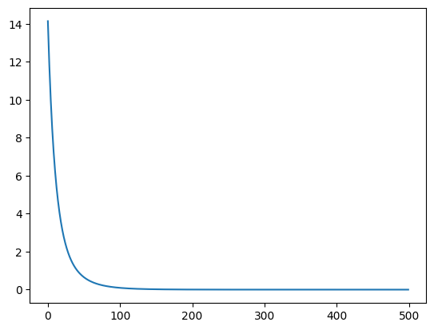
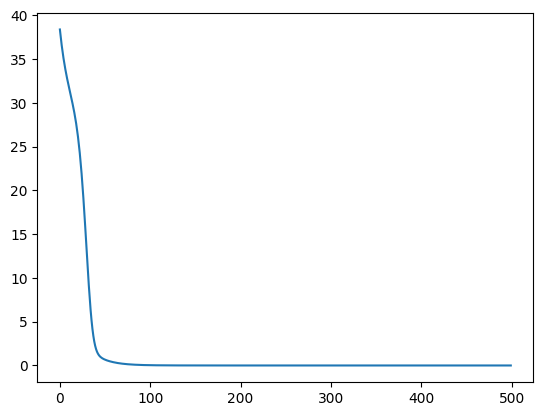
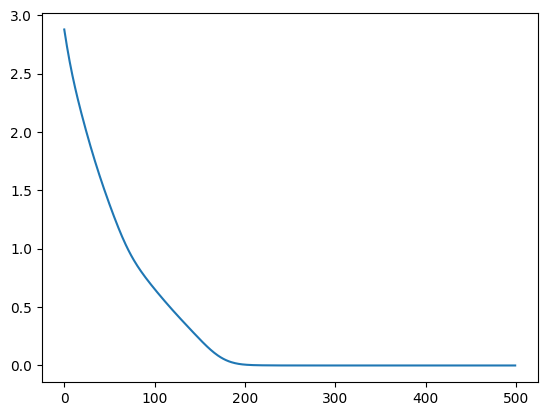
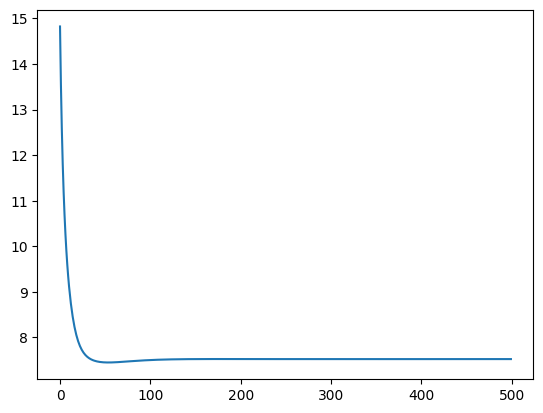

# Matrix Factorization with Bias

Similar to 09_matrix_factorization.py, but with user and item bias (TODO: Add reference on why this bias is needed).

## Reference:
- https://github.com/GabrielSandoval/matrix_factorization/blob/master/lib/mf.py
- https://d2l.ai/chapter_recommender-systems/mf.html
- https://medium.com/@maxbrenner-ai/matrix-factorization-for-collaborative-filtering-linear-to-non-linear-models-in-python-5cf54363a03c


```python
import matplotlib.pyplot as plt
import numpy as np
```


```python
import numpy as np

# Assume we have some ratings matrix R
R = np.array(
    [[5, 3, 0, 1], [4, 0, 0, 1], [1, 1, 0, 5], [1, 0, 0, 4], [0, 1, 5, 4]],
    dtype=np.float32,
)

# Initialize user and item embedding matrices
num_users, num_items = R.shape
embedding_dim = 10
U = np.random.normal(size=(num_users, embedding_dim))
V = np.random.normal(size=(num_items, embedding_dim))

# Initialize user and item bias vectors
user_bias = np.zeros(num_users)
item_bias = np.zeros(num_items)

# Initialize global bias
avg_rating = R[R.nonzero()].mean()

# Define the learning rate and regularization strength
lr = 0.01
reg_strength = 1e-5
losses = []

mask = R > 0
known_ratings = np.sum(mask)

# Define the loss function
def mse_loss(U, V, user_bias, item_bias, avg_rating, R):
    prediction = U @ V.T + user_bias[:, None] + item_bias[None, :] + avg_rating

    loss = np.sum(np.square(R - prediction) * mask) / known_ratings
    # Add regularization
    loss += reg_strength * (
        np.sum(U ** 2)
        + np.sum(V ** 2)
        + np.sum(user_bias ** 2)
        + np.sum(item_bias ** 2)
    )
    return loss


# Run the optimization
for i in range(500):
    R_hat = U @ V.T + user_bias[:, None] + item_bias[None, :] + avg_rating
    error = (R - R_hat) * mask

    # Compute gradients
    grad_U = -2 * error @ V / known_ratings + 2 * reg_strength * U
    grad_V = -2 * error.T @ U / known_ratings + 2 * reg_strength * V
    grad_user_bias = (
        -2 * np.sum(error, axis=1) / known_ratings + 2 * reg_strength * user_bias
    )
    grad_item_bias = (
        -2 * np.sum(error, axis=0) / known_ratings + 2 * reg_strength * item_bias
    )

    # Update parameters
    U -= lr * grad_U
    V -= lr * grad_V
    user_bias -= lr * grad_user_bias
    item_bias -= lr * grad_item_bias

    loss = mse_loss(U, V, user_bias, item_bias, avg_rating, R)
    if i % 100 == 0:
        print("Iteration", i, "Loss", loss)
    losses.append(loss)
```

    Iteration 0 Loss 9.886281612756491
    Iteration 100 Loss 0.022797585125228604
    Iteration 200 Loss 0.0008844487159315772
    Iteration 300 Loss 0.0007834422817237784
    Iteration 400 Loss 0.0007825208701494093


```python
plt.plot(losses)
```


    [<matplotlib.lines.Line2D at 0x132555b40>]


    

    


```python
print("Original ratings:")
print(R)
```

    Original ratings:
    [[5. 3. 0. 1.]
     [4. 0. 0. 1.]
     [1. 1. 0. 5.]
     [1. 0. 0. 4.]
     [0. 1. 5. 4.]]


### Reconstructed Ratings


```python
print("Reconstructed ratings:")
R_hat = (
    np.round(U @ V.T, 2)
    + user_bias[:, np.newaxis]
    + item_bias[np.newaxis, :]
    + avg_rating
)
print(np.round(R_hat, 2))
```

    Reconstructed ratings:
    [[ 5.    3.   -0.14  1.  ]
     [ 4.    1.95  5.5   1.  ]
     [ 1.    1.   -0.64  5.  ]
     [ 1.    6.8   3.49  4.  ]
     [ 4.04  1.    5.    4.  ]]


### Output


```python
# If the replace does not work, check if the data type for R matches R_hat, which is float.
# If the data type of the matrix to replace does not match, it will silently failed.
mask = R == 0
R[mask] = R_hat[mask]
np.maximum(np.round(R, 1), 0)
```


    array([[5. , 3. , 1.6, 1. ],
           [4. , 1.9, 1.9, 1. ],
           [1. , 1. , 0. , 5. ],
           [1. , 0. , 1.6, 4. ],
           [5.5, 1. , 5. , 4. ]], dtype=float32)


## Using Keras

The `tf.reduce_sum` function is used in the loss function to sum up all the individual squared differences between the actual ratings and the predicted ratings.

In the context of matrix factorization, the goal is to find the user and item embeddings that minimize the total (or sum of) squared differences between the actual and predicted ratings. This is known as the Mean Squared Error (MSE) loss, and it's a common choice for regression problems.

The `tf.reduce_sum` function is used instead of `tf.reduce_mean` because we're only considering non-zero entries in the ratings matrix (i.e., the user-item pairs where a rating is available). The number of such entries is not fixed (it depends on the sparsity of the ratings matrix), so it's simpler to sum up all the squared differences and let the optimizer find the minimum of this sum.

If you were to use `tf.reduce_mean`, you would need to divide by the number of non-zero entries, which would add an extra step to the computation. The optimizer would still be able to find the minimum of the mean loss, but the loss values reported during training would be smaller by a factor equal to the number of non-zero entries.


```python
import tensorflow as tf

R = tf.constant(
    [[5, 3, 0, 1], [4, 0, 0, 1], [1, 1, 0, 5], [1, 0, 0, 4], [0, 1, 5, 4]],
    dtype=tf.float32,
)
n_user, n_item = R.shape
K = min(R.shape) - 2


U = tf.Variable(tf.random.normal([n_user, K], stddev=0.1))
V = tf.Variable(tf.random.normal([n_item, K], stddev=0.1))

N = n_user * n_item


avg_rating = tf.constant(
    tf.math.reduce_mean(R[tf.math.not_equal(R, 0)]), name="global_average"
)
b_u = tf.Variable(tf.zeros(n_user), name="user_bias")
b_i = tf.Variable(tf.zeros(n_item), name="item_bias")

T = 500  # Epochs
alpha = 0.01  # learning rate
beta = 1e-5

trainable_weights = [U, V, b_u, b_i]
optimizer = tf.keras.optimizers.SGD(learning_rate=alpha, weight_decay=beta)
losses = []

# Define the loss function
def mse_loss(U, V, b_u, b_i, R):
    R_hat = tf.matmul(U, V, transpose_b=True) + b_u[:, None] + b_i[None, :] + avg_rating

    # non_zero_mask = tf.math.not_equal(tf.reshape(R, [-1]), 0)
    # indices = tf.where(non_zero_mask)
    # loss = tf.keras.metrics.mean_squared_error(
    #     tf.gather(tf.reshape(R, [-1]), indices),
    #     tf.gather(tf.reshape(R_hat, [-1]), indices),
    # )
    # return loss
    # num_ratings = tf.reduce_sum(tf.cast(non_zero_mask, tf.float32))
    # loss = tf.reduce_sum(tf.square(R - R_hat) * tf.cast(non_zero_mask, tf.float32))
    # return tf.divide(loss, num_ratings)
    # We are not using the mean.
    # This changes the scale of the loss values and the gradients, but doesn't fundamentally change the optimization problem.
    non_zero_mask = tf.math.not_equal(R, 0)
    loss = tf.reduce_sum(tf.square(R - R_hat) * tf.cast(non_zero_mask, tf.float32))
    return loss


for t in range(T):
    with tf.GradientTape() as tape:
        # We rely on automatic differentiation to calculate the gradient loss.
        loss = mse_loss(U, V, b_u, b_i, R)
    grads = tape.gradient(loss, trainable_weights)
    optimizer.apply_gradients(zip(grads, trainable_weights))
    losses.append(tf.reduce_mean(loss).numpy())

    if t % 100 == 0:
        print(t, tf.reduce_mean(loss).numpy())
```

    0 38.38217
    100 0.032197073
    200 0.00020707061
    300 1.6542647e-06
    400 1.3372642e-08


```python
plt.plot(losses)
```


    [<matplotlib.lines.Line2D at 0x1328256f0>]


    

    


```python
R_hat = (
    tf.matmul(U, V, transpose_b=True) + b_u[:, None] + b_i[None, :] + avg_rating
).numpy()
R = R.numpy()
```


```python
R
```


    array([[5., 3., 0., 1.],
           [4., 0., 0., 1.],
           [1., 1., 0., 5.],
           [1., 0., 0., 4.],
           [0., 1., 5., 4.]], dtype=float32)


### Reconstructed Ratings


```python
np.round(R_hat, 2)
```


    array([[5.  , 3.  , 4.19, 1.  ],
           [4.  , 2.17, 3.79, 1.  ],
           [1.  , 1.  , 4.35, 5.  ],
           [1.  , 0.65, 3.93, 4.  ],
           [2.15, 1.  , 5.  , 4.  ]], dtype=float32)


```python
mask = R == 0
R[mask] = R_hat[mask]
np.round(R, 1)
```


    array([[5. , 3. , 4.2, 1. ],
           [4. , 2.2, 3.8, 1. ],
           [1. , 1. , 4.4, 5. ],
           [1. , 0.7, 3.9, 4. ],
           [2.1, 1. , 5. , 4. ]], dtype=float32)


### Output


```python
# We still have issue with negative values, and some values goes beyond 5.
np.round(np.clip(R, 0, 5), 1)
```


    array([[5. , 3. , 4.2, 1. ],
           [4. , 2.2, 3.8, 1. ],
           [1. , 1. , 4.4, 5. ],
           [1. , 0.7, 3.9, 4. ],
           [2.1, 1. , 5. , 4. ]], dtype=float32)


## Keras, skipping ratings


```python
import numpy as np
import tensorflow as tf

# Assume we have some ratings matrix R
R = np.array(
    [[5, 3, 0, 1], [4, 0, 0, 1], [1, 1, 0, 5], [1, 0, 0, 4], [0, 1, 5, 4]],
    dtype=np.float32,
)

# Get the number of users and items
num_users, num_items = R.shape

# Get the indices of non-zero entries
user_ids, item_ids = np.nonzero(R)

# Get the corresponding ratings
ratings = R[user_ids, item_ids]

# Define the embedding dimension
embedding_dim = 2

# Initialize user and item embedding matrices
U = tf.Variable(tf.random.normal((num_users, embedding_dim)))
V = tf.Variable(tf.random.normal((num_items, embedding_dim)))

# Initialize user and item bias vectors
user_bias = tf.Variable(tf.zeros(num_users))
item_bias = tf.Variable(tf.zeros(num_items))

# Initialize global bias
avg_rating = tf.constant(np.mean(ratings))

# Define the learning rate
lr = 0.01

# Define the number of epochs
epochs = 500

# Define the optimizer
optimizer = tf.optimizers.Adam(lr)
losses = []
# Run the optimization
for epoch in range(epochs):
    with tf.GradientTape() as tape:
        # Compute the dot product between the user and item embeddings
        prediction = tf.reduce_sum(
            tf.gather(U, user_ids) * tf.gather(V, item_ids), axis=1
        )

        # Add the biases to the prediction
        prediction += (
            avg_rating + tf.gather(user_bias, user_ids) + tf.gather(item_bias, item_ids)
        )

        # Compute the mean squared error loss
        loss = tf.reduce_mean((ratings - prediction) ** 2)

    # Compute the gradients
    grads = tape.gradient(loss, [U, V, user_bias, item_bias])

    # Apply the gradients
    optimizer.apply_gradients(zip(grads, [U, V, user_bias, item_bias]))
    if epoch % 100 == 0:
        print("Epoch", epoch, "Loss", loss.numpy())
    losses.append(loss.numpy())
```

    Epoch 0 Loss 2.879625
    Epoch 100 Loss 0.6547214
    Epoch 200 Loss 0.00706932
    Epoch 300 Loss 1.2559363e-07
    Epoch 400 Loss 1.0330198e-12


```python
plt.plot(losses)
```


    [<matplotlib.lines.Line2D at 0x132c38760>]


    

    


### Reconstructed Ratings


```python
R_hat = (
    U.numpy() @ V.numpy().T
    + avg_rating.numpy()
    + user_bias.numpy()[:, None]
    + item_bias.numpy()[None, :]
)
np.round(R_hat, 2)
```


    array([[5.  , 3.  , 4.93, 1.  ],
           [4.  , 1.23, 4.18, 1.  ],
           [1.  , 1.  , 2.49, 5.  ],
           [1.  , 1.31, 2.27, 4.  ],
           [4.21, 1.  , 5.  , 4.  ]], dtype=float32)


## SGD


```python
import numpy as np

# Assume we have some ratings matrix R
R = np.array(
    [[5, 3, 0, 1], [4, 0, 0, 1], [1, 1, 0, 5], [1, 0, 0, 4], [0, 1, 5, 4]],
    dtype=np.float32,
)

# Initialize user and item embedding matrices
num_users, num_items = R.shape
embedding_dim = 2
U = np.random.normal(size=(num_users, embedding_dim))
V = np.random.normal(size=(num_items, embedding_dim))

# Initialize user and item bias vectors
user_bias = np.zeros(num_users)
item_bias = np.zeros(num_items)

# Initialize global bias
avg_rating = np.mean(R[R > 0])

# Define the learning rate
lr = 0.01

# Define the number of epochs
epochs = 500
losses = []
# Run the optimization
for epoch in range(epochs):
    for i in range(num_users):
        for j in range(num_items):
            if R[i, j] > 0:  # only consider non-zero entries
                error = R[i, j] - (
                    avg_rating + np.dot(U[i, :], V[j, :]) + user_bias[i] + item_bias[j]
                )
                U[i, :] += lr * error * V[j, :]
                V[j, :] += lr * error * U[i, :]
                user_bias[i] += lr * error
                item_bias[j] += lr * error

    mse_loss = np.sum(
        (R - (avg_rating + np.dot(U, V.T) + user_bias[:, None] + item_bias[None, :]))
        ** 2
    ) / np.sum(R > 0)
    if epoch % 100 == 0:
        print("Epoch", epoch, "MSE Loss", mse_loss)
    losses.append(mse_loss)
```

    Epoch 0 MSE Loss 14.821845975216345
    Epoch 100 MSE Loss 7.505415823913703
    Epoch 200 MSE Loss 7.527446178756847
    Epoch 300 MSE Loss 7.525891225916559
    Epoch 400 MSE Loss 7.526175385010887


```python
plt.plot(losses)
```


    [<matplotlib.lines.Line2D at 0x132cb8160>]


    

    


### Reconstructed Ratings


```python
np.round(avg_rating + np.dot(U, V.T) + user_bias[:, None] + item_bias[None, :], 2)
```


    array([[5.  , 3.  , 0.84, 1.  ],
           [4.  , 2.19, 2.61, 1.  ],
           [1.  , 1.  , 8.7 , 5.  ],
           [1.  , 0.95, 2.75, 4.  ],
           [1.21, 1.  , 5.  , 4.  ]])


```python

```
