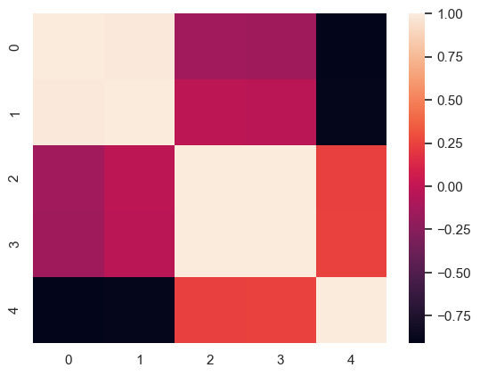
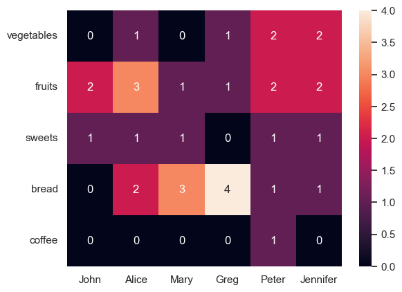
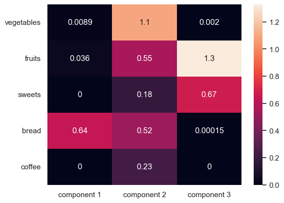

```python
import matplotlib.pyplot as plt
import numpy as np
import pandas as pd
import seaborn as sns
from sklearn.decomposition import NMF

sns.set_theme()
```


```python
X = np.array(
    [[5, 3, 0, 1], [4, 0, 0, 1], [1, 1, 0, 5], [1, 0, 0, 4], [0, 1, 5, 4]],
    dtype=np.float32,
)

model = NMF(n_components=3)
W = model.fit_transform(X)
H = model.components_
```


```python
sns.heatmap(np.corrcoef(W @ H))
```


    <Axes: >


    

    


```python
np.round(W @ H, 2)
```


    array([[5.34, 2.14, 0.17, 1.01],
           [3.46, 1.37, 0.  , 0.98],
           [1.17, 0.56, 0.09, 5.01],
           [0.85, 0.4 , 0.  , 3.99],
           [0.  , 1.04, 4.99, 4.  ]], dtype=float32)


```python
X
```


    array([[5., 3., 0., 1.],
           [4., 0., 0., 1.],
           [1., 1., 0., 5.],
           [1., 0., 0., 4.],
           [0., 1., 5., 4.]], dtype=float32)


## Non-negative Matrix Factorization Recommender
https://acme.byu.edu/00000179-af53-d74f-a3ff-bfdb224d0000/nmf-pdf


```python
df = pd.DataFrame(
    {
        "John": [0, 2, 1, 0, 0],
        "Alice": [1, 3, 1, 2, 0],
        "Mary": [0, 1, 1, 3, 0],
        "Greg": [1, 1, 0, 4, 0],
        "Peter": [2, 2, 1, 1, 1],
        "Jennifer": [2, 2, 1, 1, 0],
    },
    index="vegetables fruits sweets bread coffee".split(),
)
df
```


<div>
<style scoped>
    .dataframe tbody tr th:only-of-type {
        vertical-align: middle;
    }

    .dataframe tbody tr th {
        vertical-align: top;
    }

    .dataframe thead th {
        text-align: right;
    }
</style>
<table border="1" class="dataframe">
  <thead>
    <tr style="text-align: right;">
      <th></th>
      <th>John</th>
      <th>Alice</th>
      <th>Mary</th>
      <th>Greg</th>
      <th>Peter</th>
      <th>Jennifer</th>
    </tr>
  </thead>
  <tbody>
    <tr>
      <th>vegetables</th>
      <td>0</td>
      <td>1</td>
      <td>0</td>
      <td>1</td>
      <td>2</td>
      <td>2</td>
    </tr>
    <tr>
      <th>fruits</th>
      <td>2</td>
      <td>3</td>
      <td>1</td>
      <td>1</td>
      <td>2</td>
      <td>2</td>
    </tr>
    <tr>
      <th>sweets</th>
      <td>1</td>
      <td>1</td>
      <td>1</td>
      <td>0</td>
      <td>1</td>
      <td>1</td>
    </tr>
    <tr>
      <th>bread</th>
      <td>0</td>
      <td>2</td>
      <td>3</td>
      <td>4</td>
      <td>1</td>
      <td>1</td>
    </tr>
    <tr>
      <th>coffee</th>
      <td>0</td>
      <td>0</td>
      <td>0</td>
      <td>0</td>
      <td>1</td>
      <td>0</td>
    </tr>
  </tbody>
</table>
</div>


```python
sns.heatmap(df, annot=True)

plt.yticks(rotation=0)
pass
```


    

    


```python
model = NMF(n_components=3)
W = model.fit_transform(df)
H = model.components_
```


```python
sns.heatmap(
    pd.DataFrame(
        W, index=df.index, columns=["component 1", "component 2", "component 3"]
    ),
    annot=True,
)
plt.yticks(rotation=0)
pass
```


    

    


`W` represents how much each grocery feature contributes to each component; a higher weight means it's more important to that component.


```python
sns.heatmap(
    pd.DataFrame(
        H, index=["component 1", "component 2", "component 3"], columns=df.columns
    ),
    annot=True,
)
plt.yticks(rotation=0)
pass
```


<div>
<style scoped>
    .dataframe tbody tr th:only-of-type {
        vertical-align: middle;
    }

    .dataframe tbody tr th {
        vertical-align: top;
    }

    .dataframe thead th {
        text-align: right;
    }
</style>
<table border="1" class="dataframe">
  <thead>
    <tr style="text-align: right;">
      <th></th>
      <th>John</th>
      <th>Alice</th>
      <th>Mary</th>
      <th>Greg</th>
      <th>Peter</th>
      <th>Jennifer</th>
    </tr>
  </thead>
  <tbody>
    <tr>
      <th>component 1</th>
      <td>0.000000</td>
      <td>2.434610</td>
      <td>4.664494</td>
      <td>5.577052</td>
      <td>0.000000</td>
      <td>0.157663</td>
    </tr>
    <tr>
      <th>component 2</th>
      <td>0.000000</td>
      <td>0.871472</td>
      <td>0.000000</td>
      <td>0.846342</td>
      <td>1.924870</td>
      <td>1.735532</td>
    </tr>
    <tr>
      <th>component 3</th>
      <td>1.503022</td>
      <td>1.712571</td>
      <td>0.801863</td>
      <td>0.151135</td>
      <td>0.757168</td>
      <td>0.827288</td>
    </tr>
  </tbody>
</table>
</div>


`H` is similar, except instead of showing how much each grocery category affects the components, it shows how much each person belongs to the comopnent, again with a higher weight indicating that the person belongs more in that component.


```python
pd.DataFrame(W @ H, index=df.index, columns=df.columns).round(2)
```


<div>
<style scoped>
    .dataframe tbody tr th:only-of-type {
        vertical-align: middle;
    }

    .dataframe tbody tr th {
        vertical-align: top;
    }

    .dataframe thead th {
        text-align: right;
    }
</style>
<table border="1" class="dataframe">
  <thead>
    <tr style="text-align: right;">
      <th></th>
      <th>John</th>
      <th>Alice</th>
      <th>Mary</th>
      <th>Greg</th>
      <th>Peter</th>
      <th>Jennifer</th>
    </tr>
  </thead>
  <tbody>
    <tr>
      <th>vegetables</th>
      <td>0.00</td>
      <td>0.98</td>
      <td>0.04</td>
      <td>0.98</td>
      <td>2.11</td>
      <td>1.90</td>
    </tr>
    <tr>
      <th>fruits</th>
      <td>2.00</td>
      <td>2.84</td>
      <td>1.23</td>
      <td>0.87</td>
      <td>2.07</td>
      <td>2.06</td>
    </tr>
    <tr>
      <th>sweets</th>
      <td>1.01</td>
      <td>1.31</td>
      <td>0.54</td>
      <td>0.26</td>
      <td>0.86</td>
      <td>0.87</td>
    </tr>
    <tr>
      <th>bread</th>
      <td>0.00</td>
      <td>2.01</td>
      <td>2.99</td>
      <td>4.01</td>
      <td>0.99</td>
      <td>1.00</td>
    </tr>
    <tr>
      <th>coffee</th>
      <td>0.00</td>
      <td>0.20</td>
      <td>0.00</td>
      <td>0.20</td>
      <td>0.45</td>
      <td>0.41</td>
    </tr>
  </tbody>
</table>
</div>


```python
df
```


<div>
<style scoped>
    .dataframe tbody tr th:only-of-type {
        vertical-align: middle;
    }

    .dataframe tbody tr th {
        vertical-align: top;
    }

    .dataframe thead th {
        text-align: right;
    }
</style>
<table border="1" class="dataframe">
  <thead>
    <tr style="text-align: right;">
      <th></th>
      <th>John</th>
      <th>Alice</th>
      <th>Mary</th>
      <th>Greg</th>
      <th>Peter</th>
      <th>Jennifer</th>
    </tr>
  </thead>
  <tbody>
    <tr>
      <th>vegetables</th>
      <td>0</td>
      <td>1</td>
      <td>0</td>
      <td>1</td>
      <td>2</td>
      <td>2</td>
    </tr>
    <tr>
      <th>fruits</th>
      <td>2</td>
      <td>3</td>
      <td>1</td>
      <td>1</td>
      <td>2</td>
      <td>2</td>
    </tr>
    <tr>
      <th>sweets</th>
      <td>1</td>
      <td>1</td>
      <td>1</td>
      <td>0</td>
      <td>1</td>
      <td>1</td>
    </tr>
    <tr>
      <th>bread</th>
      <td>0</td>
      <td>2</td>
      <td>3</td>
      <td>4</td>
      <td>1</td>
      <td>1</td>
    </tr>
    <tr>
      <th>coffee</th>
      <td>0</td>
      <td>0</td>
      <td>0</td>
      <td>0</td>
      <td>1</td>
      <td>0</td>
    </tr>
  </tbody>
</table>
</div>


